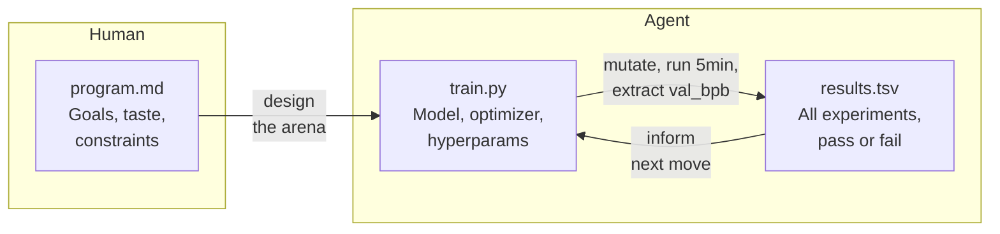
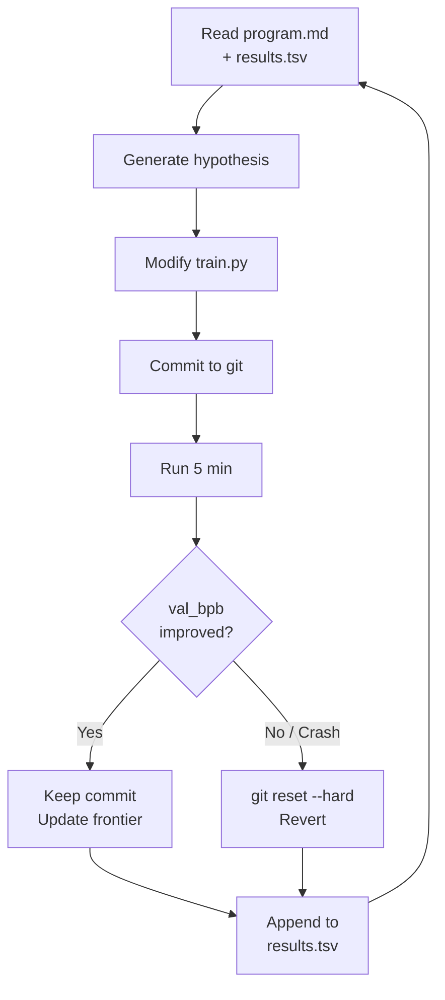

On March 8, Andrej Karpathy dropped a 630-line Python file and broke the internet. Within two days, the tweet had 8.6 million views. The repo hit 27,000 stars in its first week and has since crossed 50,000. Within two weeks, Shopify CEO Tobias Lutke was running it on an internal search quality model — 37 experiments overnight, 19% improvement on his target metric.

The project is called **autoresearch**, and if you work in ML, you need to understand it — not because of what it does today, but because of the pattern it establishes for tomorrow.

I've spent the last two weeks building on top of this pattern — porting it to SageMaker, generalizing it beyond ML training, and designing it as a platform. I have opinions. This is the first in a series of five posts covering the full arc: what autoresearch is, where it falls short, and what comes next. But first, let's understand why this particular 630 lines of Python matter.

## The Pattern in 60 Seconds

Autoresearch is three files and a loop.

**`program.md`** is what Karpathy calls the "research org code." The human defines the optimization objective, constraints, and research taste in plain Markdown. **`train.py`** is the only file the agent can touch — a complete GPT training script. **`results.tsv`** tracks every experiment, pass or fail.

The loop is a ratchet: the agent mutates `train.py`, commits to git, runs for exactly 5 minutes, and checks `val_bpb` (validation bits per byte). Improved? Keep the commit. Regressed or crashed? `git reset --hard HEAD~1`. Repeat ~100 times overnight. The codebase monotonically improves.

The taste comes from `program.md`:

> A 0.001 val_bpb improvement that adds 20 lines of hacky code? Probably not worth it. A 0.001 val_bpb improvement from deleting code? Definitely keep. An improvement of ~0 but much simpler code? Keep.

This isn't just optimization. It's opinionated research direction encoded in plain English. No orchestration framework, no experiment tracking platform — just three files and an AI agent with a terminal.

## What Karpathy Got Right

Having built two implementations on top of this pattern, here are the design decisions that matter most:

### 1. Binary Evaluation

The agent doesn't rate experiments on a scale. It doesn't compute a weighted score across multiple metrics. It answers one question: did `val_bpb` go down? Yes or no.

This eliminates interpretation drift. When you give an agent a 1-10 scale, you get score inflation over time. When you give it a binary gate, there's nowhere to hide.

### 2. Git as Experiment Memory

Every experiment is a git commit. The ratchet forward is a kept commit; the ratchet back is a `git reset`. This means the full experiment history is in `git log`, diffs are in `git diff`, and the current best is always `HEAD`.

No MLflow. No Weights & Biases. No experiment tracking database. Git is the experiment tracker, and it's one the agent already knows how to use.

### 3. Fixed Time Budget

Each training run gets exactly 5 minutes. Not a step count, not an epoch count — wall clock time. This makes every experiment directly comparable on the same hardware, and it means the agent optimizes for *efficiency*, not just final loss. A model that converges faster in 5 minutes wins over a model that would converge better given an hour.

### 4. The Human Writes Markdown, Not Code

The human's job is to write `program.md` — to define the arena, the constraints, the research taste. The agent's job is to iterate on code within those constraints. Karpathy frames this as the natural evolution: *"The human iterates on the prompt (.md), the AI agent iterates on the training code (.py)."*

This is the "design the arena" philosophy, and it's powerful. The human contributes judgment, direction, and taste — the things LLMs are worst at. The agent contributes speed, thoroughness, and tireless iteration — the things humans are worst at.

### 5. Radical Simplicity

630 lines. One file. One metric. One GPU. No framework dependencies beyond PyTorch.

When SkyPilot scaled autoresearch to 16 GPUs and ran 910 experiments in 8 hours, they didn't need to modify the core pattern. They just parallelized it. The simplicity is a feature — it means the pattern is composable.

## Why Now?

You might be thinking: this is just AutoML with extra steps. Karpathy's been asked that directly, and his answer is worth considering: *"LLMs can read research papers, develop hypotheses, and access the internet — unlike AutoML's random variations or evolutionary algorithms."*

He's right, but I think the timing matters more than the technique. Three things converged in early 2026:

1. **Coding agents crossed the coherence threshold.** Claude Code, Codex, Kiro — these tools don't just autocomplete. They maintain context across multi-file edits, reason about build systems, and recover from errors. Karpathy himself admits his *"manual coding skills are atrophying"* because agents crossed this line around December 2025.
2. **"Vibe coding" hit its limits.** Karpathy coined the term in 2025 (4.5M views on that tweet). By February 2026, he quietly retired it in favor of "agentic engineering" — *"not just because agents are writing the code, but because there is an art & science and expertise to it."* Autoresearch is the concrete embodiment of that shift.
3. **The economics of experimentation changed.** Cloud GPU instances now spin up in seconds with warm pools. A 5-minute training run on an A10G costs about $0.10. Running 100 experiments overnight costs less than a team lunch. The bottleneck moved from compute cost to human iteration speed — exactly the bottleneck agents eliminate.

AutoML searches a parameter space. Autoresearch searches a *hypothesis* space. That's a different thing entirely.

You might also be thinking: **I can already do this with Claude Code.** Write a detailed CLAUDE.md, give the agent clear instructions, and tell it to iterate on a file until a metric improves. A well-crafted prompt engineer can get 80% of the way there.

The difference is structural, not capability. When you tell Claude Code "improve this training script until val_bpb drops below 1.0," the agent decides *how* to evaluate, *when* to commit, *whether* to revert, and *what counts* as improvement. All of that lives in the agent's reasoning — ephemeral, non-reproducible, and invisible to you.

Autoresearch externalizes those decisions into files. The evaluation is a script, not a judgment call. The commit/revert logic is a ratchet, not a heuristic. The "what counts as improvement" is a binary criterion, not a vibes check. The experiment history is a TSV, not a conversation that gets truncated after 100k tokens.

The practical consequence: an autoresearch loop produces the same results regardless of which agent runs it. A Claude Code session depends on the model version, the context window state, and how the agent happens to interpret your instructions on that particular run. For a one-off improvement, Claude Code with good instructions is faster. For a 100-experiment overnight run that needs to be reproducible, auditable, and resumable — you need the structure.

## What's Missing

Now for the harder conversation. If you try to use autoresearch in a real enterprise ML workflow, you'll hit walls fast.

### 1. Single GPU, Single Machine

Autoresearch runs on one GPU. Karpathy acknowledges this: *"It's a lot more complex at scale of course."* The SkyPilot team showed you can parallelize across GPUs, but their solution was bespoke — 16 GPUs, custom coordination, ~$300 in GPU compute for 8 hours.

If your team already has access to a managed GPU fleet through a cloud provider, you shouldn't need to wire up custom coordination. The loop should submit jobs to your existing infrastructure — and the infrastructure should handle the rest.

When I ported the pattern to SageMaker, this was the first thing I tackled. The agent calls a stateless CLI that wraps `CreateTrainingJob`; SageMaker handles instance provisioning, warm pools, and log streaming. The agent doesn't know or care about GPU fleet management. More on that tomorrow.

### 2. No Cost Visibility

When you run `uv run train.py` on your local GPU, the cost is your electricity bill. When you run experiments on cloud GPUs, each one costs real money. An unattended loop burning through H100 hours overnight needs per-experiment cost tracking and budget controls — and autoresearch has neither.

### 3. No Parallelism in the Core Loop

The ratchet is sequential: run one experiment, evaluate, keep or revert, repeat. But many hypotheses are independent — "try a wider model" and "try a different optimizer" don't need to be tested in sequence. A parallel mode that launches N hypotheses simultaneously and keeps the best would dramatically increase throughput.

### 4. No Governance

Who approved the 100 experiments that ran overnight? What was the total spend? Did the agent stay within the constraints defined in `program.md`, or did it find a creative way around them? In a production environment, you need audit trails, cost controls, and guardrails. Autoresearch has none.

### 5. It Only Works for ML Training

This is the biggest limitation, and it's by design. Autoresearch optimizes a training script against a validation metric. But the core pattern — mutate, evaluate, keep or revert — applies to far more than model training.

Think about it: prompt engineering has a measurable outcome (eval scores). Documentation has measurable outcomes (SEO scores, readability metrics, link checks). Accessibility has measurable outcomes (axe-core violations). Configuration tuning has measurable outcomes (latency, throughput). Anywhere you have a file you can mutate and a metric you can measure, this pattern works.

Karpathy scoped it tight on purpose. But the community has already started generalizing — `pi-autoresearch` (1,300+ stars) added dashboard UI and branch-aware tracking for non-ML workflows; `pjhoberman/autoresearch` applied the loop to Django search optimization; one developer used it to optimize semantic HTML skills through LLM-as-judge scoring across 8 quality dimensions.

> **From the field:** Yash Kumar recently documented [running the autoresearch loop on eCLIP](https://ykumar.me/blog/eclip-autoresearch/), a CLIP variant for Japanese woodblock prints. His agent completed 42 experiments on an RTX 4090 — 13 committed, 29 reverted — and cut Mean Rank by 54%. The biggest single win? Finding a temperature parameter bug, not an architectural breakthrough. His conclusion maps exactly to the gaps we'll address this week: the pattern excels at structured optimization with clear feedback signals, but hits a wall on open-ended architectural exploration. His wishlist — planning mechanisms, subagents, parallel hypotheses — is what Days 2 through 5 build.

The pattern is bigger than ML training. In Day 3, I'll show you how much bigger.

## The "Loopy Era"

In a recent interview, Karpathy described what he calls the "loopy era of AI" — a future where *"agents running continuous self-improvement loops on code and research will become standard at frontier labs."*

He's not wrong. But I think the scope is broader than frontier labs. Any team with an optimization problem and a measurable metric can run this pattern. The question isn't whether the pattern works — it does. The question is how to make it practical, scalable, and governable for real-world use.

That's what this series is about.

**Tomorrow**: I'll walk you through `sagemaker-autoresearch` — a version of the pattern that runs on Amazon SageMaker, with parallel hypothesis testing, warm pools for near-zero startup time, and per-experiment cost tracking. We'll run real experiments and look at real results.

---

*This is Part 1 of 5 in the Autoresearch Week series. Follow along for the full build.*
