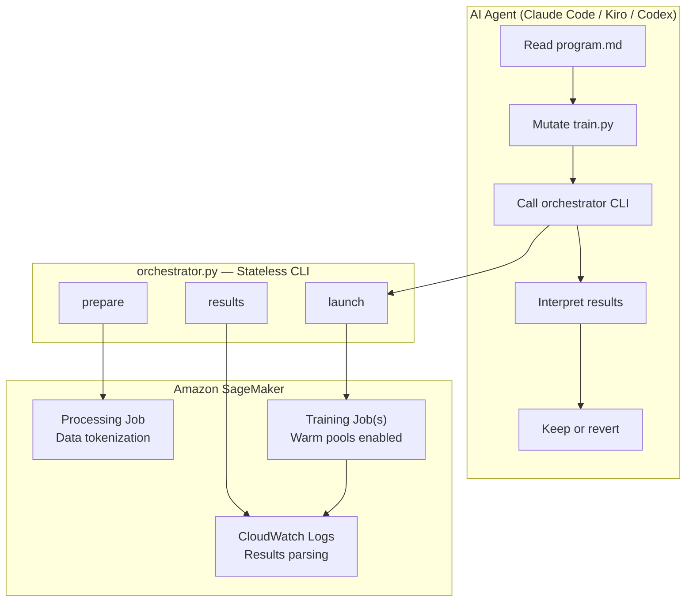
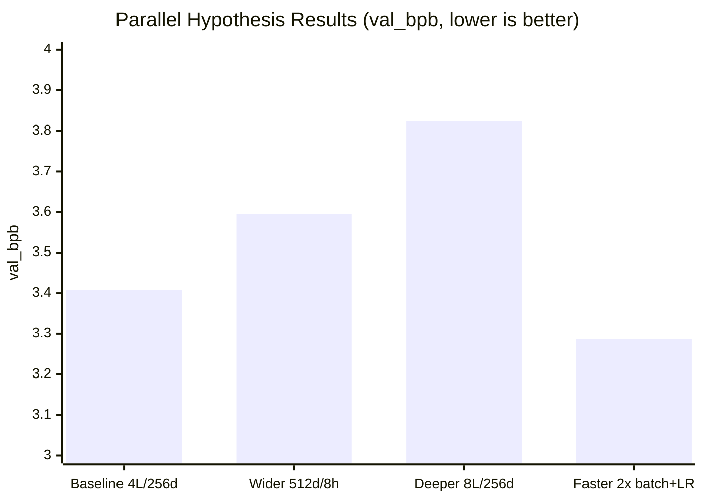

> *This is Part 2 of 5 in the Autoresearch Week series.*

Yesterday I broke down the autoresearch pattern — Karpathy's 630-line ratchet loop that turns an AI agent into an overnight research assistant. I listed five things it's missing for real-world use: (1) fleet-scale compute, (2) cost visibility, (3) parallelism, (4) governance, and (5) generalization beyond ML.

Karpathy called this the "loopy era" — agents running self-improvement loops at silicon speed. Today I'm making that concrete by open-sourcing **sagemaker-autoresearch**.

The agent still drives the loop — it still mutates code, evaluates results, and keeps or reverts. But instead of running `uv run train.py` on a local GPU, it calls a stateless CLI that submits SageMaker Training Jobs. SageMaker handles provisioning, warm pools, log streaming, and shutdown. The agent doesn't know or care.

**Repo**: [github.com/dgallitelli/sagemaker-autoresearch](https://github.com/dgallitelli/sagemaker-autoresearch)

## What SageMaker Enables for the Pattern

If you've used SageMaker Training Jobs before, the primitives aren't new to you. What's new is what they enable when an AI agent is driving the loop:

**Warm pools collapse the iteration cycle.** The first experiment takes ~2 minutes to start (container pull + data download). With warm pools enabled, every subsequent job reuses the running instance — startup drops to under 30 seconds. Over 50 experiments, the agent's effective iteration cycle is ~5.5 minutes instead of ~7 minutes. That's close enough to local execution that the agent doesn't need to change its strategy. *(Gap #1 from yesterday: closed.)*

**Parallel jobs unlock hypothesis branching.** The agent can submit 3 competing hypotheses as 3 independent jobs. SageMaker provisions 3 instances, runs them simultaneously, and the agent picks the winner. No GPU scheduling, no shared state. *(Gap #3: closed.)*

**Per-job cost estimates keep the loop accountable.** Every results table includes billable seconds and estimated cost. The agent can track cumulative spend and honor budget constraints written in `program.md`. *(Gap #2: closed.)*

## The Architecture

The design is deliberately minimal:



```
sagemaker-autoresearch/
  orchestrator.py    Stateless CLI (prepare|launch|results)
  program.md         Agent instructions (human writes)
  config.yaml        Instance types, containers, budgets
  scripts/
    train.py         GPT training (agent mutates this)
    hyperparams.yaml Numeric knobs (agent tunes this)
    prepare.py       Data tokenization (one-time)
```

The orchestrator is ~450 lines of raw `boto3` — no SageMaker Python SDK. Three subcommands: `prepare` (Processing Job for data tokenization), `launch` (1-N Training Jobs + log parsing + cost estimates), `results` (re-fetch results by job name).

The critical design choice: **the orchestrator is stateless**. No database, no state file. Job results are parsed from CloudWatch logs on demand. The agent maintains state the way Karpathy's original does — through git commits and `results.tsv`.

## What the Agent Sees

Before we run anything, here's what matters: the agent's interface is intentionally simple. From `program.md`:

```
## Tools

You have one tool: the orchestrator CLI.

  python orchestrator.py launch <dir> --tag <tag>
  python orchestrator.py results <job-name>

The launch command prints a results table. Use it.
```

The agent doesn't know about SageMaker APIs, instance types, or S3 paths. It modifies `train.py` and `hyperparams.yaml`, calls the CLI, reads the results table, and decides what to try next. The complexity is behind the orchestrator — where it belongs.

This is why I used raw `boto3` instead of the SageMaker Python SDK: when the agent reads `orchestrator.py` (and it will, when something breaks), it sees the actual API calls — `CreateTrainingJob`, `DescribeTrainingJob`, `GetLogEvents`. No abstraction layers. The agent can reason about failures because it can see the raw surface.

One subtlety worth noting: the training time budget is enforced **inside** `train.py`, not via SageMaker's `MaxRuntimeInSeconds`. SageMaker's timeout includes container startup and data download, which varies. The Python-level timer gives consistent 5-minute training windows. `MaxRuntimeInSeconds = 1800` is a safety net, not the budget.

## Running It: Data Preparation

Data prep is one-time. The orchestrator launches a Processing Job on a CPU instance:

```bash
python orchestrator.py prepare
```

This downloads TinyStories (~6500 parquet shards), trains a BPE tokenizer (vocab 4096), and writes tokenized binary shards to S3:

```
s3://your-bucket/autoresearch/data/
  train.bin    920 MB (~460M tokens)
  val.bin       49 MB (~24M tokens)
  tokenizer.json
  meta.json
```

The agent never touches this data — it's immutable infrastructure, the equivalent of Karpathy's `prepare.py`.

## Running It: The Baseline

First experiment, single command:

```bash
python orchestrator.py launch scripts/ --tag baseline
```

Default config: 4-layer GPT, d_model=256, 4 heads, FFN multiplier 4, trained on `ml.g5.2xlarge` (A10G 24GB) for 5 minutes:

```
==========================================================
Variant  Status  val_bpb   VRAM_MB  Steps   Cost
----------------------------------------------------------
001      OK      3.408     1715     5135    $0.25
----------------------------------------------------------
TOTAL                                       $0.25
==========================================================
```

**Baseline: val_bpb = 3.408 at $0.25.** That's our ratchet starting point. The model is a ~4M parameter GPT trained on children's stories — small enough to iterate fast, large enough that architectural changes matter.

## Running It: Parallel Hypotheses

Here's where the SageMaker version diverges from Karpathy's sequential ratchet. Instead of testing one idea at a time, we launch three competing hypotheses simultaneously.



The hypotheses:

| Hypothesis | Change | Rationale |
|---|---|---|
| wider | d_model 256→512, n_heads 4→8 | SkyPilot found width matters most |
| deeper | depth 4→8 (same d_model) | More layers, same width — does depth help? |
| faster | 2x batch, 2x LR | Chinchilla-style: see more tokens per step |

Each variant gets its own directory with a modified `hyperparams.yaml`:

```bash
python orchestrator.py launch \
  variants/wider variants/deeper variants/faster \
  --tag blogdemo
```

Three jobs, three instances, one command. Results:

```
==========================================================
Variant  Status  val_bpb  VRAM_MB  Steps   Cost
----------------------------------------------------------
wider    OK      3.595    3001     2137    $0.26
deeper   OK      3.824    2866     2820    $0.26
faster   OK      3.287    3343     2728    $0.25
----------------------------------------------------------
TOTAL                                      $0.76
==========================================================
```

Wall-clock time for all three: ~8 minutes (5 min training + ~3 min cold start). Total cost: $0.76. In sequential mode, this would have taken 24 minutes.

The result surprised me. Both "bigger model" hypotheses — wider (d_model 512) and deeper (8 layers) — **regressed**. The wider model hit 3.595 (vs baseline 3.408) and the deeper model hit 3.824. More parameters meant fewer training steps in the 5-minute budget: the wider model ran 2,137 steps vs the baseline's 5,135.

The winner was **faster** — same architecture, but 2x batch size and 2x learning rate. It saw more tokens per step and hit 3.287, a 3.5% improvement over baseline. In the ratchet, the agent would keep this change and explore from the new frontier.

The lesson: under a fixed time budget, throughput beats capacity. This is exactly what Karpathy's SkyPilot experiment found at scale — *"model width scaling mattered more than any single hyperparameter"* — but only after the training loop was already fast enough. On a cold start with a small dataset, seeing more data faster wins.

## The Agent Loop in Action

Here's what the agent's reasoning would look like after seeing these results:

```
> Baseline val_bpb = 3.408 (4L/256d, 5135 steps).
> Ran 3 hypotheses in parallel.
>
> wider (3.595): REGRESSED. Fewer steps (2137)
>   killed it — model too big for 5-min budget.
> deeper (3.824): REGRESSED. Same problem,
>   worse result.
> faster (3.287): IMPROVED +3.5%. Keep this.
>
> Next: explore from faster baseline.
>   Try cosine schedule with longer warmup?
```

The agent commits the faster variant to git, reverts wider and deeper, and generates the next hypothesis informed by everything in `results.tsv`. Over 50-100 cycles, the model improves monotonically — same ratchet, bigger fleet.

## The Ratchet Gets a Price Tag

Here's `results.tsv` after our parallel run:

```
exp  variant   val_bpb  cost   status   description
001  baseline  3.408    $0.25  OK       4L/256d default
002  wider     3.595    $0.26  REVERT   d_model=512 (regressed)
003  deeper    3.824    $0.26  REVERT   depth=8 (regressed)
004  faster    3.287    $0.25  KEEP     2x batch + 2x LR
```

Every row has a cost column. The agent sees cumulative spend ($1.01 after 4 experiments). You can extend `program.md` with a budget constraint: *"Stop if total cost exceeds $20."* Or an efficiency constraint: *"Do not use instances larger than ml.g5.2xlarge."* The ratchet now has a price tag and guardrails.

At $0.25 per experiment, 100 overnight runs cost $25. Human iteration speed was the bottleneck, and it cost far more than $25/night in salary.

## Comparing to the Original

| Aspect | Karpathy | SageMaker |
|---|---|---|
| Compute | Local 1 GPU | Any SM instance |
| Parallelism | Sequential | N jobs at once |
| Data prep | Local script | Processing Job |
| Cost visibility | Electricity | Per-job estimate |
| Warm pools | N/A | 30-min keep-alive |
| Startup | Instant | ~2m cold / <30s warm |
| Agent coupling | Tight (uv run) | Loose (CLI wrapper) |

The core philosophy is preserved: the AI agent IS the research loop. The orchestrator is a tool, not a framework. It doesn't make decisions — it wraps API complexity the same way `uv run train.py` wraps local execution.

## Try It Yourself

```bash
git clone https://github.com/dgallitelli/sagemaker-autoresearch
cd sagemaker-autoresearch

# Configure (edit .env with your role ARN + bucket)
cp .env.example .env

# Prepare data (one-time, ~10 min on ml.m5.2xlarge)
python orchestrator.py prepare

# Run baseline
python orchestrator.py launch scripts/ --tag my-first-run
```

For parallel experiments, create variant directories with modified hyperparams:

```bash
mkdir -p variants/h1
cp scripts/* variants/h1/
# Edit variants/h1/hyperparams.yaml with your hypothesis

python orchestrator.py launch \
  scripts/ variants/h1 \
  --tag compare
```

Point your favorite AI agent at `program.md` and let it run overnight. Claude Code, Kiro, Codex — any agent that can read files and execute shell commands works.

## What's Next

Today we moved autoresearch from a single GPU to a managed fleet. We closed three of five gaps: fleet compute, parallelism, and cost visibility. Governance and generalization remain.

But we're still in ML training territory — optimizing a GPT's validation loss on a single metric.

**Tomorrow**: I'll show you that the mutate-evaluate-keep pattern works far beyond training scripts. We'll optimize documentation for SEO and tune a code review prompt using LLM-as-judge scoring — no GPU required. The pattern is bigger than ML.

---

*This is Part 2 of 5 in the Autoresearch Week series.*