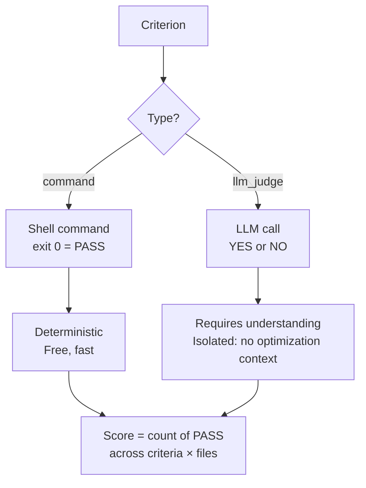
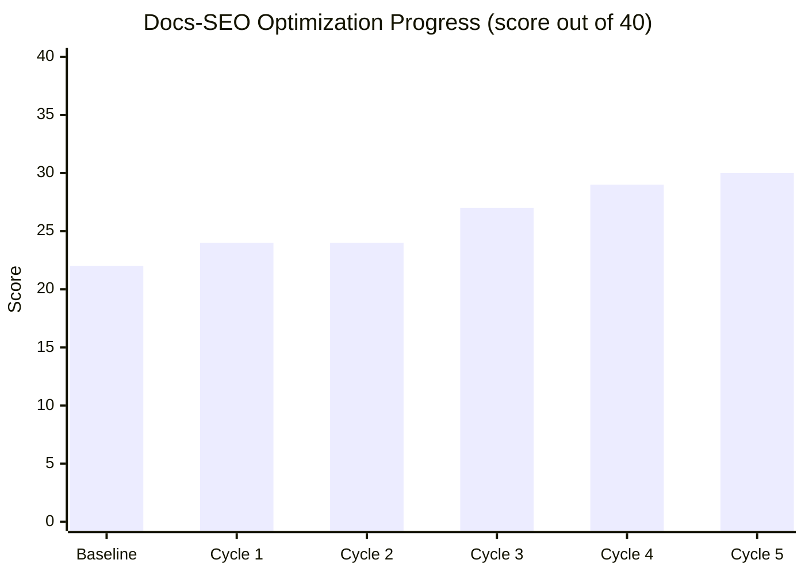

> *This is Part 3 of 5 in the Autoresearch Week series.*

On Monday I broke down Karpathy's autoresearch pattern and mentioned that the community was already generalizing it beyond ML. Yesterday I ported it to SageMaker with parallel hypothesis testing and per-experiment cost tracking. Both posts shared the same assumption: autoresearch is about training ML models.

Today I'm formalizing that generalization.

The core pattern — mutate an artifact, evaluate it against binary criteria, keep improvements, revert regressions — has nothing inherently to do with machine learning. It works anywhere you have a file you can change and a metric you can measure.

I've generalized this into a tool called **kiro-power-autoresearch**. If you haven't used [Kiro](https://kiro.dev) — it's an agentic IDE from AWS. Kiro Powers are declarative steering files that give the agent specialized capabilities without writing MCP servers or custom tools. Think of them as "skill packs" for your IDE agent. This Power brings autonomous optimization loops to any codebase.

Today I'm open-sourcing it, and I'll demonstrate the pattern on a problem that has zero to do with training neural networks.

**Repo**: [github.com/dgallitelli/kiro-power-autoresearch](https://github.com/dgallitelli/kiro-power-autoresearch)

## From One Criterion to Many

Karpathy's autoresearch has one binary gate: did `val_bpb` improve? That works for ML training, but most real-world optimization problems have multiple quality dimensions.

Consider documentation quality. A good doc page needs a short title (SEO), a meta description in the right character range (SEO), exactly one H1 heading (accessibility), internal links to related pages (navigation), and descriptive alt text on images (accessibility). Five independent criteria, each binary: pass or fail.

The generalization is straightforward: instead of `val_bpb < previous_best`, we count YES votes across all criteria and all sample items. The score is a count, not a number on a continuous scale. An improvement means strictly more passes than before.

This preserves Karpathy's key insight — binary evaluation eliminates interpretation drift — while extending it to multi-dimensional problems.

## The Generalized Loop

The Kiro Power implements the pattern as four phases:

**1. Scan & Plan** — Read-only analysis of the repository. The agent identifies optimization targets and suggests criteria.

**2. Define Criteria** — The human writes 4-8 binary yes/no criteria. Each criterion is either a shell command (exit code 0 = pass) or an LLM judge prompt (must answer YES or NO, nothing else). The agent establishes a baseline score on a fixed validation set.

**3. Run Loop** — The autonomous optimization cycle. Each iteration: select a mutation operator, apply it to the best-known artifact, generate outputs, evaluate all criteria, keep or revert.

**4. Analyze Results** — Score trends, operator effectiveness, hardest criteria, recommendations.

The loop uses six named mutation operators, rotating in fixed order:

| Operator | What it does |
|---|---|
| `add_constraint` | Add a specific rule or requirement |
| `add_negative_example` | Show what NOT to do |
| `add_counterexample` | Before/after pair (wrong → right) |
| `tighten_language` | Replace vague with precise |
| `remove_bloat` | Cut redundant content |
| `restructure` | Reorder, reformat, change flow |

One operator per cycle. One change at a time. This is the single-mutation rule from the original autoresearch — it enables clean attribution of what caused improvement or regression.

## Two Types of Evaluation

The generalized pattern supports two eval types, and the choice matters:



**Command evals** run shell commands. `grep -c '^# ' doc.md` checks heading count. `wc -w < review.txt` checks word count. Exit code 0 = pass. These are deterministic, free, and fast. Same input always gives same result.

**LLM judge evals** use an LLM to assess qualities that require understanding — readability, semantic correctness, tone. The judge sees ONLY the raw output plus the criterion text. No artifact content, no optimization goal, no mutation history. This isolation is critical: without it, the judge grades charitably because it knows what you're trying to achieve.

The rule: **command evals over LLM evals, always.** Use LLM judges only when no shell command can express the criterion.

## Demo 1: Documentation SEO Optimization

Let me make this concrete. I have 10 Markdown documentation pages with YAML frontmatter — a typical docs site. The goal: optimize them for SEO compliance using four command-based criteria:

| Criterion | Type | Check |
|---|---|---|
| `title_length` | command | Title under 60 chars |
| `meta_description` | command | Description 120-160 chars |
| `single_h1` | command | Exactly one H1 heading |
| `internal_links` | command | At least one .md link |

No LLM judge needed. Every criterion is a shell command.

**Baseline score: 22/40 (55%)**

The initial state has real problems: missing meta descriptions, titles over 60 characters, multiple H1 headings, pages with no internal links. Here's the per-doc breakdown:

| Doc | title | desc | h1 | links |
|---|---|---|---|---|
| advanced-config.md | ✅ | ❌ | ❌ | ❌ |
| api-reference.md | ❌ | ❌ | ❌ | ❌ |
| configuration.md | ❌ | ✅ | ✅ | ❌ |
| deployment.md | ❌ | ❌ | ✅ | ✅ |
| faq.md | ✅ | ✅ | ✅ | ❌ |
| getting-started.md | ✅ | ✅ | ✅ | ✅ |
| installation.md | ✅ | ✅ | ✅ | ✅ |
| migration-guide.md | ❌ | ❌ | ✅ | ❌ |
| troubleshooting.md | ✅ | ❌ | ❌ | ✅ |
| tutorial.md | ✅ | ❌ | ✅ | ✅ |

I ran the loop for 5 cycles. Here's what happened:



```
Cycle  Operator              Score  Status
----------------------------------------------
0      (baseline)            22/40  --
1      add_constraint        24/40  IMPROVED
2      add_negative_example  24/40  skipped
3      add_counterexample    27/40  IMPROVED
4      tighten_language      29/40  IMPROVED
5      remove_bloat          30/40  IMPROVED
```

**Final score: 30/40 (75%)** — a 36% relative improvement in 5 cycles.

The operators rotated in order: `add_constraint` fixed missing meta descriptions on two docs. `add_negative_example` found nothing to do (skipped). `add_counterexample` added internal links to three isolated pages. `tighten_language` shortened overly long titles. `remove_bloat` fixed duplicate H1 headings.

Cycle 2 was skipped — the operator found no applicable changes for the worst-failing criterion at that point. No change means no regression. Move to the next operator.

The ratchet worked exactly as expected: monotonic improvement, one operator at a time, clear attribution for every score increase.

## Operator Analysis: What Worked and Why

Before moving to principles, let's look at which operators actually contributed. In 5 cycles, 4 of 6 operators fired with improvements:

- **add_constraint** added missing meta descriptions — strongest when the artifact has gaps (things entirely absent).
- **add_counterexample** added internal links to isolated pages — providing a "before/after" where the before was no links.
- **tighten_language** shortened overly long titles — precise fixes where existing content needed trimming.
- **remove_bloat** fixed duplicate H1 headings by demoting extras to H2 — cutting structural redundancy.
- **add_negative_example** found nothing applicable (skipped) — it needs existing bad patterns to flag, which this dataset lacked.

The pattern: **additive operators fix early (missing structure), precision operators fix late (existing content). Early cycles address absence; later cycles address quality.** This matches what the community found with LLM training: early experiments make big architectural changes, later experiments fine-tune.

## The LLM Judge Pattern: Prompt Engineering

The docs-SEO demo used only command evals. But many domains require LLM judges — you can't grep for "hallucinated API" or "actionable suggestion."

The repo includes a second test case for this: a code review bot prompt optimized against 10 vulnerable code snippets (SQL injection, XSS, race conditions, auth bypasses). Five of six criteria use LLM judges:

| Criterion | Type | Check |
|---|---|---|
| `consistent_format` | LLM judge | Structured sections |
| `identifies_real_bug` | LLM judge | Finds genuine bug |
| `no_hallucinated_apis` | LLM judge | No invented APIs |
| `actionable_suggestions` | LLM judge | Specific fixes |
| `under_token_budget` | command | Under 500 words |

The key design constraint: the judge sees ONLY the review output plus the criterion question. It doesn't know about the system prompt being optimized. It doesn't know what cycle we're on. It answers YES or NO, nothing else. This isolation prevents charitable grading — the failure mode that plagued my early attempts before I learned principle #3.

The mutation operators work on the system prompt itself. `add_constraint` adds "always include a Summary section." `add_negative_example` adds "do not reference `asyncio.run_in_executor` unless the code actually uses it." `tighten_language` replaces "provide actionable feedback" with "for each bug found, show the exact line and a corrected version."

Same ratchet, same binary gate, different domain. The test case is pre-configured in the repo if you want to run it yourself.

## The Seven Principles

After building both test cases and studying the edge cases, I've distilled the pattern into seven core principles that apply regardless of domain:

**1. Mutate from the best, not the latest.** If cycle 5 regresses and you mutate from cycle 5's output, you're compounding the regression. Always start from `best_artifact.md`, never from the latest attempt. This seems obvious but every agent's default behavior is to work with the most recent file.

**2. One mutation per cycle.** If you change two things and the score improves, you don't know which one helped. In the docs-SEO demo, `add_constraint` improved the score by 2 in cycle 1. If I'd also applied `remove_bloat` in the same cycle, I wouldn't know whether the meta descriptions or the internal links drove the improvement. Single-change attribution is non-negotiable.

**3. Eval in isolation.** The judge sees only the output and the criterion. No context about the optimization goal. I learned this the hard way: in an early prototype, the LLM judge could see the system prompt being optimized. It started grading charitably — "the review mostly follows the requested format, YES" — because it could infer what I wanted. Stripping context fixed it immediately.

**4. Files are truth, not memory.** Re-read all state from disk every cycle. In a 30-cycle run, I found the agent's memory of cycle 3's results had drifted significantly from what `results.jsonl` actually recorded. Conversation context degrades over long sessions. Files don't.

**5. Binary only.** YES or NO. No scales, no "mostly good." I tried 1-5 scales early on and watched scores inflate from 3.2 to 4.1 over 10 cycles with no meaningful improvement in the actual artifact. Binary gates hold because there's nowhere to hide.

**6. Fixed validation set + coverage-first sampling.** A control group of items tested every cycle ensures apples-to-apples comparison across cycles. Beyond the control group, pick the least-tested items first — no item gets tested N+1 times while another has been tested fewer than N. Without this, you can "improve" by accidentally sampling easier items.

**7. Command evals over LLM evals.** Deterministic, free, reproducible. The docs-SEO demo used zero LLM calls and still drove a 36% improvement. Use LLM judges only when no shell command can express the criterion.

These aren't theoretical. Every principle came from watching the loop fail in a specific way and adding the constraint that prevented it.

## What's Next

Today we broke autoresearch out of ML training. The pattern works on docs, prompts, and anything with a binary eval. We also established principles for making the loop reliable: isolation, single mutations, file-based truth.

But all of this still requires understanding the loop mechanics, writing scripts, and wiring things together. What if the pattern was a single `pip install`?

**Tomorrow**: I'm shipping `autoresearchctl` — a CLI that bakes the seven principles, the dual eval harness, and the six mutation operators into six honest verbs. `init`, `eval`, `run`, `log`, `diff`, `rollback`.

---

*This is Part 3 of 5 in the Autoresearch Week series. [Part 1](../day1-the-autoresearch-pattern/) | [Part 2](../day2-autoresearch-on-sagemaker/)*
