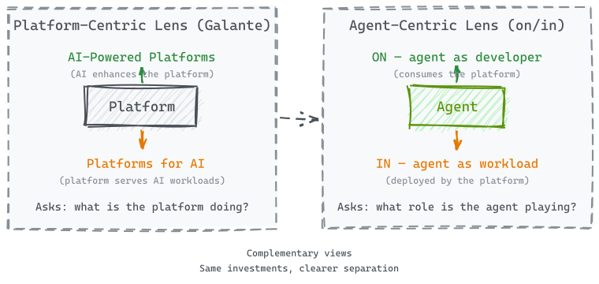
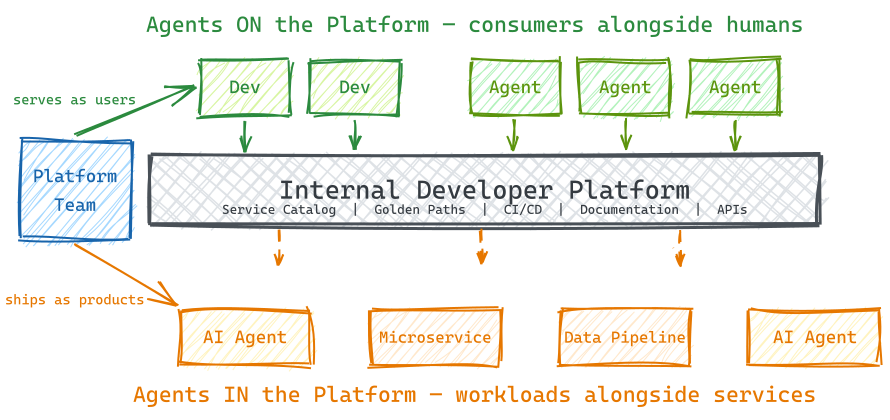
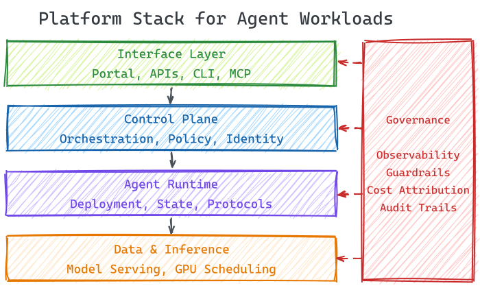
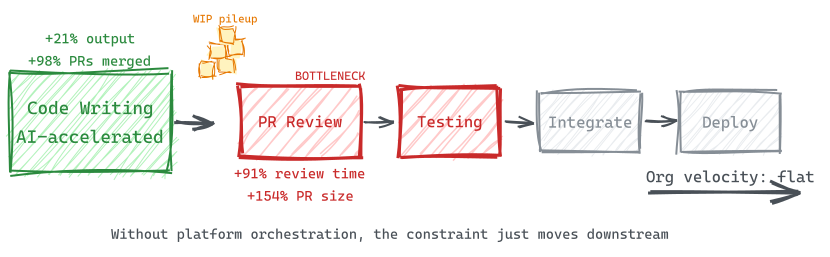
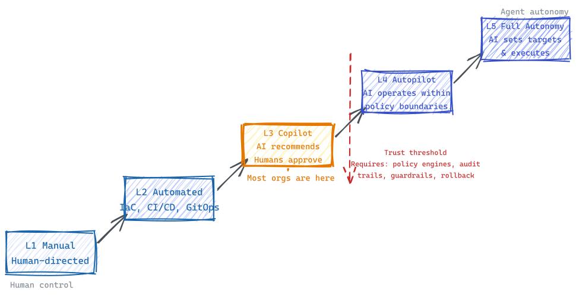

*The technical deep dive: how to architect your Internal Developer Platform for agents that consume it and agents that run on it.*

> **TL;DR:** AI agents create two distinct relationships with your platform: "agents *on* the platform" (consuming it like developers) and "agents *in* the platform" (running on it like workloads). Each has different failure modes, different architecture, and different governance needs. The vendor ecosystem is converging on MCP as the interface layer. Agents are to platform engineering in 2025–2026 what containers were to ops teams in 2014–2016. Start by auditing whether your platform APIs are machine-readable — if agents can't consume them, you have an "agents on" gap.

*Photo by [Danist Soh](https://unsplash.com/@danist07) on [Unsplash](https://unsplash.com)*

In [Part 1](../part1-the-production-gap/), we looked at the AI production gap from a leadership perspective — why 71% of CDOs are experimenting with generative AI but only 6% have it in production, and why the gap is an infrastructure problem, not a model problem. We introduced two distinct relationships: AI as a tool for your teams, and AI as part of your product.

This post is for the people who build the layer that closes that gap: platform engineers, Heads of AI Platform, and Staff+ engineers designing Internal Developer Platforms. Here, the vocabulary shifts to the precise architectural distinction: **agents *on* the platform** (consuming it as developers) and **agents *in* the platform** (running on it as workloads). Same concepts, engineering-grade framing. [Part 3](../part3-the-aws-playbook/) then takes the AWS-opinionated view — mapping these architectural patterns to Amazon Bedrock AgentCore and the new Agent Registry.

## Where Platform Engineering Stands Today

For context: the discipline has moved from emerging trend to industry standard in roughly four years. Gartner predicts that by 2026, 80% of software engineering organizations will have dedicated platform teams, up from 45% in 2024. It now has its own Gartner Hype Cycle (since 2024), and "Internal Developer Portals" is a recognized market category in Gartner Peer Insights.

The correlation with performance is notable. Humanitec's 2023 DevOps Benchmarking Study found that **93% of top-performing engineering teams** operate on an Internal Developer Platform maintained by a dedicated team. Among low performers, the figure was 2%.

Yet the field is strikingly young. The State of Platform Engineering Vol. 3 (platformengineering.org, 300+ teams surveyed) reports that **over 55% of platform teams are less than two years old**. PlatformCon expects 50,000+ virtual attendees in 2026. The 2024 DORA Accelerate State of DevOps Report made platform engineering a dedicated research area for the first time.

This matters for what follows: the organizations being asked to absorb the agentic AI wave are, in many cases, still building their foundational platform capabilities.

## The Existing Framing — and Where It Gets Blurry

The platform engineering community has been working with a useful framing, often attributed to Luca Galante (platformengineering.org): **"AI-powered platforms"** (using AI to enhance the Internal Developer Platform itself) versus **"Platforms for AI"** (building infrastructure for AI workloads). This framing centers on the platform and asks: *what should my platform team be doing?*

It works well for categorizing investments. But AI agents create an interesting ambiguity. An AI coding agent like Claude Code or Cursor simultaneously **consumes** the platform — querying service ownership, triggering CI/CD, reading golden paths — and can **be deployed** by the platform — containerized, monitored, cost-attributed, governed. The agent sits on both sides of Galante's line.

Shifting the lens from the platform to the agent clarifies things. Instead of "what is the platform doing with AI?" the question becomes "what role is the agent playing relative to the platform?" This reframing surfaces two distinct relationships that require different architecture, different tooling, and different organizational responses:

**Agents *on* the Platform (Agents as Developers)** — AI agents are consumers of the platform, just like human developers. They query the service catalog via MCP, use golden paths, trigger deployments, read documentation, and interact with self-service APIs. The platform must serve these machine consumers with declarative, API-first interfaces. The agent has agency but uses platform capabilities it didn't build.

**Agents *in* the Platform (Agents as Workloads)** — AI agents are artifacts that the platform productionizes. They are deployed, scaled, monitored, and governed by the platform — the same way the platform handles microservices or data pipelines today. The agent is the product being shipped, not the developer doing the shipping.

In practice, agents often straddle both relationships — an AI agent might use the platform's service catalog to understand dependencies, then get deployed by that same platform as a customer-facing product. The distinction isn't about putting agents in neat boxes; it's about recognizing that each relationship creates different platform requirements. The failure modes illustrate why: **they are completely different**. Getting "agents on the platform" wrong means your AI coding tools can't access organizational context — they generate plausible but wrong code because they can't see service dependencies. Getting "agents in the platform" wrong means your customer-facing AI products crash in production because nobody owns their reliability contracts. Same word — "agent" — entirely different platform engineering problems.

> **Key takeaway:** "Agents on" and "agents in" have completely different failure modes. Getting "on" wrong means agents can't see org context. Getting "in" wrong means agents crash in production. Separate them to get clear platform requirements.

What does it actually mean for agents to be platform consumers? In concrete terms: the platform now has a class of users that don't read UIs, don't attend onboarding sessions, and interact exclusively through APIs and protocols.

Every major Internal Developer Platform vendor made the same architectural bet in late 2025 through early 2026:

- **Backstage** added MCP (Model Context Protocol) server support and an Actions Registry
- **Humanitec** shipped MCP integration for their Platform Orchestrator (January 2026)
- **Port** rebranded around "Agentic Engineering Platform" with MCP integration
- **Cortex** launched "AI Chief of Staff" and Cortex MCP
- **OpsLevel** released an AI Maintenance Agent for automated code maintenance

The thesis is consistent: Internal Developer Platforms become the **knowledge layer** that AI agents query to understand organizational context — service ownership, deployment status, dependencies, compliance requirements. The platform doesn't just serve developers anymore; it serves the agents that developers delegate work to.

This has concrete design implications. Platform APIs must be machine-readable and declarative, not just human-usable through UIs. Crossplane's API-first approach addresses this directly. As CNCF's March 2026 analysis puts it: "Controllers handle mechanics, while agents focus on higher-level reasoning."

Thoughtworks Technology Radar Vol. 33 (November 2025) captures the enabling patterns: **AGENTS.md** (Trial ring) — a markdown convention enabling AI coding agents to access shared project guidance, effectively a "golden path for AI assistants." And **curated shared instructions** (Adopt ring) — teams sharing proven AI prompts through repository files for "equitable knowledge diffusion."

PlatformEngineering.org's predictions for 2026 formalize this as **"agent golden paths"** — permissions, governance, and workflows designed specifically for AI agent consumers, analogous to existing developer golden paths. The principle: "the agent proposes, the platform validates."

The results are already visible. Spotify's internal AI coding agent "Honk" has merged over 1,500 AI-generated PRs — but only because Backstage provides the organizational context that makes those PRs correct. Amazon's Q Developer migrated 30,000 Java applications internally, with 79% of auto-generated code shipped unchanged — enabled by standardized migration patterns and validation pipelines in the platform. These aren't just AI wins. They're platform wins that AI amplified.

One of the more detailed examples comes from Cisco's Outshift unit, presented at re:Invent 2025 by Neil Thompson (AWS) and Hasith Kalpage (Cisco). The impact numbers are worth noting: a dedicated 3-engineer support desk was nearly eliminated, LLM API key provisioning dropped from half a day to two minutes, and dev machine setup went from multi-day ticket queues to automated fulfillment with human-in-the-loop approval. Architecturally, Outshift built a multi-agent system — now open-sourced as CAPE (Cloud Native AI Platform Engineering) — on top of their existing platform. Developers interact with it through Backstage, Slack, Jira, and the CLI. A centralized platform agent delegates to specialized sub-agents (catalog, CI/CD, Kubernetes, security), each with their own MCP servers and scoped tools, communicating over A2A (Agent-to-Agent) protocol when distributed. Kalpage noted that the biggest challenge wasn't technical — it was building trust in AI systems across the team.

## Agents in the Platform: What It Looks Like in Practice

The previous examples all describe agents consuming the platform. But there's a second relationship that's less discussed in the developer tooling discourse and arguably more consequential for the business: AI agents as a **new workload type** that the platform productionizes.

As covered in [Part 1](../part1-the-production-gap/), the gap between experimentation and production is vast. The distance between "works in a notebook" and "runs reliably at scale" — deployment patterns, observability, governance, cost management — is precisely what platform engineering provides.

Concretely, agents require the same platform capabilities that any production workload demands — with some new dimensions worth examining:

**Deployment patterns** are crystallizing around three approaches: containerized agents on Kubernetes (CNCF's default recommendation), managed agent runtimes (AWS Bedrock AgentCore (GA), LangGraph Platform), and declarative agent-as-code frameworks (AURA by Mezmo, using TOML config files version-controlled alongside K8s manifests). The platform engineering question here is whether to provide opinionated golden paths across these options or let individual teams choose independently.

**Observability** goes beyond traditional APM. The OpenTelemetry GenAI SIG is developing semantic conventions for agent applications — tracking token usage, tool call success rates, inference latency, cost per request, and reasoning trace visibility. Dynatrace already monitors agents via these conventions, including toxicity detection, PII leak alerts, and SLO targets. The challenge for platform teams is integrating these AI-specific signals into an existing observability stack without creating a parallel monitoring universe.

**Governance** is where the stakes are highest. PlatformEngineering.org's Agent Reliability Score provides a 28-test framework adapted from Google's ML Test Score, spanning context/data integrity, agent architecture, infrastructure/orchestration, and monitoring/governance. Their core thesis is that AI agents don't primarily fail because of model limitations — they fail because the platform layer lacks reliability contracts. Scores of 22–28 indicate operational maturity. Below that, agents carry material production risk.

**State management** is the hard problem. Unlike stateless microservices, agents need persistent memory, session context, and conversation history. LangGraph Platform solves this with persistent state across threads. AWS AgentCore provides session isolation for workloads up to 8 hours. CrewAI separates deterministic backbone (Flows) from scoped intelligence (Agents/Crews). The platform must abstract this complexity the way it abstracts database provisioning today.

The analogy practitioners keep reaching for: **agents are to platform engineering in 2025–2026 what containers were to ops teams in 2014–2016** — a new workload type that demands new deployment patterns, observability, governance, and reliability contracts from the platform layer.

> **Key takeaway:** Agents need deployment patterns, AI-specific observability (tokens, tool calls, reasoning traces), governance with reliability contracts, and state management. The platform must abstract this complexity the way it abstracts database provisioning today.

## The Productivity Paradox

The productivity data from [Part 1](../part1-the-production-gap/) — individual developer output up 21%, PRs merged up 98%, organizational delivery velocity flat — is a familiar pattern for platform engineers. It's the theory of constraints playing out in real time: AI accelerated code writing, but the bottleneck shifted downstream to review, testing, and integration.

Without platform-level orchestration — automated testing gates, intelligent review routing, deployment guardrails, standardized quality checks — more code production simply creates more work-in-progress. The constraint moves downstream. This is the "agents on the platform" problem: agents consume the platform, but the platform isn't designed for machine consumers.

The "agents in the platform" problem has its own version. Without reliability contracts, governance frameworks, and production-grade observability, AI agents deployed to production compound errors instead of value. The pattern suggests that capturing AI's productivity promise requires investment in the platform layer — both for agents using it and agents running on it.

## The Structural Shift: Governing Autonomous Systems

Both mandates — agents on and agents in — are part of a larger transition. An AWS blog by Parasuraman and Madden captures it concisely: "Cloud started as a platform for applications. With AI, it is now a platform for intelligence. With agentic AI, it becomes a platform for delegated action." The governance implication is the key insight for platform teams: the shift isn't from manual to automated, it's from governing predictable systems to orchestrating autonomous ones.

This is already showing up in infrastructure. Kubernetes v1.35 shipped Dynamic Resource Allocation (DRA) to General Availability, making GPU scheduling a first-class concern. CNCF projects like Model Runtime and Agent Runtime are gaining traction. A three-plane model is emerging: a **control plane** (Kubernetes + policy engines), a **data plane** (model serving, feature stores, vector databases), and a **governance plane** (audit trails, model provenance, compliance enforcement).

But the convergence is incomplete — CNCF research reveals that **only 41% of professional AI developers currently identify as cloud native**. Platform engineers think in infrastructure primitives; ML engineers think in model performance metrics. Bridging this vocabulary gap requires shared golden paths and cross-functional team structures — organizational design work, not just technical integration.

## Governance Cuts Across Both Mandates

In an era of AI-accelerated shadow IT (flagged as a Hold item in Thoughtworks Radar Vol. 33), prompt injection risks, and probabilistic systems that produce variable outputs, governance becomes the platform team's most valuable offering — and it applies to both "on" and "in."

For **agents on the platform**: governance means controlling what agents can access and do. Agent golden paths define permissions boundaries. The AGENTS.md convention standardizes what context agents receive. Policy-as-code gates prevent agents from triggering destructive operations. Platformengineering.org warns specifically about "naive API-to-MCP conversion" — blindly exposing platform APIs to autonomous agents without safeguards.

For **agents in the platform**: governance means production reliability contracts. CNCF's Cloud Native Agentic Standards (March 2026) define four pillars: security (least privilege, secrets management, runtime monitoring), observability (token consumption, tool interaction latency, cost tracking), communication protocols (MCP, A2A (Agent-to-Agent), SPIFFE/SPIRE for workload identity), and control/fault tolerance (GitOps-driven orchestration, schema validation, contingency planning).

The threat model spans both mandates. CNCF's March 2026 analysis adapts OWASP's framework to identify four critical risks: prompt injection (analogous to SQL injection), information disclosure (model memorization leaking secrets), supply chain risks (binary model artifacts lacking transparency), and excessive agency (models making probabilistic authorization decisions). Nigel Douglas at Cloudsmith warns about Trojanized AI skills in public repositories — the agent equivalent of malicious npm packages.

What's emerging as a response is architectural rather than procedural governance. Policy engines like OPA (Open Policy Agent), Kyverno, and Cedar are becoming standard infrastructure in this space. The EU AI Act's requirements for auditable logs, explainable decision chains, and human-in-the-loop for high-risk actions further accelerate this — embedding compliance into the platform layer rather than layering it on after the fact.

There's also a cost governance dimension worth noting. Traditional FinOps tracks cloud spend by service, account, and team. With agents, spending becomes dynamic — a single request may trigger a chain of actions across multiple services. Parasuraman and Madden frame this as the evolution from FinOps to **"AI Economics"**: tracking token usage, tracing costs across agent decision chains, and enforcing real-time spending guardrails. The question shifts from "who spent what?" to "which agents consumed resources and why those decisions were made." The Agent Efficiency Index (AEI), proposed by Forbes as a new success metric, compares actual agent steps to optimal paths — measuring the quality of autonomous decisions, not just their cost.

## The Autonomy Ladder

The on/in distinction also maps to a question of degree: how much autonomy should agents have? The industry is converging on a five-level model (analogous to self-driving vehicles), from L1 (manual, script-based operations) through L3 (copilot — AI recommends, humans approve) to L5 (full autonomy — AI sets targets and executes independently).

For "agents on the platform," the level describes how much you trust coding agents to act on your infrastructure without human approval. For "agents in the platform," it describes operational maturity — from manually supervised workloads to self-healing ones. Most organizations sit at L2–L3 today. ServiceNow's 2025 Enterprise AI Maturity Index found that **fewer than 1% of organizations scored above 50 out of 100** on AI operational maturity. Only 26% achieve full-stack observability — a prerequisite for any meaningful agent deployment.

Dababneh at platformengineering.org frames the responsible approach as **"bounded autonomy"** — agents operate within platform-defined constraints, never as independent actors. Start with 100% human review, gradually reduce oversight as systems prove reliability. One case study showed an HR agent earning autonomy over 50% of tickets only after thousands of consistent decisions.

## Questions Worth Asking

The "on/in" distinction provides a useful diagnostic. Here are five questions that map to it. If you answer "no" to questions 3 and 4, you have platform gaps in both agent mandates:

**1. Does the platform team own both agent relationships?**
If GPU orchestration, model serving, and AI governance are being reinvented by every team independently, that's what platformengineering.org calls "organizational debt" — and it tends to compound.

**2. Are AI metrics measuring organizational outcomes or just individual output?**
Port's earnings call analysis found nobody connecting AI tool adoption to delivery outcomes. Deployment frequency, lead time, change failure rate, and MTTR — the DORA metrics — are what actually correlate with performance. "% of code written by AI" is an input metric, not an outcome metric.

**3. Can agents use the platform, or only humans?**
If platform APIs aren't machine-readable and declarative, agents can't consume them. MCP integration is the interface layer between the platform and the autonomous workflows teams are building. This is the "agents on" diagnostic.

**4. Can the platform ship agents to production, or only traditional workloads?**
Agent deployment golden paths, observability for token usage and tool calls, reliability contracts, governance frameworks — this is the "agents in" diagnostic.

**5. Where on the autonomy ladder, and what needs to be true to move up?**
L3 (copilot) is a reasonable near-term position for most organizations. L4 (autopilot) requires platform maturity that most teams — especially those under two years old — don't yet have.

## Putting It Together

Google Cloud's research found that **94% of organizations identify AI as critical to the future of platform engineering**, and **86% believe platform engineering is essential for realizing AI's business value**. The convergence is not in question. What's missing is a clear way to reason about it.

The "on/in" distinction offers one. Agents on the platform need machine-readable APIs, MCP integration, and context-rich interfaces. Agents in the platform need deployment runtimes, observability pipelines, reliability contracts, and governance frameworks. Treating these as one problem — "AI and platforms" — leads to architectural confusion. Separating them gives platform teams a clearer mandate and engineering leadership a clearer investment thesis.

If you want a concrete starting point: audit your platform's top 10 APIs and ask whether an AI agent could consume them today without a human translating the response. If the answer is no — if the APIs return HTML dashboards, require UI-based authentication flows, or lack machine-readable error codes — that's your first "agents on" project. For "agents in," pick one agent your team has built and ask: could we deploy a new version of this agent to production in under an hour, with automated evaluation, rollback capability, and a cost attribution trail? If not, that's your first "agents in" project.

There's an irony worth noting. Platform engineering emerged because DevOps left too much cognitive load on individual teams — everyone was expected to own their own infrastructure, tooling, and deployment. The agentic AI wave is creating the same pattern one level up: every team building their own agent infrastructure, their own MCP integrations, their own governance. Platform engineering exists to absorb exactly this kind of complexity. The question is whether organizations recognize the pattern before the organizational debt compounds.

---

*This is Part 2 of the Platform Engineering for AI Agents series. [Part 1: Why Your AI Program Stalls Between Pilot and Production](../part1-the-production-gap/) covers the business case. [Part 3: The AWS Playbook](../part3-the-aws-playbook/) covers the AWS-opinionated view with AgentCore and Agent Registry.*

---

## Sources

1. Gartner Hype Cycle for Emerging Technologies (2022–2024); Gartner prediction on 80% platform team adoption by 2026
2. Humanitec DevOps Benchmarking Study 2023 — [humanitec.com/whitepapers/devops-benchmarking-study-2023](https://humanitec.com/whitepapers/devops-benchmarking-study-2023)
3. Forrester Opportunity Snapshot (Feb 2023) — [humanitec.com/whitepapers/platform-engineering-forrester-opportunity-snapshot](https://humanitec.com/whitepapers/platform-engineering-forrester-opportunity-snapshot)
4. State of Platform Engineering Vol. 3 — [platformengineering.org/state-of-platform-engineering-vol-3](https://platformengineering.org/state-of-platform-engineering-vol-3)
5. DORA Accelerate State of DevOps Report 2024 — [dora.dev/research/2024/dora-report](https://dora.dev/research/2024/dora-report/)
6. PlatformCon 2025/2026 — [platformcon.com](https://platformcon.com)
7. CNCF Platform Engineering Maturity Model — [tag-app-delivery.cncf.io/whitepapers/platform-eng-maturity-model](https://tag-app-delivery.cncf.io/whitepapers/platform-eng-maturity-model/)
8. CNCF Platforms White Paper — [tag-app-delivery.cncf.io/whitepapers/platforms](https://tag-app-delivery.cncf.io/whitepapers/platforms/)
9. CNCF: "The Platform Under the Model" (March 2026) — [cncf.io/blog/2026/03/26/the-platform-under-the-model](https://www.cncf.io/blog/2026/03/26/the-platform-under-the-model-how-cloud-native-powers-ai-engineering-in-production/)
10. CNCF: Cloud Native Agentic Standards (March 2026) — [cncf.io/blog/2026/03/23/cloud-native-agentic-standards](https://www.cncf.io/blog/2026/03/23/cloud-native-agentic-standards/)
11. CNCF: Crossplane and AI (March 2026) — [cncf.io/blog/2026/03/20/crossplane-and-ai](https://www.cncf.io/blog/2026/03/20/crossplane-and-ai-the-case-for-api-first-infrastructure/)
12. CNCF: LLMs on Kubernetes Threat Model (March 2026) — [cncf.io/blog/2026/03/30/llms-on-kubernetes-part-1](https://www.cncf.io/blog/2026/03/30/llms-on-kubernetes-part-1-understanding-the-threat-model/)
13. CNCF: llm-d CNCF Sandbox Project (March 2026) — [cncf.io/blog/2026/03/24/welcome-llm-d](https://www.cncf.io/blog/2026/03/24/welcome-llm-d-to-the-cncf-evolving-kubernetes-into-sota-ai-infrastructure/)
14. Thoughtworks Technology Radar Vol. 33 (November 2025) — [thoughtworks.com/radar](https://www.thoughtworks.com/radar)
15. Martin Fowler: Platform Prerequisites — [martinfowler.com/articles/platform-prerequisites.html](https://martinfowler.com/articles/platform-prerequisites.html)
16. Port: "63 Earnings Calls, 0 Engineering Outcomes Tied to AI" (March 2026) — [port.io/blog](https://www.port.io/blog)
17. Spotify Engineering: Backstage 5th Anniversary, Honk AI Agent — [engineering.atspotify.com](https://engineering.atspotify.com)
18. Booz Allen Hamilton: Building Enterprise Generative AI Applications — [boozallen.com](https://www.boozallen.com/content/dam/home/docs/ai/building-enterprise-generative-ai-applications.pdf)
19. PlatformEngineering.org: AI and Platform Engineering — [platformengineering.org/blog/ai-and-platform-engineering](https://platformengineering.org/blog/ai-and-platform-engineering)
20. PlatformEngineering.org: Agent Reliability Score — [platformengineering.org/blog/the-agent-reliability-score](https://platformengineering.org/blog/the-agent-reliability-score-what-your-ai-platform-must-guarantee-before-agents-go-live)
21. PlatformEngineering.org: The Rise of Agentic Platforms — [platformengineering.org/blog/the-rise-of-agentic-platforms](https://platformengineering.org/blog/the-rise-of-agentic-platforms-scaling-beyond-automation)
22. PlatformEngineering.org: 10 Platform Engineering Predictions for 2026 — [platformengineering.org/blog/10-platform-engineering-predictions-for-2026](https://platformengineering.org/blog/10-platform-engineering-predictions-for-2026)
23. PlatformEngineering.org: Agent Skills and Platform Engineering — [platformengineering.org/blog/agent-skills](https://platformengineering.org/blog/agent-skills-are-changing-platform-engineering)
24. AWS: Accelerating GenAI with Platform Engineering (November 2025) — [aws.amazon.com/blogs/machine-learning/accelerating-generative-ai-applications-with-a-platform-engineering-approach](https://aws.amazon.com/blogs/machine-learning/accelerating-generative-ai-applications-with-a-platform-engineering-approach/)
25. AWS Bedrock AgentCore — [aws.amazon.com/bedrock/agentcore](https://aws.amazon.com/bedrock/agentcore/)
26. OpenTelemetry: AI Agent Observability — [opentelemetry.io/blog/2025/ai-agent-observability](https://opentelemetry.io/blog/2025/ai-agent-observability/)
27. ServiceNow Enterprise AI Maturity Index 2025
28. Deimos: Agentic AI's Role in Modern IT Operations — [deimos.io/blog-posts/agentic-ais-role-in-modern-it-operations](https://www.deimos.io/blog-posts/agentic-ais-role-in-modern-it-operations)
29. Google Cloud: AI and Platform Engineering Survey (2025) — [futurumgroup.com](https://futurumgroup.com/press-release/platform-engineers-critical-to-ai-adoption-in-2026/)
30. Faros AI: Developer Productivity Study (10,000 developers) — cited via Port's "63 Earnings Calls" analysis (source 16)
31. Anthropic: Building Effective Agents — [anthropic.com/engineering/building-effective-agents](https://www.anthropic.com/engineering/building-effective-agents)
32. Patrick Debois: AI Native Development / AI Platform Engineering — [jedi.be/blog](https://www.jedi.be/blog/)
33. AWS re:Invent 2025 — OPN303: "Building Agentic AI Platform Engineering Solutions with Open Source" (Neil Thompson, Hasith Kalpage / Cisco Outshift) — [youtube.com/watch?v=xwzInf90iUc](https://www.youtube.com/watch?v=xwzInf90iUc)
34. AWS: "When Software Thinks and Acts — Reimagining Cloud Platform Engineering for Agentic AI" (Parasuraman, Madden, March 2026) — [aws.amazon.com/blogs/migration-and-modernization](https://aws.amazon.com/blogs/migration-and-modernization/when-software-thinks-and-acts-reimagining-cloud-platform-engineering-for-agentic-ai/)
