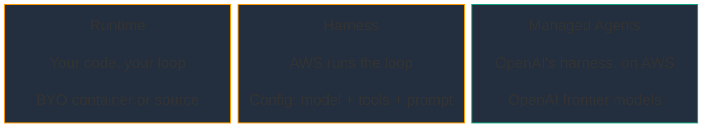
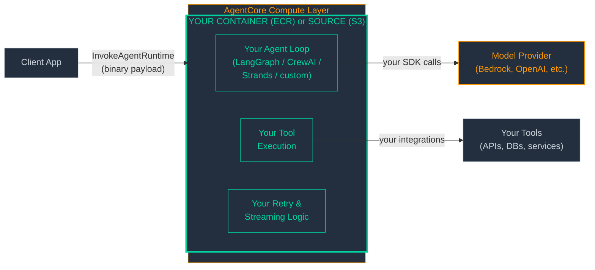
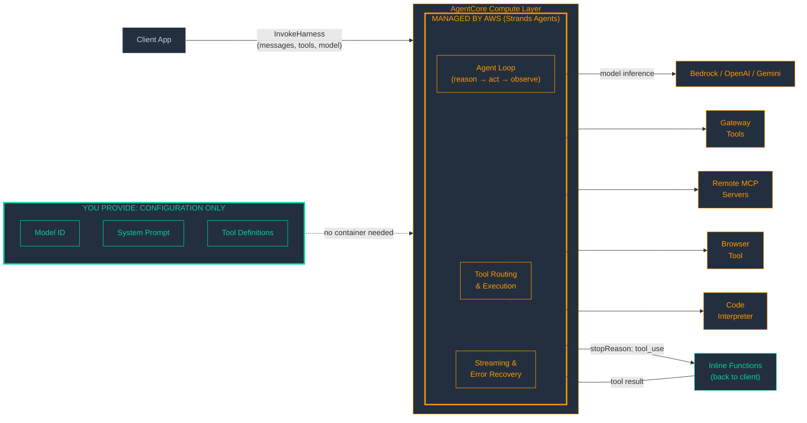
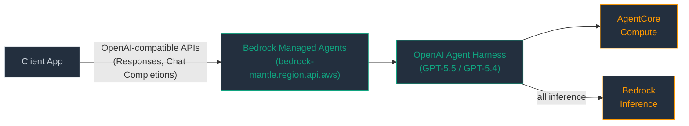
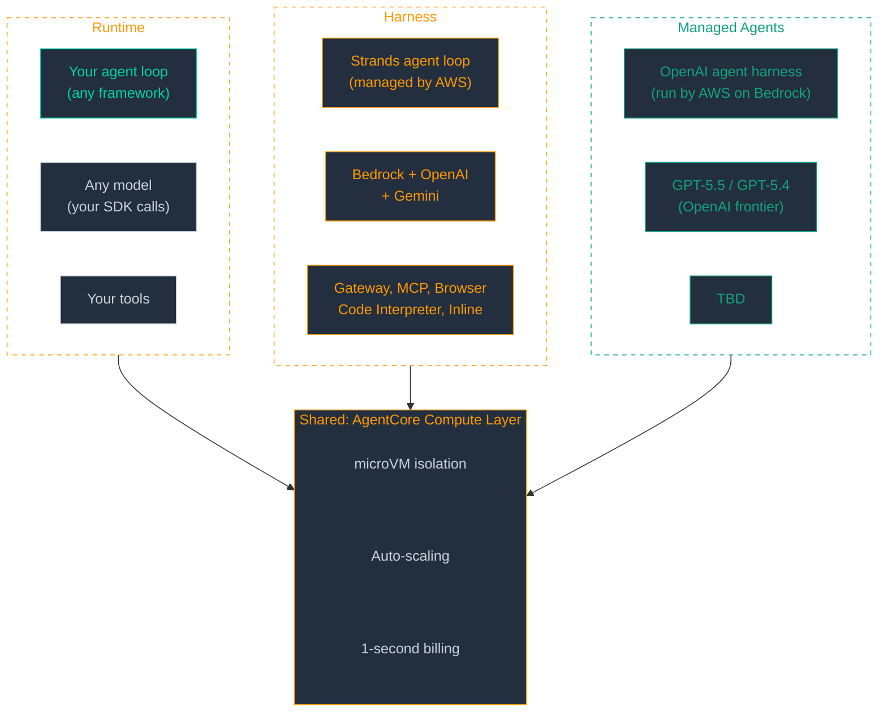
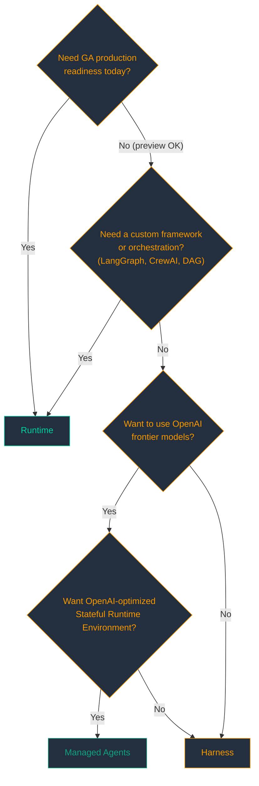

*AWS now has three distinct ways to deploy AI agents — and choosing wrong means either rebuilding later or paying for infrastructure you don't need.*


*Photo by [Joey Chacon](https://unsplash.com/@joey_noside) on [Unsplash](https://unsplash.com)*

---

AgentCore Runtime has been generally available since October 2025, giving teams a solid "bring your own container" path to production agents. But the managed side of the story was still taking shape — until April 2026 changed the picture fast.

On April 22, AWS launched the **Harness** (managed agent loop) in public preview. Six days later, the "What's Next with AWS" event dropped a third option: **Bedrock Managed Agents, powered by OpenAI** — backed by a $50 billion Amazon investment in OpenAI and running GPT-5.5 and GPT-5.4 on Bedrock infrastructure — in limited preview.

Enterprise architects now face a three-way fork. Each option sits at a different point on the control-versus-convenience spectrum, with distinct model support, protocol compatibility, and cost profiles. This post maps the architecture of all three, compares what we know about costs, and ends with a decision framework.

> **Scope note.** AgentCore Runtime is generally available. Harness is in public preview. Bedrock Managed Agents, powered by OpenAI, is in limited preview — pricing and API surface may change. This analysis uses the April 29, 2026 API definitions. Views expressed here are my own, not an official AWS position.

---

## The Three Execution Models at a Glance

Before we compare the three, a terminology note. The **agent loop** is the core reasoning cycle: the model generates a response, decides to call a tool, receives the result, and reasons again — repeat until done. An **agent harness** is the infrastructure that *manages* that loop: tool routing, streaming, error recovery, context management, and observability. You can write your own harness (that's what frameworks like LangGraph, CrewAI, and Strands Agents give you), or you can use a managed one. The three execution models below differ primarily in who provides the harness — you, AWS, or OpenAI.

The fundamental question is: *who runs the agent loop?* The model-tool-model cycle that turns a single LLM call into a multi-step reasoning agent — who owns that code?



Here's the comparison across every axis that matters for an architectural decision:

| Aspect | Runtime | Harness | Managed Agents (OpenAI) |
|---|---|---|---|
| What you deploy | Container (ECR) or source code (S3) | Configuration (model + tools + prompt) | Configuration (limited preview) |
| Who runs the agent loop | Your code | AWS (Strands Agents, per AWS docs) | OpenAI's harness, managed by AWS on Bedrock |
| Models supported | Any (your code calls them) | Bedrock + OpenAI + Gemini | OpenAI frontier (GPT-5.5, GPT-5.4) |
| Per-call model/tool override | No (baked into your code) | Yes | TBD |
| Protocols | HTTP, MCP, A2A, AG-UI | AWS API only (`InvokeHarness`) | OpenAI-compatible APIs |
| Tool types | Whatever you implement | 5 configurable types + built-in shell and filesystem | TBD |
| Memory | Manual (use AgentCore Memory SDK) | Managed (requires explicit Memory resource setup) | TBD |
| GA status | GA | Preview | Limited preview |

The "TBD" column for Managed Agents is honest, not evasive. Limited preview means the API surface is not yet public. And here's the thing about architectural decisions: the only option you can bet on for production today is Runtime. Harness is in preview — usable and worth evaluating, but not yet GA. Managed Agents is an earlier preview you can plan for, not a production bet you can make.

---

## AgentCore Runtime: Bring Your Own Brain

Runtime is the least opinionated option. You bring a container image (pushed to ECR) or a Python source bundle (uploaded to S3 with an entry point), and AWS provides the compute environment — microVMs with session isolation, auto-scaling, and a managed API surface.

Your code *is* the agent. You own the orchestration loop, the model calls, the tool execution, the retry logic, the context window management. AWS runs the box; you run everything inside it.



The session model is `InvokeAgentRuntime` with an opaque binary payload — AWS doesn't inspect or structure your messages. Versioning is built in: each `UpdateAgentRuntime` creates a new version, and endpoints pin to specific versions. This gives you blue-green deployments for free.

Invoking a Runtime agent is straightforward — you send a binary payload and stream the response:

```python
import boto3, json

client = boto3.client("bedrock-agentcore")

response = client.invoke_agent_runtime(
    agentRuntimeArn="arn:aws:bedrock-agentcore:us-east-1:123456789012:runtime/my-agent",
    runtimeSessionId=session_id,
    payload=json.dumps({"prompt": "Summarize yesterday's incidents"}).encode(),
)

for line in response["response"].iter_lines():
    if line:
        print(line.decode("utf-8"))
```

The payload is opaque bytes — your agent code on the other side parses it however you want. AWS never inspects the content.

The protocol story is strong. Your agent running on Runtime can expose itself as an MCP server, an A2A (Agent-to-Agent) participant, or an AG-UI endpoint. This matters for multi-agent architectures where agents need to discover and call each other — Runtime agents can *be* the services that other agents consume.

**When Runtime shines:**

- You already have a framework investment — LangGraph, CrewAI, Strands Agents, custom — and don't want to rewrite
- Your orchestration is a state machine or DAG, not a simple ReAct loop
- You need your agent to expose MCP, A2A, or AG-UI endpoints for other agents to discover
- You want full control over which models you call, when, and how

**The trade-off:** Maximum control, minimum managed features. You own the loop, the retry logic, the prompt engineering, the streaming implementation. If Harness adds a new tool type tomorrow, you build your own equivalent or wait for your framework to support it.

---

## AgentCore Harness: The Managed Agent Loop

Harness inverts the Runtime model. Instead of deploying code, you deploy *configuration*: a model identifier, a set of tools, a system prompt, and optionally a set of skills. AWS runs the agent loop internally — according to AWS documentation, this is powered by the Strands Agents framework — and you interact with it through the structured `InvokeHarness` API.



The killer feature is **per-invocation overrides**. Every call to `InvokeHarness` can specify a different model, different tools, different system prompt, different skills, `allowedTools` filters, `maxIterations`, `maxTokens`, and `timeoutSeconds`. You can swap from Claude Sonnet to GPT-5.4 between turns without redeploying anything. Try doing that with a container.

Here's a minimal Harness invocation — create the resource once, then call it with structured messages:

```python
import boto3, uuid

client = boto3.client("bedrock-agentcore")

# One-time setup: create the harness
harness = client.create_harness(
    name="support-agent",
    executionRoleArn=role_arn,
    model={"bedrockModelConfig": {"modelId": "anthropic.claude-sonnet-4-6-20260514"}},
    systemPrompt=[{"text": "You are a helpful support agent."}],
)

# Invoke — structured messages, not opaque bytes
response = client.invoke_harness(
    harnessArn=harness["harnessArn"],
    runtimeSessionId=str(uuid.uuid4()),
    messages=[{"role": "user", "content": [{"text": "What's the status of ticket #1234?"}]}],
    tools=[{
        "type": "agentcore_gateway",
        "name": "ticketing",
        "config": {"agentCoreGateway": {"gatewayArn": gateway_arn}},
    }],
)
```

No container, no framework code, no deployment pipeline. The Harness manages the agent loop, tool routing, and streaming. Note that today Harness is accessible only through the AWS API (`InvokeHarness` via SDK or CLI) — there is no HTTP/MCP/A2A endpoint exposure like Runtime offers, though this may expand in the future.

Harness supports five configurable tool types, plus built-in `shell` and `file_operations` tools that are available in every session by default:

1. **`remote_mcp`** — connects to external MCP servers
2. **`agentcore_gateway`** — tools registered in AgentCore Gateway
3. **`agentcore_browser`** — managed browser for web interaction
4. **`agentcore_code_interpreter`** — sandboxed code execution
5. **`inline_function`** — the escape hatch

That last one deserves attention. Inline functions let the Harness *pause* execution (streaming back a `stopReason: "tool_use"` event), hand control to your application code, and resume when you send back the tool result. Your code executes locally — not in the Harness compute environment — which means you can access local databases, internal APIs, or anything behind your firewall without exposing it to the agent's compute layer.

**Memory** is available but requires explicit setup. You create a Memory resource, configure it on the Harness, and then session history loads transparently per session. This is not zero-config — you provision it.

**Skills** use a `HarnessSkill` type with a filesystem path-based reference (the only variant available today). Skill content loaded via AgentCore Registry is capped at 100KB.

**When Harness shines:**

- You're starting fresh and want the fastest path to a production agent
- You need multi-model flexibility without redeployment
- Your agent pattern is model-driven (ReAct-style: reason, act, observe, repeat)
- You want managed tool integrations — browser, code interpreter, MCP — without building connectors

**The trade-off:** Maximum flexibility with zero framework code. But the orchestration pattern is fixed: a model-driven loop where the LLM decides what to do next. If your workflow is a deterministic DAG with conditional branches, or a multi-agent graph where different agents hand off to each other, the Harness's single-loop model won't fit. That's Runtime territory.

---

## Bedrock Managed Agents, Powered by OpenAI: The Newcomer

Announced April 28, 2026 at "What's Next with AWS" — this is the product of the $50 billion Amazon investment in OpenAI. The premise: use OpenAI's own agent harness, engineered to unlock the full potential of OpenAI frontier models (GPT-5.5, GPT-5.4), running on AgentCore compute with all inference flowing through Bedrock.

This is architecturally distinct from using Harness with an OpenAI model configuration. Harness uses AWS's agent loop (Strands) with OpenAI models. Managed Agents uses *OpenAI's* agent harness — their orchestration logic, built by the same team that built the models — but it runs as a managed runtime within AWS infrastructure, with all inference on Bedrock. OpenAI designed the harness; AWS operates it.



The service uses OpenAI-compatible APIs through Bedrock's existing `bedrock-mantle.{region}.api.aws/v1` endpoint — the same OpenAI-compatible inference surface that Bedrock has offered since late 2025 for the Responses API, Chat Completions API, and Models API. If you've built against the OpenAI SDK, the migration path is URL and auth, not code.

Here's what's confirmed:

- All inference runs through Bedrock — data never leaves AWS
- Each agent gets its own identity and action logging
- AgentCore provides the default compute environment
- Planned future: AgentCore Policy enforcement, Registry/Gateway integration, observability parity

Here's what's not yet confirmed: pricing, tool integrations, memory model, per-call overrides, and the exact API surface. Limited preview means these are subject to change.

The architectural promise is compelling. A model provider's own orchestration, tuned for their frontier models, is likely to extract more capability per token than a generic ReAct loop. But today you can't evaluate that empirically. The item to watch is the **Stateful Runtime Environment** — co-developed by OpenAI and Amazon, coming "in the next few months" — which will enable persistent state across sessions. That's the real architectural shift, not just another managed agent option.

---

## The Architecture Compared

All three execution models share the same foundational infrastructure: AgentCore's compute layer with microVM isolation, per-session sandboxing, and 1-second billing granularity. The differentiation is in the orchestration layer — who runs the agent loop, what models they support, and what tools they integrate.



The shared compute layer is the unifying design principle. Whether your agent loop is a LangGraph state machine, a Strands ReAct cycle, or OpenAI's own orchestration, it runs in the same isolated, auto-scaled, per-second-billed environment. The control plane differences are real; the data plane is common.

---

## The Cost Question

For enterprise architects, this is often the deciding section. Here's what we know.

### Known Pricing (GA Services)

| Component | Pricing |
|---|---|
| AgentCore compute (Runtime + Harness) | $0.0895/vCPU-hour, $0.00945/GB-hour (active consumption, 1-second billing) |
| Harness orchestration | Free (pay for compute + model inference) |
| Gateway | $0.005/1K invocations, $0.025/1K search queries |
| Memory | $0.25/1K events, $0.75/1K records stored/month, $0.50/1K retrievals |
| Identity | $0.010/1K token requests (free via Runtime/Gateway) |

> **Preview pricing note.** The Harness orchestration layer is currently free per the [AgentCore pricing page](https://aws.amazon.com/bedrock/agentcore/pricing/), and the underlying compute rates match Runtime (which is GA). However, Harness is still in public preview — pricing may change before general availability.

The critical detail in the pricing model: **AgentCore bills for active resource consumption, not allocated time.** Unlike traditional compute services that charge for a fixed instance size per second, AgentCore only charges for actual CPU usage. During I/O wait — when your agent is waiting for an LLM response, a tool call, or a database query — CPU charges drop to zero if no background process is running. AWS estimates that agentic workloads spend 30-70% of time in I/O wait, which means your effective compute cost can be significantly lower than a naive vCPU-hours calculation would suggest. Memory is billed at peak consumption per second.

The Harness itself adds zero orchestration surcharge. You pay the same compute rate whether you're running your own code on Runtime or letting Harness run the loop. The cost difference between Runtime and Harness is not in AWS billing — it's in what you build and maintain.

### Cost Structure Per Execution Model

**Runtime:** Compute (vCPU-hours while the session is active) + model inference (your provider's pricing) + optional AgentCore services (Gateway, Memory, Identity). You also bear the engineering cost of building and maintaining the agent loop, container builds, and deployment pipelines.

**Harness:** Same compute + same model inference + no orchestration surcharge. Configuration replaces code — no containers to build, no deployment pipelines for the agent logic itself.

**Managed Agents (OpenAI):** Not yet priced. Likely compute + OpenAI model inference through Bedrock. The financial angle that matters for procurement: all usage counts toward AWS cloud commitments (EDPs and PPAs). For organizations with committed spend, this could make OpenAI model usage "free" against existing budgets.

### A Concrete Example

Consider an agent handling **10,000 sessions per day**, each averaging 5 minutes of wall-clock time on a 2-vCPU, 4-GB configuration, using Claude Sonnet 4.6 on Bedrock. Assume the agent is actively consuming CPU roughly 40% of the time (the rest is I/O wait for model responses and tool calls):

| Cost Component | Daily | Monthly (30 days) |
|---|---|---|
| Compute: 10K sessions × 5 min × 40% active × (2 vCPU × $0.0895 + 4 GB × $0.00945) / 60 | ~**$73** | ~**$2,200** |
| Model inference: ~1K input + 500 output tokens/session × 10K sessions | Varies by model | Varies by model |
| Gateway (if used): 10K × avg 3 tool calls = 30K invocations | $0.15 | $4.50 |
| Memory (if used): 10K events/day | $2.50 | $75 |

The compute estimate above is illustrative — your actual active CPU percentage will vary by workload. An agent that does heavy local computation between model calls will have higher active time; a simple ReAct agent that mostly waits for LLM responses will have lower. The key insight is that AgentCore's consumption-based pricing rewards the I/O-heavy nature of agentic workloads.

The compute cost is identical whether you use Runtime or Harness for the same workload. The hidden cost differential is engineering time. Building and maintaining a production agent loop — streaming, error handling, tool execution, context management — is measured in engineering weeks. At a fully loaded rate of $150-250/hr for a senior engineer, even a few weeks of development time dwarfs months of compute spend.

For Managed Agents, substitute the model inference line with OpenAI pricing through Bedrock (TBD) and the architecture is the same. The question isn't "which is cheaper to run" — it's "which is cheaper to build, run, and maintain over 18 months."

---

## Which Should You Choose?



The flowchart captures the decision logic, with one critical gate: **GA readiness**. Runtime is the only generally available execution model today. Harness is in public preview — fully functional and worth evaluating, but without production SLAs. Managed Agents is in limited preview. Here's how the decision plays out for three common starting points:

**"We have a LangGraph agent in production."** Runtime. Package your existing code in a container, deploy to AgentCore, and get session management, auto-scaling, and versioned deployments without rewriting your orchestration. Your LangGraph state machine, your conditional edges, your custom tool execution — all of it runs as-is. You can also expose your agent as an MCP server or A2A endpoint, making it discoverable to other agents in your organization.

**"We're starting fresh and want the fastest path."** Harness — if you're comfortable with preview status. Define your model, wire up tools (Gateway for internal APIs, MCP for external services, Browser and Code Interpreter as needed), write a system prompt, and call `InvokeHarness`. No containers. No framework to learn. Per-invocation overrides mean you can iterate on model choice and tool configuration without redeployment. When you need custom logic, inline functions let your application code handle specific tool calls without leaving the Harness model. If you need GA guarantees today, Runtime with Strands Agents gives you a similar developer experience with full production readiness.

**"We're an OpenAI shop moving to AWS."** Managed Agents when it goes GA. The OpenAI-compatible API surface at `bedrock-mantle.{region}.api.aws/v1` means your existing OpenAI SDK code needs a URL change, not a rewrite. Until GA, Harness with `openAiModelConfig` gets you OpenAI models (GPT-5.5, GPT-5.4) running through Bedrock with AWS's agent loop — roughly 80% of the target experience, with the option to migrate to Managed Agents when the preview lifts.

---

## What's Coming Next

The April announcements set the foundation. Here's what's on the horizon:

**Harness GA** — the managed Harness is currently in public preview. General availability will bring production SLAs, full VPC and PrivateLink support parity, and CloudFormation resource coverage — the same enterprise readiness that Runtime gained at its October 2025 GA.

**Stateful Runtime Environment** — co-developed by OpenAI and Amazon, this will enable persistent state across agent sessions. Today, each session is ephemeral. Statefulness changes the architecture fundamentally: agents can maintain working memory, checkpoint mid-task, and resume after interruptions. This is "in the next few months."

**HarnessSkill expansion** — the `HarnessSkill` union type currently has only a `path` variant. The type is extensible, and inline content and Registry record ARN variants are natural next steps. This would let skills be embedded directly in Harness configuration or pulled dynamically from the Agent Registry.

**Registry and Gateway integration** — today, wiring a Registry-published tool into a Gateway endpoint is manual configuration. Tighter integration — publish once, discover everywhere — is the obvious evolution.

**AgentCore integration for Managed Agents** — Policy enforcement, Registry discovery, and observability parity with Runtime and Harness. This is the bridge from "OpenAI models on AWS" to "OpenAI agents fully integrated into the AgentCore control plane."

---

## Further Reading

- [AgentCore documentation](https://docs.aws.amazon.com/bedrock/latest/userguide/agentcore.html)
- [Harness getting started guide](https://docs.aws.amazon.com/bedrock/latest/userguide/agentcore-harness.html)
- [AgentCore Gateway and Registry docs](https://docs.aws.amazon.com/bedrock/latest/userguide/agentcore-gateway.html)
- [OpenAI on Amazon Bedrock announcement](https://aws.amazon.com/blogs/aws/openai-on-amazon-bedrock/)
- [AgentCore pricing page](https://aws.amazon.com/bedrock/agentcore/pricing/)
- [Strands Agents open-source framework](https://strandsagents.com)
