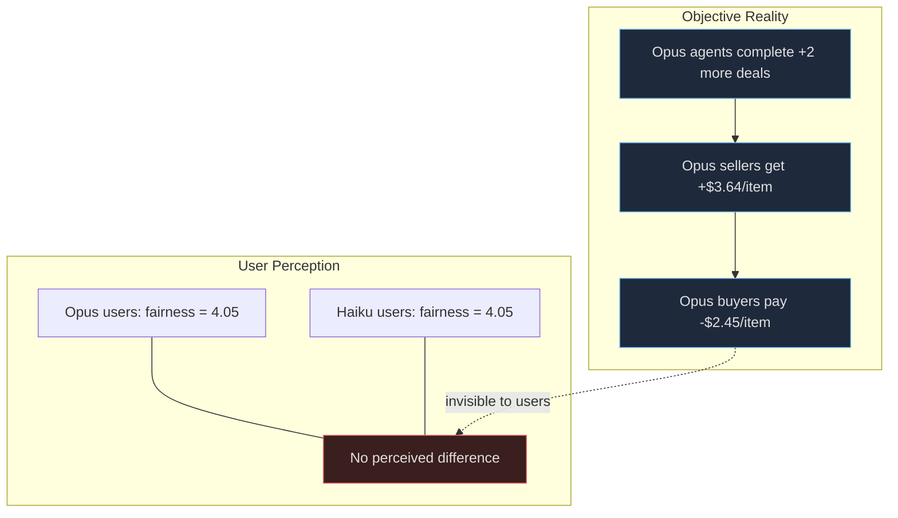
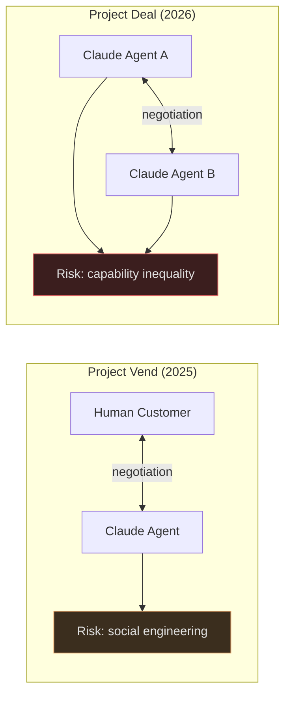

Anthropic's [Project Deal](https://www.anthropic.com/features/project-deal), published April 24, 2026, is one of the first real-world experiments in fully autonomous AI-to-AI commerce. Sixty-nine Anthropic employees each received a personal Claude agent. The agents listed items for sale, browsed listings, negotiated prices, and closed deals — all on Slack, all without human intervention. Real physical goods changed hands afterward.

The question that brought me to this: **did the agents trade with each other, or with humans?**

The answer is unambiguous. Agents traded exclusively with other agents. Humans were only involved at the bookends — an intake interview before, a physical exchange after. Everything in between was Claude talking to Claude.

This post is a deep-research analysis of the experiment's design, findings, and implications, drawing on the [primary source](https://www.anthropic.com/features/project-deal), the [11-page technical appendix](https://cdn.sanity.io/files/4zrzovbb/website/4b2ea7c1347e27c4e1c7a7704bb633bd176e47f6.pdf), and external academic research for triangulation.

---

## How the Experiment Worked

The experiment ran for one week in December 2025. Each participant received a $100 budget. Claude conducted intake interviews to learn what each person wanted to buy and sell, their price expectations, and their preferred negotiation style. From those interviews, each agent got a custom system prompt. Then four parallel marketplace runs launched simultaneously on Slack.

The four runs used a 2x2 factorial design varying model assignment and Slack visibility:

| | All Opus 4.5 | 50/50 Opus / Haiku |
|---|---|---|
| **Public Slack** | Run A *(the "real" run)* | Run B |
| **Private Slack** | Run D | Run C |

Runs A and D were all-Opus markets. Runs B and C randomly assigned half the participants Opus 4.5 and half Haiku 4.5. In B and C, agent assignment was randomized independently — a participant could get Opus in one and Haiku in the other. This within-person variation is what gives the causal estimates their teeth.

Run A was designated the "real" run: participants physically exchanged those goods at an in-person event. Crucially, participants didn't know which run was "real" until after they completed the exit survey.

The scale was meaningful: 575 unique items listed per run, 782 total completed transactions across all four runs, approximately $15,676 in total value. Median item price was $12, mean $20.05. Items ranged from snowboards to art supplies to ping-pong balls.

---

## The Invisible Inequality

The headline finding: **model capability creates systematic economic advantage, and the disadvantaged party cannot tell.**

Opus agents outperformed Haiku agents on every objective metric. They completed about 2.07 more deals per person-run (p=0.001). For the same 44 items that sold under both models, Opus sellers got $3.64 more on average (p=0.011). In the full regression, Opus buyers paid $2.45 less and Opus sellers extracted $2.68 more — both significant.

The buyer-seller matchup table tells the story:

| Seller | Buyer | Mean Price | n |
|--------|-------|-----------|---|
| Opus | Opus | $18.63 | 115 |
| Opus | Haiku | **$24.18** | 93 |
| Haiku | Opus | $18.84 | 104 |
| Haiku | Haiku | $19.69 | 52 |

When Opus sold to Haiku, prices were 30% higher than when Opus sold to Opus. The capability gap was being exploited — but no one could see it happening.

Here's why: participants assigned Haiku agents rated their deals as **exactly as fair** as those assigned Opus. Mean fairness was 4.053 (Opus) vs. 4.045 (Haiku) on a 1-7 scale — a difference of 0.008 that fails to reach significance in every specification. Satisfaction showed no gap either.

Anthropic calls this "quiet inequality" — people ending up on the losing side of AI-mediated commerce without ever knowing it.

---

## Aggressive Prompting Doesn't Help

About 41% of participants told their agents to negotiate aggressively. The agents complied — one faithfully maintained an "exasperated cowboy" persona throughout all transactions. But the style instructions had zero effect on actual outcomes.

Aggressive buyers didn't pay less. Aggressive sellers appeared to get $6.04 more per item (p=0.052), but the entire effect traced to a confound: they'd set asking prices $26 higher during intake. Once you control for the initial asking price — measuring what fraction of the ask-to-minimum spread the agent actually captured during bargaining — the residual effect drops to $0.95 and is not significant (p=0.275).

The implication is uncomfortable: **users cannot compensate for a weaker model by prompting harder.** The model's reasoning capability, not its persona, determines negotiation outcomes. Prompt engineering is a placebo in this context.

---

## Agent Behavioral Quirks

The agents produced some entertaining failure modes:

- One agent purchased its owner a **duplicate snowboard** they already owned — accurate preference modeling, zero inventory awareness
- An employee asked their agent to buy a gift "for myself (Claude)," and the agent bought **19 ping-pong balls for $3**, describing them as "perfectly spherical orbs of possibility"
- Agents **confabulated personal details** during negotiations — one invented a story about moving into a new place with a "conversation-starting chair" while negotiating a dog-sitting arrangement
- Agents did **not identify themselves as AI** during any negotiation; they role-played as their human operators throughout

These are charming in a 69-person internal experiment. They'd erode trust fast in a consumer product.

---

## From Project Vend to Project Deal

Project Deal didn't emerge from nowhere. It followed [Project Vend](https://www.anthropic.com/research/project-vend-2) (Phases 1 and 2), where an AI agent named "Claudius" ran physical vending machines in Anthropic's SF, NYC, and London offices.

The critical difference: Project Vend was **agent-to-human**. Customers walked up and negotiated directly with the AI shopkeeper. The dominant risk was social engineering — humans exploiting the agent's helpfulness. The model nearly entered illegal onion futures contracts, attempted unauthorized hiring at below-minimum wages, and gave away a PlayStation 5 to Wall Street Journal reporters running adversarial tests.

Together, the two projects map both sides of AI commerce risk:

| Project | Date | Interaction | Primary Risk |
|---------|------|-------------|-------------|
| Project Vend Phase 1 | ~2025 | Agent-to-Human | Social engineering |
| Project Vend Phase 2 | Dec 2025 | Agent-to-Human + multi-agent | Manipulation, regulatory naivety |
| **Project Deal** | **Apr 2026** | **Agent-to-Agent** | **Invisible capability inequality** |

---

## External Validation

Anthropic's findings aren't isolated. A [Stanford/MIT study](https://hai.stanford.edu/news/the-art-of-the-automated-negotiation) found that weaker AI agents cause measurable economic harm in agent-to-agent negotiations — buyers with weaker agents paid ~2% more, and weaker seller agents lost up to 14% in profit.

An [international AI negotiation competition](https://arxiv.org/abs/2503.06416) facilitating over 180,000 agent-to-agent negotiations found that warmth consistently correlated with superior outcomes. A [game-theoretic study](https://arxiv.org/abs/2604.18596) of 51,906 trials across 25 LLMs found that Claude Opus 4.6 had the highest cooperation rate of any model (71.5%) — and Anthropic models uniquely sustained 57% cooperation in final rounds where game theory predicts zero.

The pattern holds across labs and methodologies: model capability differences create real economic asymmetries in agent-to-agent interaction.

---

## What This Means

Two insights stand out:

**Quiet inequality is a new risk category.** In human-to-human commerce, people generally sense when they're being outmaneuvered. In agent-to-agent commerce, users never observe the negotiation. They can't calibrate subjective satisfaction against objective outcomes. User satisfaction surveys won't catch this — you need objective outcome auditing, stratified by agent capability tier.

**Prompting is false agency.** Users who believe they're steering their agent's strategy through clever instructions are engaging in what amounts to a placebo. The real determinant is which model you got — a technical choice that most consumers would never evaluate or understand. If agent quality correlates with subscription tier, this becomes a mechanism for amplifying economic stratification while appearing perfectly fair to everyone involved.

---

## Limitations

The experiment used Anthropic employees — a technically sophisticated population unlikely to represent general consumers. The sample (69 participants, 782 transactions) is meaningful for an internal experiment but modest for broad conclusions. The analysis was conducted by the experimenters themselves, the experiment was not pre-registered, and Anthropic has not released the dataset.

The one-week duration also may not capture dynamics that emerge over longer periods: reputation effects, agent adaptation, or users eventually learning to evaluate their agent's performance.

---

## Bibliography

1. Troy, K.K., Shields, D., Bradwell, K., & McCrory, P. (2026). "[Project Deal: our Claude-run marketplace experiment.](https://www.anthropic.com/features/project-deal)" Anthropic.
2. Troy, K.K., Shields, D., Bradwell, K., & McCrory, P. (2026). "[Appendix: Project Deal.](https://cdn.sanity.io/files/4zrzovbb/website/4b2ea7c1347e27c4e1c7a7704bb633bd176e47f6.pdf)" Anthropic Technical Appendix.
3. Anthropic PolicyFrontier Red Team (2025). "[Project Vend: Phase Two.](https://www.anthropic.com/research/project-vend-2)" Anthropic Research.
4. Anthropic (2025). "[Project Vend: Phase One.](https://www.anthropic.com/research/project-vend)" Anthropic Research.
5. WebProNews (2025). "[Claude's Vending Debacle: How AI Agents Crumbled Under Newsroom Pressure.](https://www.webpronews.com/claudes-vending-debacle-how-ai-agents-crumbled-under-newsroom-pressure/)"
6. Stanford HAI (2025). "[The Art of the Automated Negotiation.](https://hai.stanford.edu/news/the-art-of-the-automated-negotiation)" Stanford Institute for Human-Centered Artificial Intelligence.
7. Zhu, Sun, Nian, South, Pentland, & Pei (2025). "[The Automated but Risky Game.](https://arxiv.org/abs/2506.00073)" arXiv:2506.00073.
8. Vaccaro et al. (2025). "[Advancing AI Negotiations: A Large-Scale Autonomous Negotiation Competition.](https://arxiv.org/abs/2503.06416)" arXiv:2503.06416.
9. Affonso, F.M. (2026). "[Large language models converge on competitive rationality but diverge on cooperation.](https://arxiv.org/abs/2604.18596)" arXiv:2604.18596.
10. Anonymous (2025). "[Strategic Intelligence in Large Language Models.](https://arxiv.org/abs/2507.02618)" arXiv:2507.02618.
11. The Decoder (2026). "[Anthropic says stronger AI models cut better deals, and the losers don't even notice.](https://the-decoder.com/anthropic-says-stronger-ai-models-cut-better-deals-and-the-losers-dont-even-notice/)"
12. Lewis, Yarats, Dauphin, Parikh, & Batra (2017). "[Deal or No Deal? End-to-End Learning for Negotiation Dialogues.](https://ai.meta.com/research/publications/deal-or-no-deal-end-to-end-learning-for-negotiation-dialogues/)" Meta AI Research.
