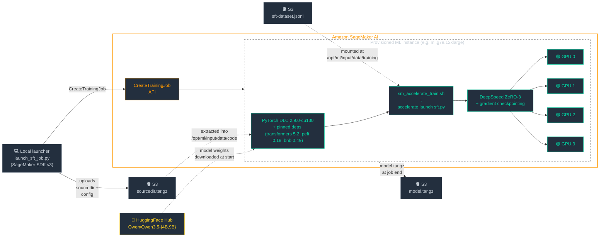

*Eight recipe cells, one OOM that proved my napkin math wrong, and a stack of small gotchas in between.*


*Photo by [Christopher Burns](https://unsplash.com/@christopher__burns) on [Unsplash](https://unsplash.com)*

---

I had a working set of SFT recipes for **Qwen3.5-{4B,9B}-Base** on SageMaker. The question was simple: do they also work for the **Instruct** variants? The recipes carried over cleanly. The instance picks didn't — and a 192 GB box turned out to be a 178 GB box once you account for what really lives on a GPU during a backward pass.

---

## Step 1: There Is No `Qwen/Qwen3.5-Instruct`

I started by looking up `Qwen/Qwen3.5-4B-Instruct` on HuggingFace, expecting the obvious naming convention. **401 Unauthorized.** That was the first surprise: the page doesn't exist.

A quick scan of the Qwen organization on HF shows what's actually published:

```
Qwen/Qwen3.5-4B          ← post-trained ("Instruct")
Qwen/Qwen3.5-4B-Base     ← pretrained
Qwen/Qwen3.5-9B          ← post-trained
Qwen/Qwen3.5-9B-Base     ← pretrained
```

The convention is reversed from what I expected: the `-Base` suffix denotes the *pretrained* checkpoint, and the unsuffixed name is the *post-trained* one. The HF tags for `Qwen/Qwen3.5-4B` make it explicit:

```
"tags": [..., "base_model:Qwen/Qwen3.5-4B-Base",
              "base_model:finetune:Qwen/Qwen3.5-4B-Base"]
```

So `Qwen3.5-4B` *is* the Instruct model — Qwen just doesn't put the suffix on it. **Gotcha #1**, written into memory so I don't re-derive it the next time someone asks.

Next thing I checked was whether the architectures actually match — because if they don't, none of the existing recipes carry over. The two `config.json` files were structurally identical:

```json
{
  "architectures": ["Qwen3_5ForConditionalGeneration"],
  "model_type": "qwen3_5",
  "image_token_id": 248056,
  "text_config": {
    "hidden_size": 2560,
    "intermediate_size": 9216,
    "head_dim": 256,
    "layer_types": [
      "linear_attention", "linear_attention", "linear_attention", "full_attention",
      "linear_attention", "linear_attention", "linear_attention", "full_attention",
      ...
    ]
  }
}
```

Same hybrid 3:1 attention pattern, same dims, same `image_token_id`. Only the weights and the `chat_template.jinja` differ. That meant my hypothesis was: **the existing recipes should work for the Instruct variants with only `model_name_or_path` changed**. Same DLC, same dependency pins, same trainer.

Worth noting: Qwen3.5 is natively multimodal (vision-language), but the text-only training path works identically to Qwen3 once you set `modality_type: "text"` in the recipe. None of this benchmark touches vision.

---

## Step 2: How Does a SageMaker Training Job Actually Work?

Before I could test the hypothesis I had to remind myself how the recipe-driven SageMaker training stack is wired together. The flow looks deceptively simple — there's a launcher script that calls `ModelTrainer.train()`, and 30 minutes later a `model.tar.gz` shows up in S3. But there are a lot of moving pieces inside:



The launcher uploads source + dataset to S3, calls `CreateTrainingJob`, and SageMaker mounts both into a PyTorch DLC container. The container runs `sm_accelerate_train.sh`, which installs the pinned `requirements.txt`, reads `SM_NUM_GPUS`, and `accelerate launch`es `sft.py` under DeepSpeed ZeRO-3. `sft.py` pulls the model weights from HuggingFace at start (Qwen3.5 is ungated), wires up TRL's `SFTTrainer`, and trains.

A few wrinkles I'd forgotten about:

- **The DLC defaults don't match Qwen3.5.** The `qwen3_5` architecture isn't in `transformers` 4.x, so we have to pin `transformers==5.2.0`. That cascades: `peft 0.17.0` references `HybridCache` which was removed in `transformers` 5.x, so we pin `peft==0.18.1`. `bitsandbytes 0.46.x` doesn't ship a CUDA 13.0 binary, so `bitsandbytes==0.49.2`. `liger-kernel 0.6.1` has the same `HybridCache` issue, so `liger-kernel==0.7.0`. None of this is documented anywhere central — it's something you discover by reading import errors. **Gotcha #2.**

- **`flash_attention_2` is broken on this stack.** Importing it under `transformers` 5.x on the CUDA 13.0 DLC throws. `attn_implementation: sdpa` works fine and the throughput cost is small for these model sizes. **Gotcha #3.**

- **Checkpoint S3 paths are auto-derived.** If you pin `CheckpointConfig.s3_uri` yourself, every run shares one checkpoint folder, and SageMaker auto-restores optimizer state from a prior (LoRA-shape-mismatched) run on the next launch — which crashes with a tensor-shape mismatch. Leaving `s3_uri` unset lets the SDK derive a per-run path. **Gotcha #4** (already burned-in to the launcher with a comment).

---

## Step 3: Which Fine-Tuning Technique?

The recipes ship with two strategies — QLoRA and full SFT. There are more in the wild. What each one costs in GPU memory determines instance choice.

For a model with **N parameters** in **bf16**, here's what training each style needs to keep resident on the GPU:

| Component | Size | Full SFT | LoRA | QLoRA |
|---|---|---|---|---|
| Frozen base weights | 2N bytes (bf16) | ✓ trainable | ✓ frozen | ½N bytes (4-bit) frozen |
| Activations + gradients during fwd/bwd | ~K · seqlen · hidden_size | ✓ | ✓ | ✓ |
| Trainable parameter weights (bf16) | varies | 2N bytes | ~2 · r · (in+out) per LoRA module | same as LoRA |
| Optimizer fp32 master + Adam (m, v) | 12 × trainable | 12N bytes | 12 × LoRA params | 12 × LoRA params |
| **Total (rough)** | | **~16N + activations** | **~2N + small** | **~½N + small** |

The full-SFT row is "16N" if you keep the fp32 master copy of the parameters that DeepSpeed bf16 mixed-precision uses by default — 2N (bf16 params) + 2N (bf16 grads) + 4N (fp32 master) + 4N (m) + 4N (v). You'll see "12N" quoted in some references; that drops the fp32 master, which a few bf16-native optimizers do but DeepSpeed under our config does not.

Some napkin math for **Qwen3.5-9B**:

- **Full SFT:** ~16 × 9B ≈ **144 GB** just for params + grads + fp32 master + Adam. Won't fit on a single GPU under 80 GB. Multi-GPU with **DeepSpeed ZeRO-3** shards all three of those across the cluster — on 4 GPUs that's ~36 GB/GPU before activations. Tight on 4×L40S (48 GB/GPU); comfortable on 4×Blackwell (96 GB/GPU).
- **QLoRA:** ~½ × 9B = ~4.5 GB for the 4-bit base, plus a few hundred MB for LoRA adapters and Adam state. Fits on a single 24 GB A10G with room to spare.

The recipe defaults use a small set of LoRA target modules (`q_proj`, `k_proj`, `v_proj`, `o_proj`) at rank 8, which keeps the trainable parameter count tiny. Widening to all-linear (`gate_proj`, `up_proj`, `down_proj`) and bumping rank to 32 barely moves the needle — LoRA-trainable params are dwarfed by the frozen base. What matters more is the **activation memory** during forward/backward — which scales with batch size × sequence length × hidden size and is what actually OOMs you.

---

## Step 4: Picking Instances

This is where I had to do the actual sizing work. SageMaker training has a long list of GPU instance types and the right one isn't always obvious. The candidates I cared about:

| Instance | GPU(s) | VRAM total | $/hr † | Notes |
|---|---|---|---|---|
| `ml.g5.2xlarge` | 1× A10G | 24 GB | $1.52 | QLoRA workhorse |
| `ml.g6e.2xlarge` | 1× L40S | 48 GB | $2.24 | Single-GPU L40S |
| `ml.g7e.2xlarge` | 1× RTX PRO 6000 (Blackwell) | 96 GB | $2.49 | Single-GPU Blackwell |
| `ml.g6e.12xlarge` | 4× L40S | 192 GB | $10.49 | Multi-GPU L40S |
| `ml.g7e.12xlarge` | 4× RTX PRO 6000 (Blackwell) | 384 GB | $19.99 | Multi-GPU Blackwell |
| `ml.p4d.24xlarge` | 8× A100 (40 GB) | 320 GB | $37.69 | The "old" full-SFT default |

† SageMaker training pricing, us-east-1. Re-verify against the [AWS pricing page](https://aws.amazon.com/sagemaker/pricing/) before treating any of these as authoritative — they drift.

The original full-SFT recipes pointed at `p4d.24xlarge` and were marked "Not yet tested." Given the napkin math (4B full SFT needs ~64 GB; 9B needs ~144 GB pre-shard), **g7e.2xlarge** ought to fit a 4B full-FT comfortably on one Blackwell GPU, and **g7e.12xlarge** ought to fit a 9B full-FT on 4×Blackwell. **g6e.12xlarge** at 192 GB total looked plausible for 9B too — and at half the price of g7e.12xlarge.

The matrix I wanted to validate:

| # | Variant | Strategy | Instance | Why |
|---|---|---|---|---|
| T1 | 4B Instruct | QLoRA | g5.2xl | Cheapest signal that the architecture trains |
| T2 | 4B Base | Full SFT | g7e.2xl | Replaces untested p4d default |
| T3 | 4B Instruct | Full SFT | g7e.2xl | Confirms Instruct full SFT on the same footprint |
| T4 | 9B Base | Full SFT | g6e.12xl | Replaces untested p4d default; cheaper than g7e.12xl |
| T5 | 9B Instruct | Full SFT | g7e.12xl | Confirms 9B Instruct full SFT |

Five jobs, in parallel. Most of the wall-clock time should be in training itself.

---

## Step 5: Submitting Five Jobs in Parallel — Or Trying To

First problem: my dev box's instance role wasn't trusted by SageMaker. The launcher tried to pass it to `CreateTrainingJob` and got back:

```
Could not assume role arn:aws:iam::.../EC2-AdminAccess-i-...
Please ensure that the role exists and allows principal
'sagemaker.amazonaws.com' to assume the role.
```

Right. EC2 instance roles aren't SageMaker execution roles — different trust policy. Found a pre-existing `AmazonSageMaker-ExecutionRole-...` in the account, passed it via `--role`, moved on. **Gotcha #5.**

Second problem: a couple of `ResourceLimitExceeded` errors on `g7e.2xlarge` and `g7e.12xlarge` — the SageMaker training quotas for those instance types weren't set in this account. AWS Service Quotas with `request-service-quota-increase --desired-value 1` (or 2, since one g7e.2xl was already busy), and the increases came through. Resubmitted, and the matrix was on its way:

```
T1  4b /instruct/qlora on ml.g5.2xlarge      -> Training
T2  4b /base    /full  on ml.g7e.2xlarge     -> Training
T3  4b /instruct/full  on ml.g7e.2xlarge     -> Training
T4  9b /base    /full  on ml.g7e.12xlarge    -> Training
T5  9b /instruct/full  on ml.g7e.12xlarge    -> Training
```

Wall clock: T1 ~21 min, T2 ~29 min, T3 ~30 min, T4 ~49 min, T5 ~46 min — billable. Five cells, all green. The hypothesis held: **the existing recipes work for the Instruct variants with only `model_name_or_path` changed.** Same DLC, same dependency pins, same trainer, same `attn_implementation: sdpa`, same modality setting, same LoRA target modules — they all just work.

A bit later I closed two more cells — 9B Instruct QLoRA on both `g5.2xl` and `g6e.2xl`, ~22-28 minutes each. Seven cells green.

The eighth cell is where things got interesting.

---

## Step 6: The g6e.12xl OOM

The README still listed `ml.g6e.12xlarge` (4× L40S 48 GB, 192 GB total) as "Not yet tested" for 9B full SFT. I had a hand-wavy claim from a few PRs back that 192 GB total was "tight but plausible." Time to verify — 192 GB is a lot of headroom on paper.

Submitted the eighth cell: 9B Base full SFT on `g6e.12xlarge`, default recipe. It crashed at **456 seconds billable.**

```
torch.OutOfMemoryError: CUDA out of memory.
Tried to allocate 1.89 GiB.
GPU 1 has a total capacity of 44.40 GiB
of which 1.62 GiB is free.
Including non-PyTorch memory, this process has 42.77 GiB memory in use.
```

The hand-wavy claim was wrong. Looking at the per-GPU footprint at the moment of the OOM:

- **42.77 GB resident** on each L40S
- **1.62 GB free** out of 44.4 usable (the L40S nominally has 48 GB but the runtime sees ~44.4 GB after CUDA + driver overhead)
- DeepSpeed ZeRO-3 wanted **1.89 GB more** for the matmul in the linear-layer backward pass

So the 9B full-SFT recipe with default hyperparameters (`per_device_train_batch_size=2`, `max_seq_length=4096`, `gradient_checkpointing=true`) uses ~43 GB peak per GPU. That fits in a 96 GB Blackwell with plenty of room to spare. It does **not** fit in 48 GB L40S. **Gotcha #6**, the most expensive one — it cost 7.6 minutes of training compute to confirm.

There are a few ways to make 9B full-SFT fit on g6e.12xl if you really want to:

- Drop `per_device_train_batch_size` to 1 (with `gradient_accumulation_steps=4` to keep effective batch the same).
- Drop `max_seq_length` to 2048 — activations scale with seqlen.
- Enable optimizer offload to CPU in the DeepSpeed config (`offload_optimizer_device: cpu` in `ds_zero3.yaml`). Slower, but frees the Adam fp32 m/v from GPU memory.

But the README isn't there to teach hyperparameter tuning — it's there to say "here are recipes that work out of the box on these instances." So I marked g6e.12xl as **"Does not fit (OOM)"** for 9B full SFT and added a Default Hyperparameters section so users can see exactly what footprint the validated cells correspond to. If they tune the recipe, that's on them.

---

## Step 7: What's Actually Documented Now

The validation matrix as it ended up:

| Recipe | Strategy | Instance | Status |
|---|---|---|---|
| `Qwen3.5-4B-Base--vanilla-peft-qlora.yaml` | QLoRA | ml.g5.2xlarge | Validated |
| `Qwen3.5-9B-Base--vanilla-peft-qlora.yaml` | QLoRA | ml.g5.2xlarge | Validated |
| `Qwen3.5-4B-Base--vanilla-full.yaml` | Full SFT | ml.g7e.2xlarge | Validated |
| `Qwen3.5-9B-Base--vanilla-full.yaml` | Full SFT | ml.g7e.12xlarge | Validated |
| `Qwen3.5-9B-Base--vanilla-full.yaml` | Full SFT | ml.g6e.12xlarge | **Does not fit (OOM)** |
| `Qwen3.5-4B--vanilla-peft-qlora.yaml` | QLoRA | ml.g5.2xlarge | Validated |
| `Qwen3.5-9B--vanilla-peft-qlora.yaml` | QLoRA | ml.g5.2xlarge | Validated |
| `Qwen3.5-9B--vanilla-peft-qlora.yaml` | QLoRA | ml.g6e.2xlarge | Validated |
| `Qwen3.5-4B--vanilla-full.yaml` | Full SFT | ml.g7e.2xlarge | Validated |
| `Qwen3.5-9B--vanilla-full.yaml` | Full SFT | ml.g7e.12xlarge | Validated |

Default recipe hyperparameters that all those validated runs used: `bf16`, `attn_implementation: sdpa`, `max_seq_length=4096`, `per_device_train_batch_size=2`, `gradient_accumulation_steps=2`, `gradient_checkpointing=true`, `num_train_epochs=10`, `learning_rate=1e-4`, cosine schedule, 10% warmup. QLoRA recipes additionally use `load_in_4bit=true`, LoRA target modules `q_proj/k_proj/v_proj/o_proj`, and `r=8 / alpha=16`.

If you change those — especially batch size and seq length — you change the memory footprint, and "validated" might stop holding. The Default Hyperparameters section in the repo is now where I keep that contract.

---

## Gotchas, Collected

A short index of the surprises I hit, in the order I hit them:

1. **`Qwen/Qwen3.5-4B-Instruct` doesn't exist.** The post-trained variant is published as `Qwen/Qwen3.5-4B`. The `-Base` suffix is on the *pretrained* one.
2. **The PyTorch DLC defaults don't match Qwen3.5.** Need `transformers==5.2.0`, `peft==0.18.1`, `bitsandbytes==0.49.2`, `liger-kernel==0.7.0`. Discoverable only via import errors.
3. **`flash_attention_2` is broken on transformers 5.x + CUDA 13.0 DLC.** Use `attn_implementation: sdpa`.
4. **Pinning `CheckpointConfig.s3_uri` is a footgun.** The SDK auto-derives a per-run path; overriding it makes back-to-back runs collide and crash on optimizer-state restore.
5. **EC2 instance roles aren't SageMaker execution roles.** They have a different trust policy. Need an actual `AmazonSageMaker-ExecutionRole-*`.
6. **9B full SFT does not fit on 4×L40S (192 GB).** The recipe's defaults peak at ~43 GB/GPU during the backward pass; L40S has 48 GB nominal but only ~44 GB usable after CUDA overhead. Use g7e.12xl (4×96 GB Blackwell) or tune the recipe down.

---

## What I'd Do Differently

Honestly, not much. The hypothesis was right (Instruct = Base architecturally; recipes carry over). The instance picks were mostly right (g7e is the right home for full SFT at these sizes). The one I got wrong was g6e.12xl — and I only got it wrong because I trusted the napkin math without measuring.

The math missed two things. First, I quoted the "12N" full-SFT footprint that drops the fp32 master copy of the parameters; with DeepSpeed bf16 mixed-precision keeping that master copy, the real number is closer to 16N → ~144 GB → ~36 GB/GPU pre-activations on 4 GPUs. Second, even 36 GB/GPU is just the steady-state — activations during the backward pass are on top of that, and at `seqlen=4096 × batch=2 × hidden=4096 × 32 layers` for 9B, they're not a small term. The combination tips a ~44 GB usable L40S into OOM on the linear-layer matmul, exactly as the trace showed.

---

## What's Next

The next thing I want to try is whether the same recipes work for **larger** Qwen3.5 variants — `27B` and the `35B-A3B` MoE. The MoE one is interesting because most of the parameters are inactive per token, so the memory profile is fundamentally different from a dense 27B. But that's a separate journey.

---

## References

- **Repo:** [github.com/dgallitelli/qwen35-sft-sagemaker](https://github.com/dgallitelli/qwen35-sft-sagemaker) — recipes, launcher, validation harness, dataset.
- **Earlier post on the inference side:** [One Blackwell GPU Beats Four L40S: Benchmarking Qwen3.6-27B on SageMaker](/posts/qwen36-sagemaker-benchmark/).
- **HuggingFace model cards:** [`Qwen/Qwen3.5-4B`](https://huggingface.co/Qwen/Qwen3.5-4B), [`Qwen/Qwen3.5-9B`](https://huggingface.co/Qwen/Qwen3.5-9B).
- **SageMaker Generative AI Recipes:** [github.com/aws-samples/amazon-sagemaker-generativeai](https://github.com/aws-samples/amazon-sagemaker-generativeai).
