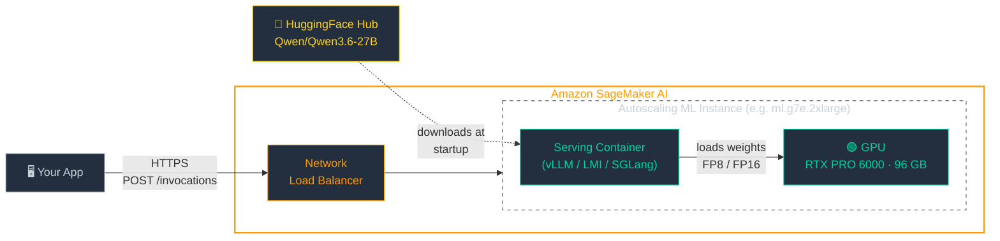
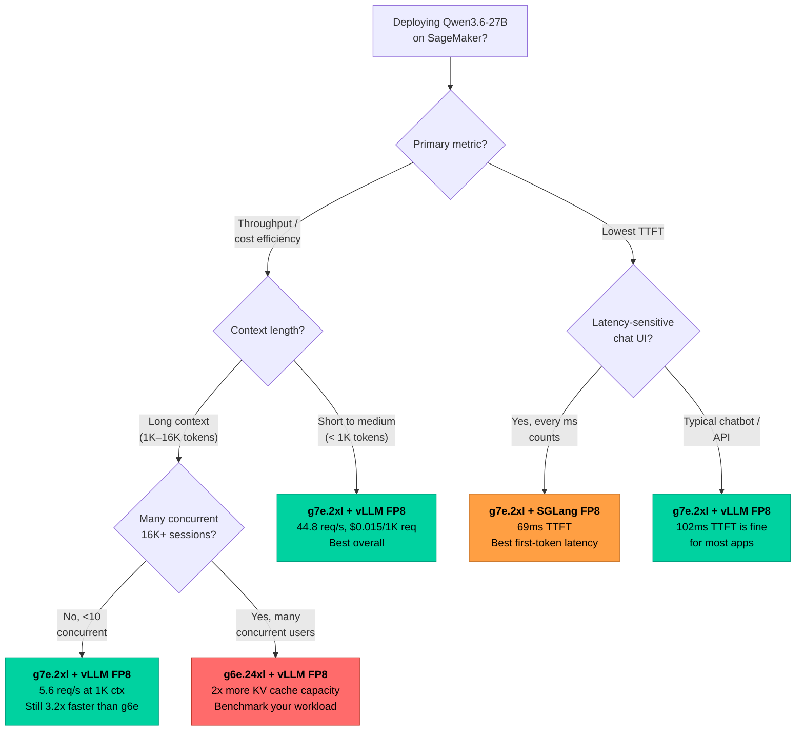

*A single Blackwell GPU at $2.49/hr outperforms four L40S GPUs at $15.68/hr — 2.2x faster and 14x cheaper per request.*


*Photo by [Nana Dua](https://unsplash.com/@nanadua11) on [Unsplash](https://unsplash.com)*

---

I wanted to find the best way to serve [Qwen3.6-27B](https://huggingface.co/Qwen/Qwen3.6-27B) on Amazon SageMaker. This is the story of what I tried, what surprised me, and what broke along the way. The punchline: a single $2.49/hr Blackwell GPU beats a $15.68/hr four-GPU setup by every metric I measured — until you push the context length past 16K tokens.

> **A note on model scope.** These results are for **Qwen3.6-27B**, the dense 27-billion parameter variant. They do *not* apply to MoE (Mixture-of-Experts) models like Qwen3.6-35B-A3B, which activate only a fraction of their parameters per token — the GPU compute and memory tradeoffs are fundamentally different.

---

## The Model: Why Qwen3.6-27B Is Interesting

Qwen3.6-27B is the first open-weight release in the Qwen3 generation. What makes it architecturally unusual is its **hybrid attention design**: the model's 64 layers alternate between three layers of linear attention ([Gated DeltaNet](https://arxiv.org/abs/2102.11174)) and one layer of standard grouped-query attention. This 3:1 ratio means most of the model uses linear attention — which processes tokens in constant memory per step — while the standard attention layers provide the deep reasoning capability. The result is a model that natively supports **262K-token contexts** (extendable to 1M with YaRN scaling) while keeping KV cache requirements manageable: only 16 of the 64 layers need traditional KV storage.

This hybrid architecture has practical implications for serving. The Mamba-style linear attention layers carry their own state (~13 GB per GPU on this model), eating into the VRAM budget before KV cache allocation even starts. It also means the model needs special handling in some serving frameworks — as we discovered with SGLang's EAGLE speculation, which required non-default flags for hybrid Mamba models.

On benchmarks, Qwen3.6-27B punches well above its weight class. It scores **77.2% on SWE-bench Verified** (agentic coding), outperforming Claude 4.5 Opus (73.4%) and its predecessor Qwen3.5-27B (75.0%). It achieves 94.1% on AIME 2026 (math competition) and 86.2% on MMLU-Pro (general knowledge). The model also supports tool calling, explicit reasoning mode with `<think>` blocks, and multimodal input (image and video). For a 27B open-weight model, it is a compelling choice for production agentic workloads — which is why finding the fastest, cheapest way to serve it matters.

---

## Background: How SageMaker Endpoints Work

If you have not used [Amazon SageMaker AI](https://aws.amazon.com/sagemaker/) for inference before, here is the short version. You define three resources: a **Model** (container image + model weights), an **Endpoint Configuration** (instance type, count, autoscaling policy), and an **Endpoint** that SageMaker provisions behind a network load balancer. Requests flow from your application through the load balancer to GPU instances running your model inside a Docker container — SageMaker handles provisioning, health checks, and scaling across availability zones.



For LLM inference, the two choices that matter are the **instance type** (which GPU hardware you get) and the **serving container** (vLLM, LMI, or SGLang — each with different scheduling, batching, and speculative decoding strategies). That is what this benchmark explores.

---

## Step 1: We Started With the Obvious Config

The [AWS samples notebook for Qwen3.6](https://github.com/aws-samples/sagemaker-genai-hosting-examples/tree/main/01-models/Qwen/Qwen3.6) deploys on `ml.g6e.12xlarge` — four NVIDIA L40S GPUs with tensor parallelism (TP=4), FP16 precision, and vLLM with MTP speculative decoding. It is the kind of config most teams would reach for: proven container, multi-GPU for a 27B model, plenty of memory.

I deployed this baseline and threw traffic at it, escalating concurrency from 1 to 256. The result: **19.82 req/s at peak**, saturating around concurrency 128. Not bad for a 27B model. Each request (11 tokens in, 50 tokens out) completed in about 670ms at low concurrency.

But $15.68/hr for 20 req/s felt expensive. And I was curious about the new g7e instances with their Blackwell GPUs.

---

## Step 2: The New Kid — g7e on a Single GPU

The `ml.g7e.2xlarge` has a single NVIDIA RTX PRO 6000 (Blackwell generation) with 96 GB of GDDR7 — enough to fit Qwen3.6-27B on one GPU without tensor parallelism. It costs $2.49/hr, a fraction of the g6e.

I expected it to be slower. One GPU versus four. No TP parallelism for the prefill phase. But the numbers told a different story:



The g7e with vLLM reached **44.82 req/s** — more than double the four-GPU g6e setup. At every concurrency level, the single Blackwell GPU was faster. The chart shows 5 of the 8 configurations I tested; the [full dataset is in the appendix](#appendix-experiment-summary).

How? Three factors compound:

1. **No TP communication overhead.** Every decode step on g6e requires an all-reduce across four GPUs over PCIe. On g7e, there is no synchronization — the single GPU just runs.
2. **Higher memory bandwidth.** The RTX PRO 6000 delivers 1.8 TB/s from a single GDDR7 pool. The four L40S GPUs have higher aggregate bandwidth on paper (4x 864 GB/s), but TP synchronization erodes the advantage.
3. **More effective KV cache.** With no TP sharding overhead and a 96 GB pool, vLLM can batch far more concurrent requests.

And the cost story is brutal:



vLLM on g7e costs **$0.0154 per 1,000 requests** — 14x cheaper than the same container on g6e ($0.2158). You pay less per hour *and* serve more requests per hour.

---

## Step 3: FP8 Changed Everything — But Only on One Instance

At this point I had been running FP16 on both instances. FP8 quantization halves the memory footprint of model weights and is natively supported on both L40S (Ada Lovelace) and RTX PRO 6000 (Blackwell). I expected a nice speedup on both.

I was wrong. FP8 barely moved the needle on g6e (+2%), but **more than doubled** throughput on g7e (+122%):



The g7e FP16 baseline (20.15 req/s) was measured in an earlier round of testing with identical methodology but concurrency capped at 32; the FP8 run used extended concurrency up to 256.

The explanation clicked once I thought about where the bottleneck was. On g6e with TP=4, the bottleneck is inter-GPU communication — every decode step requires an all-reduce across four L40S GPUs. FP8 reduces memory bandwidth per GPU, but the TP synchronization cost dominates. On g7e with TP=1, there is no TP overhead. FP8 halves the memory bandwidth needed for weight loading *and* frees ~27 GB of VRAM for KV cache, enabling vLLM to batch far more requests simultaneously. The single-GPU setup gets the full benefit; the multi-GPU setup is bottlenecked elsewhere.

---

## Step 4: We Tested Every Container

vLLM was the clear throughput winner, but I wanted to know if the other SageMaker-supported containers could compete.

**LMI (Large Model Inference)** is SageMaker's built-in container based on DJL Serving. I tested both v22 and v24. LMI 24 on g7e reached 31.90 req/s — a solid 16% improvement over LMI 22 (27.56), but still 30% behind vLLM. LMI has the **lowest single-request latency** (0.603s at concurrency 1), making it competitive for low-traffic use cases.

**SGLang** took some trial and error. The SGLang SageMaker DLC uses a different environment variable for the model path (`SM_SGLANG_MODEL_PATH`) than vLLM and LMI (`HF_MODEL_ID`) — a gotcha worth knowing. Once I matched the [reference notebook's exact env vars](https://github.com/aws-samples/sagemaker-genai-hosting-examples/tree/main/01-models/Qwen/Qwen3.6), SGLang came alive — and delivered a surprise:



**69ms time-to-first-token.** That is 33% faster than vLLM (102ms) and the best TTFT of anything I tested. For interactive chat applications where perceived responsiveness matters, SGLang is worth the throughput tradeoff (23 req/s vs vLLM's 44.82).

Then I tried **EAGLE speculative decoding** on SGLang. The AWS blog [reports 2.4x throughput improvements](https://aws.amazon.com/blogs/machine-learning/accelerate-generative-ai-inference-on-amazon-sagemaker-ai-with-g7e-instances/) with EAGLE on g7e. Getting it to work on Qwen3.6 required two non-obvious flags (`SGLANG_ENABLE_SPEC_V2=1` and `SM_SGLANG_MAMBA_SCHEDULER_STRATEGY=extra_buffer` — the model's hybrid Mamba/Attention architecture needs special handling). And the result? **9.42 req/s** — worse than SGLang without speculation, and 4.8x worse than vLLM. EAGLE's speculative compute burns GPU cycles that compete with serving concurrent requests. The published improvements were likely measured at low concurrency; under production-like load, it is a net negative for this model.

---

## Step 5: Then We Hit the 16K Wall

All the results above used short prompts (11 tokens in, 50 out). Real workloads are longer. I tested with ~1K-token inputs and ~16K-token inputs to see how the ranking holds.



At ~1K tokens, g7e still wins by 3.2x (5.58 vs 1.73 req/s). The g6e configurations started throwing errors (42% failure rate) at concurrency 128, while g7e handled it cleanly. But look at what happens when we zoom out across all context lengths:



The log-scale Y axis compresses a 750x range — without it, the 16K bar would be invisible. Going from short to medium context drops throughput 8x; going to 16K drops it another 93x. At 16K-token context, the g7e managed only **0.06 req/s** at concurrency 4 — each request takes 42-62 seconds and consumes ~2.25 GB of KV cache. At concurrency 8, the endpoint started returning errors.

This is where multi-GPU setups reclaim their advantage. With TP=4, KV heads are sharded across GPUs (Qwen3.6-27B has 4 KV heads, so each GPU holds exactly one). The per-GPU KV cost drops to a quarter, which means more total KV cache capacity:

| Config | Free VRAM for KV cache | Max concurrent 16K sessions | Max concurrent 32K sessions |
|--------|----------------------|---------------------------|---------------------------|
| g7e.2xl (1x 96GB, TP=1) | ~53 GB | ~23 | ~12 |
| g6e.24xl (4x 48GB, TP=4) | ~25 GB/GPU (100 GB total effective) | ~44 | ~22 |

The g6e 16K-context test is left as a future exercise, but the math is clear: if your workload needs many concurrent long-context sessions (RAG with 16K+ retrieval, multi-document summarization), the g6e's larger pooled KV cache may serve more users — even though each individual request is slower.

---

## So Which Config Should You Actually Use?



For most workloads: **g7e.2xlarge + vLLM + FP8**. The exceptions are TTFT-critical chat UIs (SGLang's 69ms), or high-concurrency long-context workloads where KV cache capacity tips the balance toward multi-GPU.

For **larger dense models** (50B+ parameters), a single g7e.2xlarge (96 GB) may not have enough VRAM — a 70B model in FP8 needs ~35 GB for weights alone, leaving little room for KV cache. At that scale, multi-GPU instances (g7e.12xlarge with 2 GPUs, or g6e.12xlarge with 4) become necessary, and the single-GPU advantages measured here would not apply.

---

## Deploy the Best Config

Here is the exact code for the winning configuration — vLLM 0.19.0 with FP8 quantization and MTP speculative decoding on `ml.g7e.2xlarge`.

```python
import boto3
import json
import time

region = "us-east-1"
role = "YOUR_SAGEMAKER_EXECUTION_ROLE_ARN"
image = f"763104351884.dkr.ecr.{region}.amazonaws.com/vllm:0.19.0-gpu-py312-cu129-ubuntu22.04-sagemaker"
endpoint_name = "qwen36-27b-vllm-fp8-g7e"

env = {
    "HF_MODEL_ID": "Qwen/Qwen3.6-27B",
    "SM_VLLM_MODEL": "Qwen/Qwen3.6-27B",
    "SM_VLLM_TENSOR_PARALLEL_SIZE": "1",
    "SM_VLLM_MAX_MODEL_LEN": "32768",
    "SM_VLLM_QUANTIZATION": "fp8",
    "SM_VLLM_ENABLE_AUTO_TOOL_CHOICE": "true",
    "SM_VLLM_TOOL_CALL_PARSER": "qwen3_coder",
    "SM_VLLM_REASONING_PARSER": "qwen3",
    "SM_VLLM_SPECULATIVE_CONFIG": json.dumps({
        "method": "qwen3_next_mtp",
        "num_speculative_tokens": 2,
    }),
}

sm = boto3.client("sagemaker", region_name=region)

sm.create_model(
    ModelName=endpoint_name,
    ExecutionRoleArn=role,
    PrimaryContainer={"Image": image, "Environment": env},
)
sm.create_endpoint_config(
    EndpointConfigName=f"{endpoint_name}-config",
    ProductionVariants=[{
        "VariantName": "v1",
        "ModelName": endpoint_name,
        "InstanceType": "ml.g7e.2xlarge",
        "InitialInstanceCount": 1,
        "ContainerStartupHealthCheckTimeoutInSeconds": 900,
    }],
)
sm.create_endpoint(
    EndpointName=endpoint_name,
    EndpointConfigName=f"{endpoint_name}-config",
)

# Wait for InService (~12 minutes for model download + FP8 quantization)
while True:
    status = sm.describe_endpoint(EndpointName=endpoint_name)["EndpointStatus"]
    if status == "InService":
        break
    time.sleep(30)

# Invoke
runtime = boto3.client("sagemaker-runtime", region_name=region)
response = runtime.invoke_endpoint(
    EndpointName=endpoint_name,
    Body=json.dumps({
        "messages": [{"role": "user", "content": "Explain FP8 quantization."}],
        "max_tokens": 100,
    }),
    ContentType="application/json",
)
print(json.loads(response["Body"].read()))
```

A few notes:

- **MTP speculative decoding** (`qwen3_next_mtp`) uses Qwen3.6's built-in prediction heads — no separate draft model needed. All vLLM configs in this benchmark use MTP; the 2.2x throughput boost over FP16 comes from FP8 quantization (see the FP8 chart above).
- **`MAX_MODEL_LEN=32768`** sets the maximum context window. Reduce to 16384 if you don't need 32K contexts — it frees KV cache memory for more concurrent requests.
- **`ContainerStartupHealthCheckTimeoutInSeconds=900`** gives 15 minutes for model download + FP8 quantization at first load.

---

## Validating With AIPerf: What to Actually Expect in Production

After finding the best configuration, I wanted to validate the numbers with something more rigorous than a homegrown Python load generator. SageMaker AI recently launched [AI Benchmark Jobs](https://aws.amazon.com/blogs/machine-learning/amazon-sagemaker-ai-now-supports-optimized-generative-ai-inference-recommendations/) — a managed service that runs [NVIDIA AIPerf](https://github.com/ai-dynamo/aiperf) against a deployed endpoint, measuring TTFT, inter-token latency, and throughput with statistical rigor.

The setup is straightforward: you create a workload config specifying the token distribution and concurrency, then point a benchmark job at your running endpoint.

```python
# Define the workload
sm.create_ai_workload_config(
    AIWorkloadConfigName="short-prompt-benchmark",
    AIWorkloadConfigs={"WorkloadSpec": {"Inline": json.dumps({
        "benchmark": {"type": "aiperf"},
        "parameters": {
            "prompt_input_tokens_mean": 50,
            "output_tokens_mean": 50,
            "extra_inputs": "ignore_eos:true",
            "concurrency": 32,
            "request_count": 300,
        }
    })}}
)

# Run the benchmark against your deployed endpoint
sm.create_ai_benchmark_job(
    AIBenchmarkJobName="qwen36-aiperf-short",
    BenchmarkTarget={"Endpoint": {"Identifier": "your-endpoint-name"}},
    OutputConfig={"S3OutputLocation": "s3://your-bucket/aiperf-results/"},
    AIWorkloadConfigIdentifier="short-prompt-benchmark",
    RoleArn=role,
)
```

I ran AIPerf against our winning configuration (g7e.2xl + vLLM FP8 + MTP) with two workloads:

### AIPerf Results — g7e.2xlarge, vLLM FP8, MTP

| Metric | Short (50 tok out, conc=32) | Long gen (2048 tok out, conc=8) |
|--------|---------------------------|-------------------------------|
| **Request throughput** | 4.19 req/s | 0.25 req/s |
| **Output token throughput** | 214 tok/s | 521 tok/s |
| **TTFT p50** | 209 ms | 118 ms |
| **Inter-token latency p50** | 21.6 ms | 14.0 ms |
| **Output tok/s per user** | 46.3 | 71.2 |
| **Request latency p50** | 1,331 ms | 29,060 ms |

### Why the Numbers Differ From Our Manual Benchmark

Our manual benchmark reported 44.82 req/s on the same hardware. AIPerf reports 4.19 req/s. That is a **10x difference** — and both numbers are correct. Here is why:

1. **Our manual test used trivial prompts.** "What is machine learning? Explain briefly." with `max_tokens=50`. The model often produces a short answer (10-20 tokens) and hits the EOS token well before the 50-token limit. Each request completes in ~0.6 seconds. At concurrency 128, vLLM batches 128 of these lightweight requests and blasts through them.

2. **AIPerf forces full token generation.** It sets `ignore_eos:true`, meaning the model must produce exactly ~50 tokens regardless of whether it would naturally stop. It also generates reasoning tokens (`<think>` blocks) — each request actually produces ~51 reasoning tokens plus content. And critically, AIPerf uses realistic synthetic prompts from the ShareGPT dataset rather than a single repeated prompt.

3. **Concurrent request contention.** At concurrency 32, all requests compete for KV cache and GPU compute simultaneously. Our manual benchmark at concurrency 1 showed 0.635s per request; at concurrency 32, AIPerf shows 1.33s (2.1x slower per request, but 32x more concurrent — net 15x higher throughput than concurrency 1).

The AIPerf numbers are closer to what a production deployment would see with diverse, real-world traffic. The manual benchmark numbers are useful for **relative comparisons** between configurations (g7e vs g6e, vLLM vs LMI), but the **absolute throughput** you should plan capacity around is the AIPerf number.

### What to Expect for Mixed, Spiky Workloads

For a production deployment serving a mix of short chatbot queries, medium code-generation requests, and occasional long-document tasks:

- **Plan capacity around 200-500 output tokens/second** per g7e.2xlarge instance (not 44 req/s). The actual throughput depends on your output length distribution — short responses give higher req/s but the token budget is the same.
- **TTFT will be 100-200ms at moderate load** (concurrency 8-16). At high concurrency (32+), some requests will queue and see TTFT in the seconds.
- **Inter-token latency is rock-solid at ~14-22ms** regardless of load. Users see smooth streaming once the first token arrives.
- **For traffic spikes**, SageMaker's autoscaling adds instances in minutes, not seconds. If you expect bursty traffic, keep a warm minimum instance count or use [async inference](https://docs.aws.amazon.com/sagemaker/latest/dg/async-inference.html) to queue requests during spikes.
- **Cost at realistic throughput**: at ~214 output tok/s, each g7e.2xlarge produces ~770K tokens/hour at $2.49/hr — roughly **$0.003 per 1K output tokens**. This is competitive with managed API pricing for a 27B model.

---

## Methodology and Caveats

**Load generation.** Custom load generator sending OpenAI-compatible `/v1/chat/completions` requests. At concurrency N, exactly N requests are in flight at all times. Each level ran for 60 seconds after 3 warmup requests. Throughput = completed requests per second (failures excluded).

**TTFT measurement.** Streaming invocation, parsing SSE events for first content/reasoning delta (not metadata). Concurrency 1, 20 iterations after 3 warmup requests.

**Cost calculation.** `(instance $/hr / 3600) / peak_throughput * 1000` = cost per 1,000 requests at maximum sustainable throughput.

**Single-run results.** Each concurrency level was measured once. We did not run repeated trials or compute confidence intervals. Results are directional — treat small differences (e.g., g6e FP16 vs FP8 at +2%) as within noise.

**Client-side threading.** The load generator uses Python threads. The GIL may slightly undercount server-side throughput at extreme concurrency (256+), though boto3 releases the GIL during I/O waits. Use relative comparisons across configs, not absolute numbers.

**LMI 22 confound.** LMI 22.0.0 used 3 MTP speculative tokens (its recommended default) while all other configs used 2. This is not a fully controlled comparison for that one config.

**Region.** All tests ran in us-east-1. g7e.2xlarge availability may vary by region.

---

## Raw Data

The full benchmark data — throughput and latency at every concurrency level, container image URIs, environment variables, and deployment configs — is in the [companion REPORT.md gist](https://gist.github.com/dgallitelli/e27599ca7d9c352595a2b243ddc916bc).

---

## Appendix: Experiment Summary

Reference tables for all configurations. Per-concurrency throughput and latency breakdowns are in the [full REPORT.md gist](https://gist.github.com/dgallitelli/e27599ca7d9c352595a2b243ddc916bc). All experiments ran in us-east-1 on 2026-04-27.

### Short Prompt — TTFT and Peak Throughput

| Config | TTFT Mean | TTFT Min | Max Req/s | Sat. Conc | Lat @1 | $/hr | $/1K req |
|--------|-----------|----------|-----------|-----------|--------|------|----------|
| g6e.24xl / vLLM / FP16 / TP=4 | 117 ms | 102 ms | 19.82 | 256 | 0.673s | $15.68 | $0.2198 |
| g6e.24xl / vLLM / FP8 / TP=4 | 106 ms | 94 ms | 20.19 | 256 | 0.555s | $15.68 | $0.2158 |
| g6e.24xl / LMI 24 / FP8 / TP=4 | — | — | 16.73 | 64 | 0.522s | $15.68 | $0.2604 |
| **g7e.2xl / vLLM / FP8 / TP=1** | **102 ms** | **92 ms** | **44.82** | **128** | 0.635s | **$2.49** | **$0.0154** |
| g7e.2xl / LMI 22 / FP8 / TP=1 | — | — | 27.56 | 32 | 0.623s | $2.49 | $0.0251 |
| g7e.2xl / LMI 24 / FP8 / TP=1 | — | — | 31.90 | 64 | 0.603s | $2.49 | $0.0217 |
| g7e.2xl / SGLang / FP8 / TP=1 | **69 ms** | **67 ms** | 23.03 | 128 | 0.590s | $2.49 | $0.0300 |
| g7e.2xl / SGLang+EAGLE / FP8 / TP=1 | 123 ms | 120 ms | 9.42 | 32 | 0.731s | $2.49 | $0.0734 |

### Long Prompt — TTFT and Peak Throughput

| Config | TTFT Mean | Max Req/s | Sat. Conc | Lat @1 | $/1K req |
|--------|-----------|-----------|-----------|--------|----------|
| g6e.24xl / vLLM / FP16 / TP=4 | 437 ms | 1.61 | 64 | 3.276s | $2.706 |
| g6e.24xl / vLLM / FP8 / TP=4 | 429 ms | 1.73 | 64 | 2.658s | $2.518 |
| **g7e.2xl / vLLM / FP8 / TP=1** | **153 ms** | **5.58** | **128** | **2.873s** | **$0.124** |

### 16K Context — Throughput (req/s)

~16K-token input, max_tokens=2048. Each request consumes ~2.25 GB of KV cache.

| Conc | **g7e.2xl vLLM FP8** |
|-----:|--------------------:|
| 1 | 0.02 |
| 2 | 0.04 |
| 4 | **0.06** |
| 8 | err 12.5% |

> g6e 16K-context test not completed at time of writing — left as a future exercise.

### Failed Configurations

| Config | Failure Reason |
|--------|----------------|
| ml.g6e.xlarge (1x L40S 48GB) + vLLM FP8 | CUDA OOM — model weights + MTP head + CUDA graphs exhaust 44.5 GB usable VRAM |
| ml.g6e.24xlarge + SGLang 0.5.10 FP8 TP=4 | OOM during CUDA graph capture — Mamba/GDN state 12.76 GB/GPU + KV cache leaves <9 GB |
| ml.g6.48xlarge (8x L4 24GB) + vLLM FP8 TP=8 | CUDA OOM — 24 GB L4 GPUs too small with speculative decoding |
| SGLang 0.5.9 + 0.5.10 with `HF_MODEL_ID` | SGLang DLC uses `SM_SGLANG_MODEL_PATH` instead of `HF_MODEL_ID` |
| SGLang + EAGLE (first attempt) | Needs `SGLANG_ENABLE_SPEC_V2=1` + `SM_SGLANG_MAMBA_SCHEDULER_STRATEGY=extra_buffer` for hybrid Mamba models |

### Container Image Versions

| Container | Image URI |
|-----------|-----------|
| vLLM 0.19.0 | `763104351884.dkr.ecr.us-east-1.amazonaws.com/vllm:0.19.0-gpu-py312-cu129-ubuntu22.04-sagemaker` |
| LMI 22 | `763104351884.dkr.ecr.us-east-1.amazonaws.com/djl-inference:0.36.0-lmi22.0.0-cu129` |
| LMI 24 | `763104351884.dkr.ecr.us-east-1.amazonaws.com/djl-inference:0.36.0-lmi24.0.0-cu129-v1.1` |
| SGLang 0.5.10 | `763104351884.dkr.ecr.us-east-1.amazonaws.com/sglang:0.5.10-gpu-py312-cu129-ubuntu24.04-sagemaker-v1.4` |
