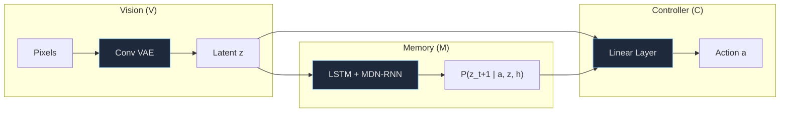
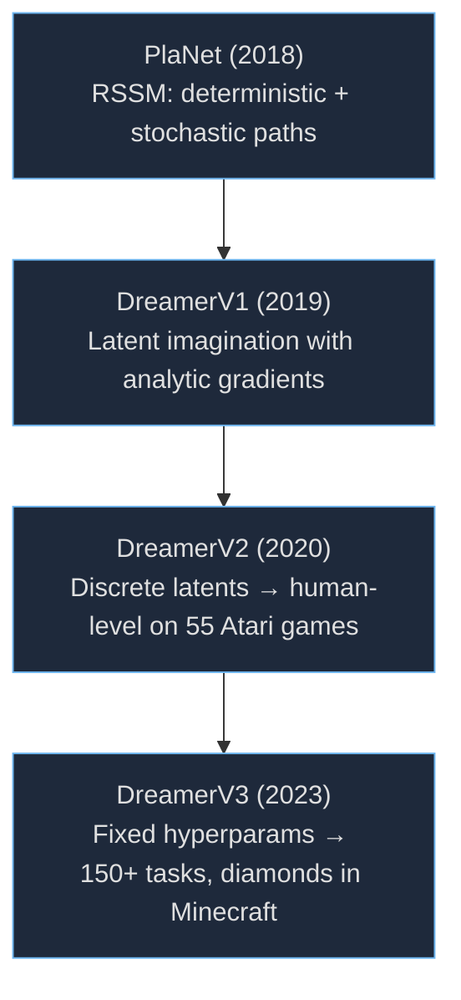
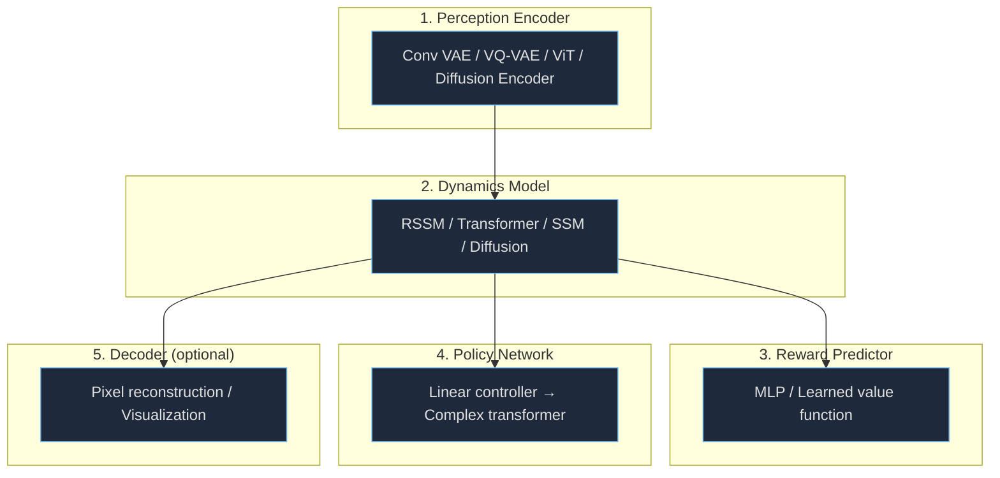
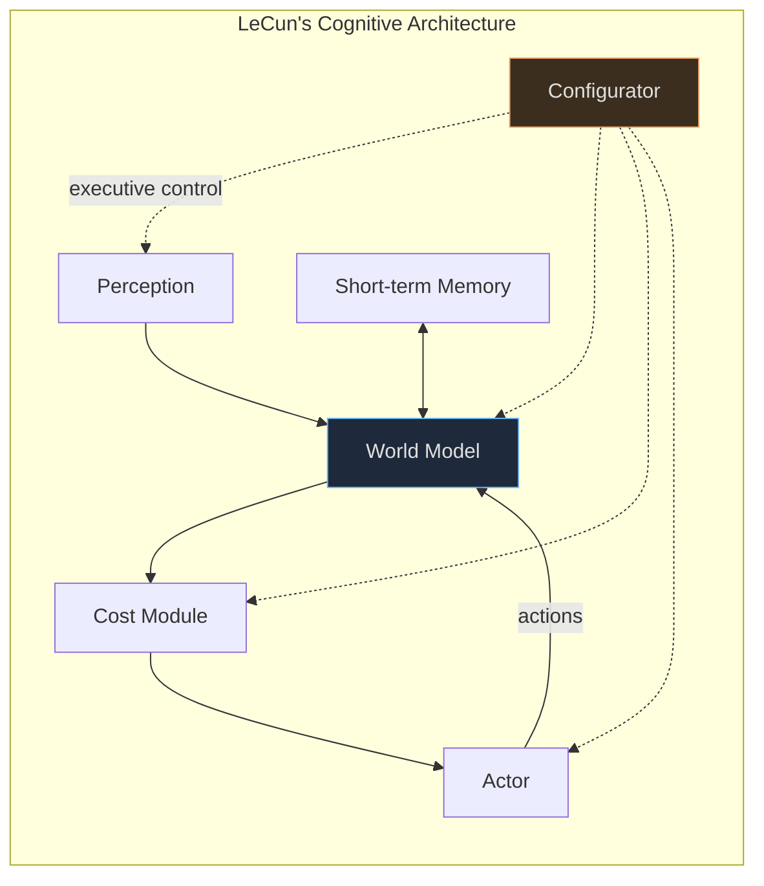
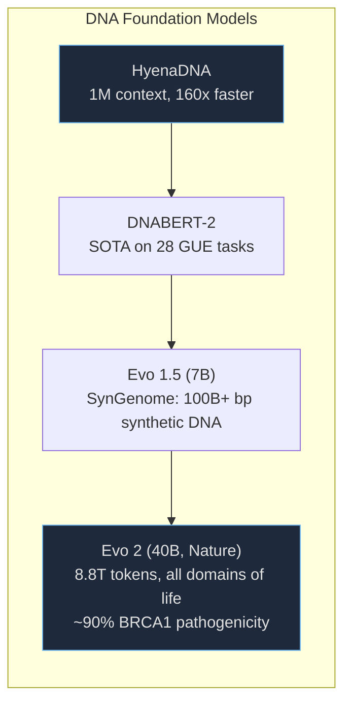
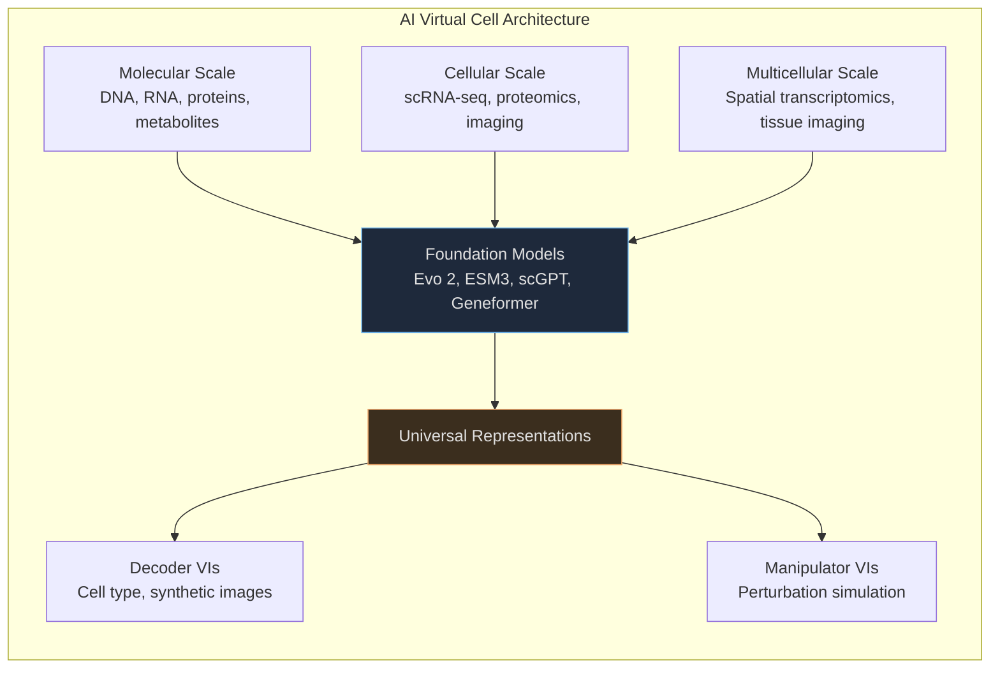

World models — learned internal representations that simulate environment dynamics and enable prediction, planning, and imagination — have emerged as one of the most consequential ideas in modern AI. Rooted in Kenneth Craik's 1943 theory of mental models and formalized through Sutton's Dyna architecture (1991), they've undergone a dramatic transformation since Ha and Schmidhuber's seminal 2018 paper demonstrated agents training entirely inside hallucinated dreams [1].

This post surveys the full landscape: three architectural generations of world models, the composite architecture pattern, the JEPA vs. generative debate, and how these same ideas are revolutionizing our understanding of living systems — from protein folding to virtual cells. It draws on 64+ sources across arXiv, NeurIPS, ICLR, Nature, and industry publications.

---

## Part I: Foundations

### From Mental Models to Learned Simulators

The idea predates AI itself. Craik argued in 1943 that organisms carry "an internal representation of external reality" enabling prediction and navigation [10]. Karl Friston formalized this through the free energy principle (~2006) — organisms minimize surprise by maintaining internal generative models and continuously updating predictions from sensory feedback [11].

In reinforcement learning, Sutton's Dyna architecture (1991) first showed the practical value: an agent simultaneously learns from real experience and from simulated experience generated by its model. This established the pattern that persists today — a world model lets an agent "imagine" the consequences of actions without executing them.

The modern era began in 2015 with two parallel efforts: Watter et al.'s Embed to Control learned locally linear latent dynamics for control from raw images [12], and Oh et al. demonstrated action-conditional video prediction in Atari [13]. Both proved that neural networks could learn compressed, manipulable representations of environment dynamics from pixels alone.

### Ha and Schmidhuber (2018): Training in Dreams

The catalyzing paper introduced a three-component composite architecture that remains the conceptual template [1]:

The Controller had just **867 parameters** for CarRacing and **1,088 for VizDoom**. Agents trained entirely in hallucinated environments survived 1,092 +/- 556 timesteps in the real VizDoom environment [1]. A critical finding: agents could discover adversarial policies exploiting model imperfections — at low temperature settings, they learned impossible strategies like preventing monsters from shooting fireballs.

### The Dreamer Lineage

Danijar Hafner's Dreamer series systematically advanced the field across four iterations:

**PlaNet** [14] introduced the Recurrent State Space Model (RSSM), combining deterministic and stochastic components. **DreamerV1** [15] solved long-horizon visual control purely by latent imagination. **DreamerV2** [16] was the first agent to achieve human-level performance on all 55 Atari benchmarks. **DreamerV3** [17] achieved the field's most impressive generalization: a single algorithm with fixed hyperparameters outperforming specialized methods across 150+ diverse tasks — including collecting diamonds in Minecraft from scratch without human data.

DreamerV3 also demonstrated the first evidence of **scaling laws for world models**: larger models improve both data-efficiency and final performance [17].

---

## Part II: Three Generations of Architecture

### Generation 1: Recurrent Latent Dynamics (2018-2021)

The first generation combined a VAE encoder (compressing observations to latent codes), an RNN (predicting latent dynamics), and a decoder (reconstructing observations). Ha and Schmidhuber's V-M-C [1] and Hafner's RSSM [14] are the defining examples.

The RSSM's innovation was a dual path — deterministic (GRU hidden state) for persistent memory plus stochastic (learned prior/posterior distributions) for uncertainty. Limitations: RNNs struggle with long-range dependencies and training is inherently sequential along the time axis.

### Generation 2: Transformer World Models (2022-2024)

The second generation replaced RNNs with Transformers, recasting world modeling as sequence prediction over discrete tokens — the same paradigm powering LLMs.

**TransDreamer** [18] was first to swap the RNN for a Transformer. **IRIS** [2] fully committed to the paradigm: VQ-VAE tokenization + autoregressive Transformer (minGPT). IRIS achieved human-level on Atari 100k with **just two hours of gameplay**, outperforming humans on 10 of 26 games.

### Generation 3: Diffusion and Foundation Models (2024-2026)

**DIAMOND** [3] challenged discrete tokenization, arguing that "compression into compact discrete representations may ignore visual details important for reinforcement learning." Its diffusion-based world model achieved **1.46 mean human normalized score on Atari 100k — a 40% improvement over IRIS**.

**Genie** (DeepMind, 2024) scaled unsupervised world model training to 11B parameters from unlabeled internet videos [20]. **Genie 2** [21] — an autoregressive latent diffusion model — generates interactive 3D worlds from single image prompts with emergent physics: object affordances, water/smoke effects, gravity, lighting, and NPC behavior. DeepMind positions it as enabling "future agents to be trained in a limitless curriculum of novel worlds."

**NVIDIA Cosmos** [4] represents the largest-scale effort: 14B parameters trained on 10,000 H100 GPUs over three months using 20 million hours of video. It provides both autoregressive (discrete token) and diffusion (continuous token) models, all open-source.

| Generation | Architecture | Key System | Atari 100k Score | Key Innovation |
|-----------|-------------|-----------|-----------------|----------------|
| Gen 1 | VAE + RNN | DreamerV2 | ~0.75 HNS | RSSM dual-path latent dynamics |
| Gen 2 | VQ-VAE + Transformer | IRIS | 1.046 HNS | Sequence prediction over visual tokens |
| Gen 3 | Diffusion | DIAMOND | 1.46 HNS | Continuous generation preserves visual detail |

---

## Part III: Building Composite World Models

### The Composite Architecture Pattern

Every successful world model shares a modular structure with independently designed, often independently trained components:

The power of this decomposition: each component can be swapped independently. Replace a VAE encoder with VQ-VAE. Swap an LSTM dynamics model for a Transformer. The pattern holds from Ha and Schmidhuber's 867-parameter controller to NVIDIA's 14B-parameter Cosmos.

### Discrete vs. Continuous Latent Spaces

The choice of latent representation profoundly affects capabilities:

**Discrete tokenization (VQ-VAE)** enables autoregressive sequence prediction with standard transformer architectures. IRIS pioneered this [2]; NVIDIA Cosmos extended it to a 64,000-token vocabulary using Finite Scalar Quantization [4].

**Continuous latent spaces** preserve more information but require different generative mechanisms. DIAMOND's result — surpassing IRIS by 40% — provides strong evidence that "visual details matter" and discretization introduces a meaningful bottleneck [3].

**NVIDIA Cosmos bridges both:** continuous tokenizers (for diffusion models) and discrete tokenizers (for autoregressive transformers), with a diffusion decoder bridging token spaces [4].

### Training Strategies

The field has converged on several key approaches:

- **Masked prediction:** VideoMAE showed that 90-95% masking ratios work for video due to temporal redundancy [24]. Data quality matters more than quantity.
- **Autoregressive next-token prediction:** The same objective powering GPT drives IRIS, Genie, and Cosmos. Predicting the next visual token given context is functionally equivalent to learning dynamics.
- **Diffusion-based training:** DIAMOND trains denoising diffusion conditioned on past frames [3]. **Diffusion Forcing** [25] combines both paradigms — training diffusion with independent per-token noise levels, enabling rollouts past the training horizon.
- **Self-supervised representation learning:** V-JEPA masks large spatiotemporal video regions and predicts representations, not pixels [5].

### State Space Models: The Efficiency Alternative

Transformers have quadratic attention complexity — critical for long video sequences. State space models offer linear-time alternatives.

**S4** [27] solved Path-X at sequence length 16,384 where all prior methods failed. **Mamba** [28] achieved 5x higher throughput than Transformers with linear scaling. **R2I** [29] integrated SSMs into DreamerV3's architecture, achieving superhuman performance on Memory Maze — demonstrating that SSMs qualitatively improve long-term memory, not just computational efficiency.

---

## Part IV: The JEPA Alternative

### LeCun's Cognitive Architecture

Yann LeCun's 2022 position paper proposed a fundamentally different approach: **predict in abstract representation space rather than pixel space** [30]. His argument: generative models waste capacity on irrelevant details — carpet texture, leaves in wind, water ripples — that cannot be accurately predicted long-term but must be reconstructed.

The architecture operates in two modes analogous to Kahneman's System 1/System 2: **Mode-1** is reactive (single pass, no world model). **Mode-2** involves deliberate planning via model-predictive control through the world model. Mode-2 reasoning can be "compiled" into Mode-1 by training a policy to approximate optimal actions [30].

### JEPA: The Technical Framework

The Joint Embedding Predictive Architecture (JEPA) defines energy as `E(x,y,z) = D(s_y, Pred(s_x, z))` — the encoder of y can produce an abstract representation from which irrelevant details have been eliminated. This is impossible in generative models that must reconstruct every detail [30].

**Hierarchical JEPA** stacks multiple levels for multi-scale prediction: JEPA-1 for short-term, JEPA-2 for longer-term — analogous to decomposing "commute to work" into driving, trains, and walking, down to muscle controls [30].

### From Theory to Deployment

**I-JEPA** [31] applied the framework to images. **V-JEPA** [5] extended to video, achieving 1.5-6x training efficiency improvements. **V-JEPA 2** [32] is the most significant validation: trained on over one million hours of internet video plus less than 62 hours of robot interaction data, it was deployed **zero-shot on physical Franka robot arms** for pick-and-place planning — JEPA-trained world models transferring to real robotics without task-specific fine-tuning.

### The Generative vs. JEPA Debate

The debate is unsettled. LeCun argues generative models waste capacity on irrelevant details [30]. But **VideoWorld** — a 300M-parameter generative video model — achieved professional 5-dan Go level without search or RL [26], providing a counter-argument that generative models can learn deep reasoning. DreamerV3's success across 150+ tasks [17] further demonstrates the generative approach works.

LeCun left Meta in November 2025 to establish Advanced Machine Intelligence (AMI) Labs, declaring "LLMs are a dead end when it comes to superintelligence" [34]. Whether joint embedding prediction, not generation, is the path to autonomous intelligence may prove the defining architectural question of the next decade.

---

## Part V: World Models for Biology

### AlphaFold as a World Model

AlphaFold functions as a learned simulator of molecular structure. AlphaFold 2 achieved median GDT 92.4 at CASP14, effectively solving protein structure prediction and earning the 2024 Nobel Prize in Chemistry [35]. **AlphaFold 3** (May 2024) expanded to protein-DNA-RNA-ligand complexes with "a minimum 50% improvement in accuracy" [6]. Its diffusion architecture "starts with a cloud of atoms, and over many steps converges on its final molecular structure" [6].

The AlphaFold database now contains over **214 million** predicted structures [36]. **ESM3** (98B parameters, EvolutionaryScale) generated a novel fluorescent protein equivalent to simulating **500 million years of evolution** [38]. **Isomorphic Labs** doubled AlphaFold 3's accuracy on protein-ligand prediction [39].

### DNA Language Models

DNA language models apply the same transformer architectures to genomics, learning implicit world models of molecular biology:

**Evo 2** [7] is the most ambitious: 40B parameters trained on 8.8 trillion tokens across all domains of life with up to one million base pair context. By predicting the next nucleotide across billions of evolutionary examples, these models implicitly learn protein folding physics, gene regulatory logic, and evolutionary fitness.

### Cell Foundation Models

Single-cell models are the biological "perception encoder" — compressing high-dimensional gene expression into meaningful latent representations:

**scGPT** [46]: 33 million cells, enables cell annotation and perturbation prediction in under one second for 10,000 cells. **Geneformer V2** [9]: 316M parameters, 104 million transcriptomes. Its in silico perturbation capability identified a novel transcription factor critical for cardiomyocyte contractile force — **experimentally validated in iPSC disease models** [9]. One of the first cases where an AI biological world model made a prediction confirmed in the wet lab.

**scFoundation** [47]: 100M parameters, SOTA across gene expression enhancement, drug response, and perturbation prediction. **Cell2Sentence** [48]: converts gene expression to natural language, enabling 27B-parameter LLMs to natively process single-cell data.

Arc Institute's **STATE model** achieves 40-60% perturbation prediction accuracy. David Burke (Arc CTO) states that **75% accuracy would enable biologists to rely on predictions without wet lab experiments** — a threshold the field is approaching [49].

### The AI Virtual Cell

The most ambitious project: 42 authors from CZI, Stanford, Arc Institute, Microsoft Research, Google, and Harvard laid out a vision for "high-fidelity simulations of cells and cellular systems directly learned from biological data" [8]. The Short Read Archive alone holds over **14 petabytes** — 1,000x larger than ChatGPT's training dataset — with data doubling every six months.

In October 2025, CZI and NVIDIA partnered to scale this to petabytes of data spanning billions of cellular observations [50]. CZI's Billion Cells Project aims to generate one billion cells of training data, compressing traditional 3-4 year pipelines to months [49].

### ML Force Fields and Molecular Simulation

**BioEmu** (Microsoft) is the most direct application of the world model concept to molecular biology — a generative model sampling from the approximated equilibrium distribution of protein conformations. It generates 1,000 structures in **~4 minutes** versus days-to-weeks for traditional MD [54].

**RFdiffusion** (Institute for Protein Design) runs a world model of protein physics **in reverse** — generating novel protein structures that fold as designed [56].

The first whole-cell computational model (2012) simulated the complete life cycle of *Mycoplasma genitalium*, requiring a 128-computer cluster and 10 hours per cell division [57]. In clinical applications, **HeartFlow** has treated 600,000+ patients with patient-specific cardiac digital twins [59].

---

## Part VI: Industry Landscape

| Company | Focus | Scale | Key Detail |
|---------|-------|-------|------------|
| NVIDIA Cosmos | Physical AI platform | 14B params, 10K H100s | Open-source, both AR + diffusion |
| World Labs (Fei-Fei Li) | Spatial intelligence | Marble + Spark 2.0 | "3D is the universal interface for space" |
| Decart | Real-time simulation | $153M raised, $3.1B val | "100x greater computational efficiency" |
| Odyssey | Interactive video | Odyssey-2 | 50ms latency frame streaming |
| Wayve | Autonomous driving | GAIA-1, 9B+ params | 4,700 hours London driving data |
| Insilico Medicine | Drug discovery | First AI-designed drug in Phase 2 | $2.75B deal with Eli Lilly |
| Recursion | Cell response modeling | 36 PB proprietary data | 2.2M samples/week, 100B cells/year |

OpenAI framed Sora as "video generation models as world simulators" [69], but it exhibited clear physics failures and was discontinued in March 2026. The gap between visually plausible video and genuine physical understanding remains the central debate.

The **Othello-GPT** experiment [72] provided evidence that language-style models develop genuine world representations — a GPT trained solely on move sequences developed an emergent board state representation. Gurnee and Tegmark [73] found that Llama-2 develops linear representations of space and time, suggesting LLMs possess "basic ingredients of a world model."

---

## Cross-Cutting Patterns

### Pattern 1: Architectural Convergence

Across RL, physical simulation, and biology, the transformer is the default backbone. IRIS, Genie, Cosmos, AlphaFold 3, Evo 2, scGPT, and Geneformer all use transformers. The autoregressive next-token prediction objective works for visual tokens, DNA bases, and gene expression ranks alike. However, SSMs (Mamba, S4) offer efficiency for long sequences, and JEPA may prove superior for embodied reasoning.

### Pattern 2: The Three-Act Structure

Every successful world model follows: **(1) Encode** observations into a latent space, **(2) Predict** how states evolve over time, **(3) Decode** or evaluate for downstream use. This holds from Ha & Schmidhuber's V-M-C to AlphaFold (encode sequences, predict structure, output coordinates) to cell foundation models (encode expression, predict perturbations, decode cell state).

### Pattern 3: Biology Recapitulates AI History

Biological world models are replaying AI's architectural history on a compressed timeline. Early: mechanistic simulation (hand-coded physics). AlphaFold: learned prediction (early neural world models). Cell foundation models: transformer sequence prediction (IRIS/GPT era). Virtual Cell: foundation-model-scale simulators (Cosmos/Genie era).

### The Sample Efficiency Revolution

A striking pattern: world models compress the cost of experience by orders of magnitude.

| System | Experience Required | vs. Alternative |
|--------|-------------------|-----------------|
| IRIS | 2 hours gameplay | Human-level Atari |
| V-JEPA 2 | <62 hours robot data | Zero-shot deployment |
| BioEmu | ~4 min / 1,000 structures | Days-weeks for MD |
| Geneformer | In silico perturbation | Months in wet lab |

### The Generative-Predictive Spectrum

Rather than a binary choice, the field is evolving toward a spectrum. V-JEPA 2 predicts in representation space but uses generative decoders for visualization. Cosmos trains both autoregressive and diffusion models sharing tokenizers. The optimal position depends on the application: generative for visual fidelity, predictive for abstract reasoning, hybrid for real-world robotics.

---

## Limitations

**Sora's physics failures** challenge the "video generation as world model" thesis — visual plausibility alone is insufficient [69]. **VideoWorld's success** challenges LeCun's anti-generative position — generative models can learn deep reasoning [26]. **Biological world models have limited prospective validation** — most claims rest on retrospective benchmarks, and the 40-60% perturbation accuracy falls short of the 75% threshold for replacing wet labs [49].

Evaluation benchmarks are fragmented. Multi-agent world models are underexplored. Compositional generalization remains a fundamental challenge. The energy cost of training at Cosmos scale (10,000 H100s for three months) is rarely discussed.

---

## Recommendations

1. **Adopt the composite architecture pattern** with swappable components. Start with IRIS (discrete tokens), DreamerV3 (continuous latent), or DIAMOND (diffusion) depending on fidelity needs.
2. **Evaluate JEPA for embodied applications.** V-JEPA 2's zero-shot robotic deployment [32] and training efficiency [5] make it the leading approach for sample-efficient robotics.
3. **Leverage open-source infrastructure.** NVIDIA Cosmos, DreamerV3, DIAMOND, and IRIS are all publicly available. Avoid building from scratch.
4. **For biology, start with cell foundation models.** scGPT, Geneformer V2, and scFoundation are pretrained on tens of millions of cells. CZI's Virtual Cells Platform provides a growing ecosystem [50].
5. **Explore SSM-transformer hybrids.** R2I's results [29] suggest combining Mamba (long-range efficiency) with attention (precise short-range modeling) yields the best of both worlds.

---

## Bibliography

1. Ha, D. and Schmidhuber, J. (2018). "[World Models.](https://worldmodels.github.io/)" arXiv:1803.10122.
2. Micheli, V., Alonso, E., and Fleuret, F. (2023). "[Transformers are Sample-Efficient World Models.](https://arxiv.org/abs/2209.00588)" ICLR 2023.
3. Alonso, E., Jelley, A., Micheli, V., et al. (2024). "[Diffusion for World Modeling: Visual Details Matter in Atari.](https://arxiv.org/abs/2405.12399)" NeurIPS 2024 Spotlight.
4. NVIDIA (2025). "[Cosmos World Foundation Model Platform for Physical AI.](https://arxiv.org/abs/2501.03575)" arXiv:2501.03575.
5. Meta AI (2024). "[V-JEPA: The next step toward advanced machine intelligence.](https://ai.meta.com/blog/v-jepa-yann-lecun-ai-model-video-joint-embedding-predictive-architecture/)"
6. Google DeepMind (2024). "[AlphaFold 3 predicts the structure and interactions of all of life's molecules.](https://blog.google/technology/ai/google-deepmind-isomorphic-alphafold-3-ai-model/)"
7. Arc Institute (2025). "[Evo 2: Genome-Scale DNA Foundation Model.](https://github.com/arcinstitute/evo2)" Nature.
8. Bunne, C., et al. (2024). "[How to Build the Virtual Cell with Artificial Intelligence.](https://arxiv.org/abs/2409.11654)" arXiv:2409.11654.
9. Theodoris, C., et al. (2024). "[Geneformer: Foundation Transformer Model for Single-Cell Biology.](https://huggingface.co/ctheodoris/Geneformer)" Nature.
10. Craik, K. (1943). *The Nature of Explanation.* Cambridge University Press.
11. Friston, K. (2006). "The Free Energy Principle."
12. Watter, M., et al. (2015). "[Embed to Control.](https://arxiv.org/abs/1506.07365)" arXiv:1506.07365.
13. Oh, J., et al. (2015). "[Action-Conditional Video Prediction.](https://arxiv.org/abs/1507.08750)" NIPS 2015.
14. Hafner, D., et al. (2018). "[Learning Latent Dynamics for Planning from Pixels.](https://arxiv.org/abs/1811.04551)" arXiv:1811.04551.
15. Hafner, D., et al. (2019). "[Dream to Control: Learning Behaviors by Latent Imagination.](https://arxiv.org/abs/1912.01603)" arXiv:1912.01603.
16. Hafner, D., et al. (2020). "[Mastering Atari with Discrete World Models.](https://arxiv.org/abs/2010.02193)" ICLR 2021.
17. Hafner, D., et al. (2023). "[Mastering Diverse Domains through World Models.](https://arxiv.org/abs/2301.04104)" arXiv:2301.04104.
18. Chen, C., et al. (2022). "[TransDreamer: Reinforcement Learning with Transformer World Models.](https://arxiv.org/abs/2202.09481)" arXiv:2202.09481.
19. Synthesis of IRIS, TransDreamer, DreamerV2, Ha & Schmidhuber — architectural evolution across respective papers.
20. DeepMind (2024). "[Genie: Generative Interactive Environments.](https://arxiv.org/abs/2402.15391)" arXiv:2402.15391.
21. DeepMind (2024). "[Genie 2: A large-scale foundation world model.](https://deepmind.google/discover/blog/genie-2-a-large-scale-foundation-world-model/)"
22. Hansen, N., et al. (2024). "[TD-MPC2: Scalable, Robust World Models for Continuous Control.](https://arxiv.org/abs/2310.16828)" ICLR 2024.
23. He, K., et al. (2021). "[Masked Autoencoders Are Scalable Vision Learners.](https://arxiv.org/abs/2111.06377)" arXiv:2111.06377.
24. Tong, Z., et al. (2022). "[VideoMAE: Masked Autoencoders are Data-Efficient Learners.](https://arxiv.org/abs/2203.12602)" NeurIPS 2022.
25. Chen, B., et al. (2024). "[Diffusion Forcing: Next-token Prediction Meets Full-Sequence Diffusion.](https://arxiv.org/abs/2407.01392)" arXiv:2407.01392.
26. (2025). "[VideoWorld: Exploring Knowledge Learning from Unlabeled Videos.](https://arxiv.org/abs/2501.09781)" arXiv:2501.09781.
27. Gu, A., et al. (2022). "[Efficiently Modeling Long Sequences with Structured State Spaces.](https://arxiv.org/abs/2111.00396)" ICLR 2022 Outstanding Paper.
28. Gu, A. and Dao, T. (2023). "[Mamba: Linear-Time Sequence Modeling with Selective State Spaces.](https://arxiv.org/abs/2312.00752)" arXiv:2312.00752.
29. Samsami, A., et al. (2024). "[Mastering Memory Tasks with World Models.](https://arxiv.org/abs/2403.04253)" ICLR 2024.
30. LeCun, Y. (2022). "[A Path Towards Autonomous Machine Intelligence.](https://openreview.net/forum?id=BZ5a1r-kVsf)" OpenReview.
31. Assran, M., et al. (2023). "[I-JEPA: Self-Supervised Learning from Images.](https://arxiv.org/abs/2301.08243)" arXiv:2301.08243.
32. Meta FAIR (2025). "[V-JEPA 2: Self-Supervised Video Models Enable Understanding, Prediction and Planning.](https://arxiv.org/abs/2506.09985)" arXiv:2506.09985.
33. ArXiv search results for V-JEPA applications (2024-2025): Drive-JEPA, SurgMotion.
34. [Yann LeCun — Wikipedia.](https://en.wikipedia.org/wiki/Yann_LeCun)
35. [The Nobel Prize in Chemistry 2024.](https://www.nobelprize.org/prizes/chemistry/2024/)
36. [AlphaFold Protein Structure Database.](https://alphafold.ebi.ac.uk/)
37. Lin, Z., et al. (2023). "[Evolutionary-scale prediction of protein structure with a language model.](https://github.com/facebookresearch/esm)" Science.
38. EvolutionaryScale (2024). "[ESM3: Simulating 500 million years of evolution.](https://www.evolutionaryscale.ai/)"
39. Isomorphic Labs (2025). "Drug Design Engine."
40. MIT (2024). "[Boltz-1: Democratizing Biomolecular Interaction Modeling.](https://github.com/jwohlwend/boltz)"
41. Arc Institute (2025). [Evo 2 technical details.](https://github.com/arcinstitute/evo2)
42. Arc Institute (2024). "[Evo: Biological Foundation Model for Long-Context DNA Modeling.](https://github.com/evo-design/evo)"
43. Nguyen, E., et al. (2023). "HyenaDNA: Long-Range Genomic Sequence Modeling." arXiv:2306.15794.
44. Zhou, Z., et al. (2024). "DNABERT-2: Efficient Foundation Model for Multi-Species Genome." ICLR 2024.
45. InstaDeep (2023). "The Nucleotide Transformer."
46. Wang Lab (2024). "[scGPT: Foundation Model for Single-Cell Multi-omics.](https://github.com/bowang-lab/scGPT)"
47. BioMap (2024). "[scFoundation: Large-Scale Foundation Model on Single-Cell Transcriptomics.](https://github.com/biomap-research/scFoundation)" Nature Methods.
48. Van Dijk Lab (2024). "[Cell2Sentence: LLM-Based Single-Cell Analysis.](https://github.com/vandijklab/cell2sentence)" ICML 2024.
49. Freethink (2025). "[AI's Next Frontier — Modeling Life Itself.](https://www.freethink.com/artificial-intelligence/virtual-cells)"
50. CZI (2025). "[CZI and NVIDIA Accelerate Virtual Cell Model Development.](https://chanzuckerberg.com/newsroom/nvidia-partnership-virtual-cell-model/)"
51. R&D World (2025). "[CZI and NVIDIA Expand Virtual Cell Push.](https://www.rdworldonline.com/czi-and-nvidia-expand-virtual-cell-push-with-open-models-and-benchmarks/)"
52. CZI (2025). "[GREmLN AI Model Could Help Scientists Pinpoint Signs of Cancer Cells.](https://chanzuckerberg.com/newsroom/gremln-ai-model-launch/)"
53. ACEsuit (2024). [MACE, NequIP, and OpenMM-ML.](https://github.com/ACEsuit/mace)
54. Microsoft Research (2025). "[BioEmu: Protein Equilibrium Ensemble Emulator.](https://github.com/microsoft/BioEmu)"
55. [Microsoft Research AI for Science.](https://www.microsoft.com/en-us/research/lab/microsoft-research-ai-for-science/)
56. Watson, J.L., et al. (2023). "De novo design of protein structure and function with RFdiffusion." Nature.
57. Karr, J.R., et al. (2012). "A Whole-Cell Computational Model Predicts Phenotype from Genotype." Cell.
58. JCVI (2024). "[First Minimal Synthetic Bacterial Cell.](https://www.jcvi.org/research/first-minimal-synthetic-bacterial-cell)"
59. HeartFlow (2026). "[AI-Powered Cardiac Digital Twin Platform.](https://www.heartflow.com/)"
60. Insilico Medicine (2026). "[AI-Driven Drug Discovery Platform.](https://www.insilico.com/)"
61. Recursion Pharmaceuticals (2026). "[Technology Platform.](https://recursion.com/technology)"
62. NVIDIA (2025-2026). "[Cosmos Platform.](https://www.nvidia.com/en-us/ai/cosmos/)"
63. World Labs (2025-2026). "[Blog.](https://www.worldlabs.ai/blog)"
64. [Decart AI.](https://decart.ai/)
65. [Odyssey AI Lab.](https://odyssey.ml/)
66. Wayve (2023). "[Scaling GAIA-1.](https://wayve.ai/thinking/scaling-gaia-1/)"
67. Hu, A., et al. (2022). "[MILE: Model-Based Imitation Learning for Urban Driving.](https://arxiv.org/abs/2210.07729)" NeurIPS 2022.
68. Brohan, A., et al. (2023). "[RT-2: Vision-Language-Action Models.](https://arxiv.org/abs/2307.15818)"
69. [Sora (text-to-video model) — Wikipedia.](https://en.wikipedia.org/wiki/Sora_(text-to-video_model))
70. [Google Veo — Wikipedia.](https://en.wikipedia.org/wiki/Google_Veo)
71. Runway (2024). "[Introducing Gen-3 Alpha.](https://runwayml.com/blog/introducing-gen-3-alpha/)"
72. Li, K., et al. (2023). "[Emergent World Representations.](https://arxiv.org/abs/2210.13382)" ICLR 2023 Oral.
73. Gurnee, W. and Tegmark, M. (2023). "[Language Models Represent Space and Time.](https://arxiv.org/abs/2310.02207)" arXiv:2310.02207.
