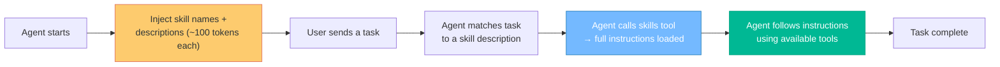
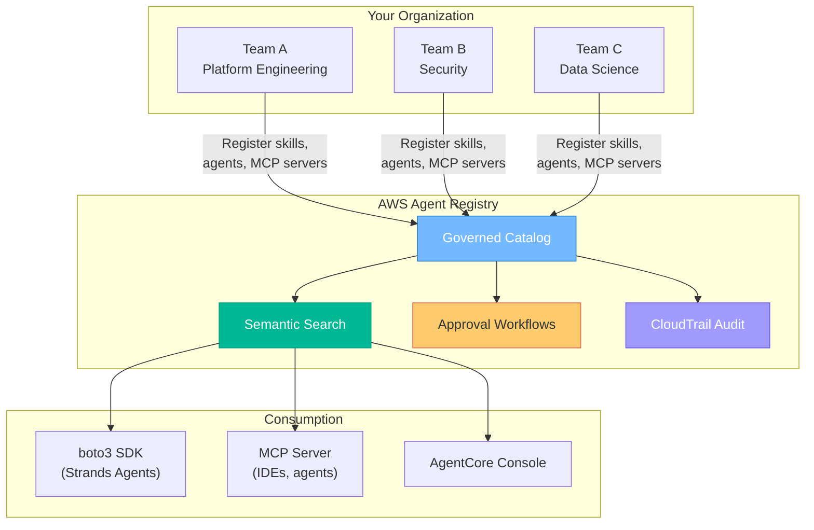
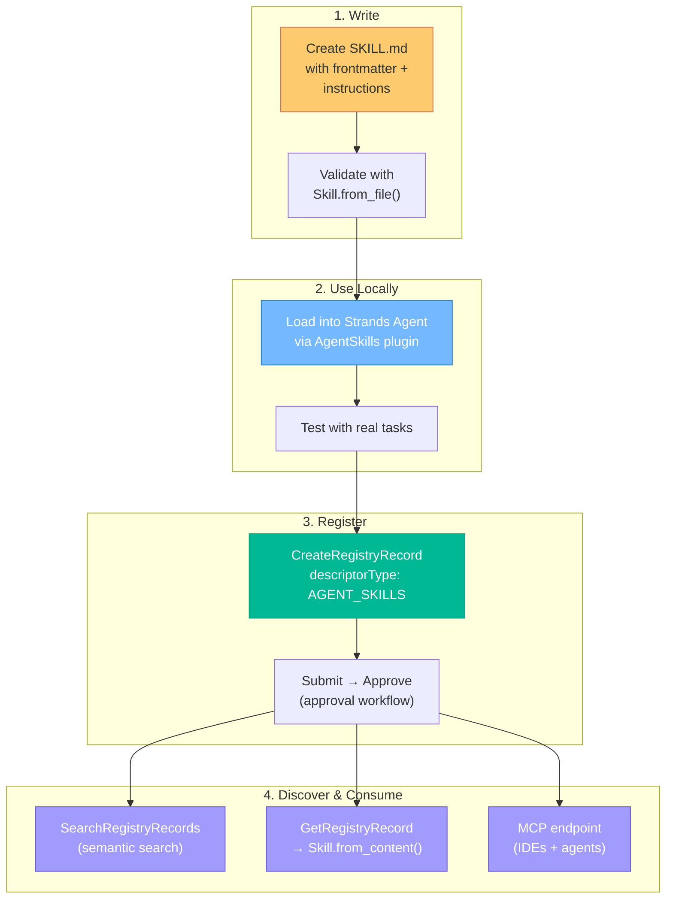

*Agent skills are the portable plugin format that works across Claude Code, GitHub Copilot, Strands Agents, and dozens more. Here's how to write one, wire it into a Strands agent, and register it in AWS Agent Registry so your whole org can discover it.*

*This post comes with a [companion Jupyter notebook](https://gist.github.com/dgallitelli/e2a85a391a8cdf63661e21314fc3d4a5) that validates every code example end-to-end — from creating a skill to loading it from the registry via MCP.*


*Photo by [Todd Quackenbush](https://unsplash.com/@toddquackenbush) on [Unsplash](https://unsplash.com)*

---

There's a problem brewing in the AI agent ecosystem that reminds me of the early days of microservices: everyone is building capabilities, but nobody can find or reuse what already exists.

Team A builds a code review agent. Team B builds another one. Neither knows the other exists. Both are hard-coded into their respective frameworks and can't be shared. Multiply this across an organization with dozens of agent projects, and you get the same sprawl that led us to service registries and API catalogs a decade ago.

**Agent skills** solve this. They're a simple, open specification for packaging agent capabilities as portable plugins — a Markdown file with YAML frontmatter that any compliant agent framework can discover, load, and execute. One skill works in Claude Code, GitHub Copilot, VS Code, Cursor, Strands Agents, Gemini CLI, OpenAI Codex, JetBrains, and [many more](https://agentskills.io).

In this post, I'll walk you through the full lifecycle: write a skill from scratch, wire it into a [Strands Agents](https://strandsagents.com) application, and register it in [AWS Agent Registry](https://aws.amazon.com/bedrock/agentcore/) so the rest of your organization can discover and use it.

---

## What Is An Agent Skill?

A skill is a **set of instructions** that an agent can load on demand. Think of it like a runbook for an AI agent — when the agent encounters a task that matches a skill's description, it loads the full instructions and follows them.

The key insight is **progressive disclosure**:

1. **Discovery** — At startup, only the skill's `name` and `description` (~100 tokens) are injected into the agent's system prompt
2. **Activation** — When the agent decides a skill is relevant, it calls an internal `skills` tool to load the full instructions
3. **Execution** — The agent follows the loaded instructions using whatever tools are available

This means an agent can have hundreds of skills available without consuming its context window. Only the relevant skill's instructions get loaded when needed.



---

## Part 1: Writing Your First Skill

A skill lives in a directory. The only required file is `SKILL.md`. Let's build one that reviews infrastructure-as-code (Terraform, CloudFormation) for security best practices.

### The Directory Structure

```
iac-security-review/
├── SKILL.md              # Required: metadata + instructions
├── references/           # Optional: documentation the agent can reference
│   └── aws-well-architected-security.md
└── scripts/              # Optional: executable code
    └── scan.sh
```

The directory name **must match** the `name` field in the SKILL.md frontmatter. This is enforced by the spec — `iac-security-review/SKILL.md` must have `name: iac-security-review`.

### The SKILL.md File

SKILL.md has two parts: YAML frontmatter (metadata) and Markdown body (instructions).

```markdown
---
name: iac-security-review
description: >
  Review infrastructure-as-code files (Terraform, CloudFormation) for security
  misconfigurations. Use when the user asks to review IaC, check for security
  issues in infrastructure code, or audit cloud resource definitions.
license: Apache-2.0
allowed-tools: file_read shell
metadata:
  author: platform-team
  version: "1.0"
---

You are an infrastructure security reviewer. When asked to review IaC files:

## Step 1: Identify IaC files

Use `file_read` or directory listing to find all `.tf`, `.yaml`, `.yml`,
and `.json` files that define cloud resources. Focus on the paths the user
specifies, or scan the current directory if none are given.

## Step 2: Check for common misconfigurations

For each file, check against these categories:

### Public access
- S3 buckets with public ACLs or missing `BlockPublicAccess`
- Security groups with `0.0.0.0/0` on sensitive ports (22, 3389, 3306, 5432)
- RDS instances with `publicly_accessible = true`
- API Gateway endpoints without authentication

### Encryption
- S3 buckets without server-side encryption
- EBS volumes without encryption
- RDS instances without `storage_encrypted`
- SNS/SQS without KMS encryption

### IAM
- Policies with `"Action": "*"` or `"Resource": "*"`
- Roles without condition keys
- Missing `MFA` conditions on sensitive operations

### Logging
- CloudTrail not enabled
- S3 access logging disabled
- VPC flow logs missing

## Step 3: Report findings

For each finding, report:
1. **File and line** — exact location
2. **Severity** — Critical, High, Medium, Low
3. **Issue** — what's wrong
4. **Fix** — specific code change to remediate

Sort findings by severity (Critical first). If no issues are found, say so
explicitly — don't invent problems.
```

Let's break down the frontmatter fields:

| Field | Required | What It Does |
|-------|----------|-------------|
| `name` | Yes | Unique identifier (lowercase, hyphens, 1-64 chars). Must match directory name |
| `description` | Yes | Up to 1024 chars. This is what the agent sees at startup to decide relevance |
| `license` | No | License identifier |
| `allowed-tools` | No | Space-separated tool names the skill needs. Currently informational, not enforced at runtime |
| `metadata` | No | Arbitrary key-value pairs (author, version, tags, etc.) |
| `compatibility` | No | Environment requirements (up to 500 chars) |

The description is the most important field after the instructions themselves. It's the agent's only signal for deciding whether to activate the skill. Write it like a search query — include the specific phrases a user would say that should trigger this skill.

### Writing Good Instructions

A few principles that make the difference between a skill that works and one that confuses the agent:

**Be specific about tools.** Don't say "check the files" — say "use `file_read` to examine each file." The agent needs to know which tools to reach for.

**Structure with numbered steps.** Agents follow ordered instructions more reliably than prose. Each step should have a clear input and output.

**Include decision criteria.** "If X, do Y" is better than "handle appropriately." The agent doesn't share your intuition — give it yours explicitly.

**Define the output format.** If you want findings in a table, show the table structure. If you want a summary paragraph, say so. Don't leave the format to chance.

### Validating Your Skill

The [Agent Skills reference library](https://github.com/agentskills/agentskills) provides a CLI validator:

```bash
pip install agent-skills
skills-ref validate ./iac-security-review
```

This checks that the frontmatter is valid, the name matches the directory, the description is within length limits, and the overall structure conforms to the [spec](https://agentskills.io/specification).

---

## Part 2: Using Skills With Strands Agents

[Strands Agents](https://strandsagents.com) is an open-source, model-driven SDK for building AI agents in Python. It takes a "model-first" approach — the LLM drives the agent loop, deciding when to use tools and when to stop, rather than following a predetermined rule-based flow.

### Installation

```bash
pip install strands-agents strands-agents-tools
```

### The Simplest Agent

Before we add skills, here's the minimal Strands agent:

```python
from strands import Agent
from strands_tools import calculator

agent = Agent(tools=[calculator])
agent("What is the square root of 1764?")
```

Three lines. The `Agent` class handles the loop: send the prompt to the model, check if it wants to use a tool, execute the tool, send the result back, repeat until the model produces a final response. By default, it uses Amazon Bedrock as the model provider.

### Adding Skills

Skills are loaded via the `AgentSkills` plugin:

```python
from strands import Agent, AgentSkills
from strands_tools import file_read, shell

# Load the skill we just created
plugin = AgentSkills(skills="./iac-security-review")

agent = Agent(
    plugins=[plugin],
    tools=[file_read, shell],
)

agent("Review the Terraform files in ./infrastructure/ for security issues")
```

Here's what happens at runtime:

1. The `AgentSkills` plugin reads the `SKILL.md` frontmatter and injects the skill's name and description into the system prompt as XML
2. The user's message arrives: "Review the Terraform files..."
3. The model sees the injected skill description and recognizes this matches `iac-security-review`
4. The model calls the `skills` tool to activate the skill
5. The full SKILL.md instructions are loaded into context
6. The model follows the instructions, using `file_read` and `shell` to examine the Terraform files
7. It reports findings in the format the skill specifies

The important thing to understand: **the skill provides instructions, not tools.** You still need to give the agent the tools that the skill's instructions reference (`file_read`, `shell`, etc.). The skill tells the agent *what to do*; the tools let it *do it*.

### Loading Multiple Skills

You can load a directory of skills, individual paths, or mix-and-match:

```python
# Load all skills from a directory
plugin = AgentSkills(skills="./skills/")

# Load specific skills
plugin = AgentSkills(skills=[
    "./skills/iac-security-review",
    "./skills/code-review",
    "./skills/incident-response",
])

# Mix file-based and programmatic skills
from strands import Skill

custom = Skill(
    name="greeting",
    description="Generate a personalized greeting for new team members",
    instructions="Greet the user warmly. Ask their name, role, and team...",
)

plugin = AgentSkills(skills=[
    "./skills/iac-security-review",
    custom,
])
```

### Creating Skills Programmatically

Besides loading from SKILL.md files, you can create skills in code:

```python
from strands import Skill

# Direct creation
skill = Skill(
    name="code-review",
    description="Review code for best practices and bugs",
    instructions="Review the provided code. Check for...",
)

# Parse from SKILL.md content string
skill = Skill.from_content("""---
name: code-review
description: Review code for best practices and bugs
---
Review the provided code. Check for...""")

# Load from a directory
skill = Skill.from_file("./skills/code-review")

# Load from a URL
skill = Skill.from_url("https://example.com/skills/code-review/SKILL.md")
```

### Choosing a Model Provider

Strands defaults to Amazon Bedrock, but supports many providers. For our use case, let's be explicit:

```python
from strands import Agent, AgentSkills
from strands.models import BedrockModel
from strands_tools import file_read, shell, python_repl

model = BedrockModel(
    model_id="us.anthropic.claude-sonnet-4-5-20250929-v1:0",
    streaming=True,
)

plugin = AgentSkills(skills="./skills/")

agent = Agent(
    model=model,
    plugins=[plugin],
    tools=[file_read, shell, python_repl],
)
```

### Managing Skills at Runtime

You can inspect and modify the skill roster while the agent is running:

```python
# List available skills
for skill in plugin.get_available_skills():
    print(f"{skill.name}: {skill.description}")

# Add a new skill dynamically
new_skill = Skill(
    name="summarize",
    description="Summarize long documents into key points",
    instructions="Read the document. Extract the 5 most important points...",
)
plugin.set_available_skills(plugin.get_available_skills() + [new_skill])

# Check which skills have been activated in the current session
activated = plugin.get_activated_skills(agent)
```

This is useful for building agents that adapt their capabilities based on context — for example, loading different skill sets based on the user's role or the project they're working in.

---

## Part 3: Registering Skills in AWS Agent Registry

You've written a skill. You've wired it into a Strands agent. It works. Now your colleague on the fraud detection team wants something similar, and the platform team wants to know what agent capabilities exist across the org.

This is where [AWS Agent Registry](https://aws.amazon.com/bedrock/agentcore/) comes in.

### What Is Agent Registry?

Agent Registry is a component of Amazon Bedrock AgentCore. It's a **private, governed catalog** for AI agents, tools, skills, MCP servers, and custom resources within your AWS organization. Think of it as a service catalog — but for agent capabilities instead of microservices.



The core value proposition: **discover existing capabilities instead of rebuilding them.**

The registry has a full API across two planes:

- **Control plane** (`bedrock-agentcore-control`) — CRUD operations for registries and records
- **Data plane** (`bedrock-agentcore`) — semantic search across registered resources

And it exposes itself as an **MCP server**, meaning any MCP-compatible client — IDEs, agents, CLI tools — can query it directly.

### Registering Your Skill

Skills are registered as records with `descriptorType: "AGENT_SKILLS"`. The descriptor carries two payloads: the raw SKILL.md content and a structured definition with repository/package metadata.

```python
import json
import boto3
from pathlib import Path

registry_client = boto3.client("bedrock-agentcore-control", region_name="us-west-2")

REGISTRY_ID = "your-registry-id"

# Read the SKILL.md you wrote in Part 1
skill_md_content = Path("./iac-security-review/SKILL.md").read_text()

# Structured metadata: where to find the full skill repo + dependencies
skill_definition = json.dumps({
    "repository": {
        "url": "https://github.com/my-org/agent-skills/tree/main/skills/iac-security-review",
        "source": "github",
    },
    "packages": [],  # e.g., [{"registryType": "pypi", "identifier": "checkov", "version": "3.0"}]
})

# Create the registry record
response = registry_client.create_registry_record(
    registryId=REGISTRY_ID,
    name="iac-security-review",
    description="Review infrastructure-as-code files for security misconfigurations",
    descriptorType="AGENT_SKILLS",
    descriptors={
        "agentSkills": {
            "skillMd": {"inlineContent": skill_md_content},
            "skillDefinition": {"inlineContent": skill_definition},
        }
    },
    recordVersion="1.0",
)

record_id = response["recordId"]
print(f"Created record: {record_id}")
```

The record starts in `DRAFT` status. To make it discoverable, submit it for approval:

```python
# Submit for approval
registry_client.submit_registry_record_for_approval(
    registryId=REGISTRY_ID,
    recordId=record_id,
)

# Admin approves (or this happens via the console)
registry_client.update_registry_record_status(
    registryId=REGISTRY_ID,
    recordId=record_id,
    status="APPROVED",
)
```

Once approved, the skill is searchable by anyone in the organization.

### Consuming Skills: Three Paths

Here's where it gets interesting. There are three concrete ways to get skills out of the registry and into an agent. Each has different trade-offs.

#### Path A: Direct SDK — `GetRegistryRecord` → `Skill.from_content()`

The simplest path. You know the record ID — fetch it, extract the SKILL.md, feed it to Strands:

```python
import boto3
from strands import Skill

client = boto3.client("bedrock-agentcore-control", region_name="us-west-2")

record = client.get_registry_record(
    registryId="your-registry-id",
    recordId="your-record-id",
)

# The full SKILL.md comes back inline — no second fetch needed
skill_md = record["descriptors"]["agentSkills"]["skillMd"]["inlineContent"]
skill = Skill.from_content(skill_md)

print(f"Loaded: {skill.name}")
print(f"Instructions: {len(skill.instructions)} chars")
```

The response also includes `skillDefinition.inlineContent` with the repository URL and package list — useful if the skill depends on external scripts or pip packages that need to be downloaded separately.

#### Path B: Semantic Search — discover then load

When you don't know what skills exist, use the data plane's `SearchRegistryRecords`. It supports natural language queries and returns full descriptors inline:

```python
import boto3
from strands import Skill, AgentSkills

search_client = boto3.client("bedrock-agentcore", region_name="us-west-2")

results = search_client.search_registry_records(
    registryIds=["your-registry-arn"],
    searchQuery="security review for Terraform",
    maxResults=5,
    filters={"descriptorType": {"$eq": "AGENT_SKILLS"}},
)

# Load every matching skill into Strands
skills = []
for record in results["registryRecords"]:
    md = record["descriptors"]["agentSkills"]["skillMd"]["inlineContent"]
    skills.append(Skill.from_content(md))
    print(f"  Found: {record['name']} [{record['status']}]")

# Wire them into an agent
plugin = AgentSkills(skills=skills)
```

Note the `filters` parameter — you can filter by `descriptorType`, `name`, or `version` using `$eq`, `$ne`, `$in`, `$and`, and `$or` operators. This lets you scope searches to only skills (excluding MCP servers, A2A agents, etc.).

#### Path C: MCP — the lazy-loading pattern

This is the most interesting path. Agent Registry exposes itself as an MCP server at:

```
https://bedrock-agentcore.<region>.amazonaws.com/registry/<registry-id>/mcp
```

Any MCP client can connect — IDEs for developer discovery, but also **Strands agents at runtime**. This turns skill discovery into a tool the agent can call on demand.

For programmatic IAM-authenticated access, use the [`mcp-proxy-for-aws`](https://github.com/aws/mcp-proxy-for-aws) package:

```python
from strands import Agent
from strands.models import BedrockModel
from strands.tools.mcp import MCPClient
from strands_tools import file_read, shell
from mcp_proxy_for_aws.client import aws_iam_streamablehttp_client

REGION = "us-west-2"
REGISTRY_ID = "your-registry-id"
MCP_URL = f"https://bedrock-agentcore.{REGION}.amazonaws.com/registry/{REGISTRY_ID}/mcp"

model = BedrockModel(
    model_id="us.anthropic.claude-sonnet-4-5-20250929-v1:0",
    region_name=REGION,
)

# Connect to the registry as an MCP server
mcp_client = MCPClient(lambda: aws_iam_streamablehttp_client(
    endpoint=MCP_URL,
    aws_region=REGION,
    aws_service="bedrock-agentcore",
))

with mcp_client:
    # The registry's MCP tools (search, etc.) become agent tools
    registry_tools = mcp_client.list_tools_sync()

    agent = Agent(
        model=model,
        tools=[*registry_tools, file_read, shell],
    )

    # The agent can now search the registry as part of its workflow
    agent("Find a skill for reviewing Terraform security, then review ./infrastructure/")
```

What makes this pattern powerful is **lazy loading**: the agent doesn't start with any skills pre-loaded. Instead, it discovers and fetches them at runtime based on the task. It's the difference between shipping an agent with a fixed toolkit versus one that assembles its own capabilities on the fly.

For IDE integration (Kiro, VS Code, Cursor), it's even simpler — add the MCP endpoint to your MCP configuration:

```json
{
  "mcpServers": {
    "agent-registry": {
      "type": "http",
      "url": "https://bedrock-agentcore.us-west-2.amazonaws.com/registry/<registry-id>/mcp/"
    }
  }
}
```

Your IDE's agent can then search the registry inline while you work — "find me a skill for..." becomes a natural part of the workflow.

### Which Path Should You Use?

| | Path A: Direct GET | Path B: Search | Path C: MCP |
|---|---|---|---|
| **When** | You know the exact skill | You're exploring what exists | You want the agent to decide |
| **API** | `GetRegistryRecord` (control plane) | `SearchRegistryRecords` (data plane) | MCP tools via registry endpoint |
| **Latency** | Single API call | Single API call | MCP connection + tool call |
| **Auth** | IAM (boto3) | IAM (boto3) | IAM (`mcp-proxy-for-aws`) or OAuth |
| **Best for** | CI/CD pipelines, known skill sets | Discovery UIs, onboarding agents | Self-assembling agents, IDE integration |

---

## Part 4: The Full Picture

Let's zoom out and see how all the pieces connect:



The beauty of this model is that each layer is independent:

- **The skill format is open.** Your `iac-security-review` skill works in Strands Agents today, in Claude Code tomorrow, and in GitHub Copilot next week — no changes needed.
- **The agent framework is pluggable.** Strands Agents supports Bedrock, Anthropic, OpenAI, Ollama, and a dozen other model providers. Switch models without touching your skills.
- **The registry is organizational.** Teams register what they build, discover what exists, and avoid duplicating work. The SKILL.md content comes back inline from every API — no second fetch, no URL chasing.

---

## Tips for Writing Production Skills

A few lessons from building skills in practice:

**Start narrow, expand later.** A skill that reviews Terraform for S3 misconfigurations is more reliable than one that reviews "any cloud infrastructure for any security issue." Scope breeds precision.

**Test with adversarial inputs.** Ask the agent to review a file with no issues. Ask it to review a file that isn't IaC at all. Ask it to review an empty directory. Skills that only work on the happy path aren't production-ready.

**Version your skills.** Use the `metadata.version` field and keep skills in version control. When you update a skill's instructions, bump the version so consumers know something changed.

**Keep instructions under 4,000 tokens.** Longer isn't better — it's more context consumed and more room for the agent to get confused. If your skill needs more than 4,000 tokens of instructions, it's probably trying to do too much. Split it.

**Use the `references/` directory for large context.** If the skill needs a long checklist or a detailed specification, put it in a reference file. The instructions can tell the agent to read it when needed, rather than loading everything upfront.

---

## Wrapping Up

The agent skills ecosystem is hitting an inflection point. The specification is open and adopted by virtually every major agent framework. AWS Agent Registry brings organizational governance to the picture. And Strands Agents makes it trivial to wire skills into production agents.

The lifecycle is simple:

1. **Write** a SKILL.md with clear, structured instructions
2. **Load** it into a Strands agent via the `AgentSkills` plugin
3. **Register** it in AWS Agent Registry so your organization can discover it
4. **Consume** it from any compliant agent framework — Strands, Claude Code, Copilot, or whatever comes next

The hard part isn't the tooling. It's writing good instructions — the same challenge we've always faced when trying to encode expertise into a system. The difference now is that the system can actually follow them.

---

**Further reading:**
- [Agent Skills specification](https://agentskills.io/specification)
- [Strands Agents documentation](https://strandsagents.com)
- [Strands Agents — Skills guide](https://strandsagents.com/docs/user-guide/concepts/plugins/skills/)
- [Strands Agents SDK on GitHub](https://github.com/strands-agents/sdk-python)
- [Amazon Bedrock AgentCore](https://aws.amazon.com/bedrock/agentcore/)
- [AgentCore samples — Agent Registry tutorials](https://github.com/awslabs/amazon-bedrock-agentcore-samples/tree/main/01-tutorials/10-Agent-Registry)
- [AgentCore samples — dynamic skill discovery](https://github.com/awslabs/amazon-bedrock-agentcore-samples/tree/main/01-tutorials/10-Agent-Registry/01-advanced/registry-skills-dynamic-discovery)
- [mcp-proxy-for-aws — IAM-authenticated MCP client](https://github.com/aws/mcp-proxy-for-aws)
- [Example skills repository (Anthropic)](https://github.com/anthropics/skills)
- [Agent Skills reference library](https://github.com/agentskills/agentskills)

---

*Davide Gallitelli is a Specialist Solutions Architect for AI/ML at Amazon Web Services, covering Southeast Asia.*
