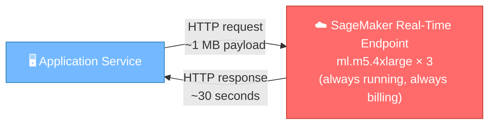
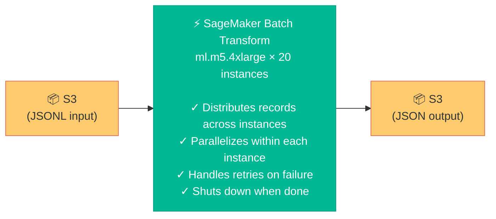
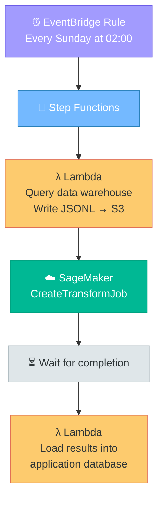
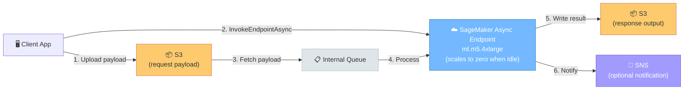

*Stop paying for a 24/7 inference endpoint when all you need is a weekly batch run.*


*Photo by [Taylor Vick](https://unsplash.com/@tvick) on [Unsplash](https://unsplash.com)*

---

There's a pattern I keep seeing with customers building ML platforms on Amazon SageMaker AI. It goes something like this:

1. Data science team trains a model
2. They deploy it to a SageMaker real-time endpoint
3. An application calls that endpoint — one request at a time — to score a large dataset
4. It takes hours. It's slow. It's expensive. Everyone's frustrated.

The problem isn't the model. The problem isn't SageMaker. The problem is that **a real-time endpoint is the wrong tool for a batch workload**.

Let me show you what I mean — and how a simple architecture change can cut your inference time from days to hours and your costs by up to 99%.

---

## The Setup: A Real-Time Endpoint Doing Batch Work

Here's a typical architecture I encounter. A demand forecasting platform — let's call the company *Meridian Retail* — needs to generate predictions for hundreds of thousands of store-product combinations every week. Each prediction requires a rich payload: months of historical sales data, seasonal features, promotional calendars, and pricing signals. The team trained a model, deployed it to a SageMaker real-time endpoint, and built a service that calls it:



```python
# Client-side: sequential invocation
for item_id in all_items:
    request  = build_payload(item_id, historical_data)  # ~1 MB per payload
    response = invoke_endpoint(request)                 # ~30 seconds
    save(response)
    # next item... (blocks until response)
```

Each inference call takes about 30 seconds. That's unusually long for most ML models, but it's common for iterative forecasting: the model predicts day 1, feeds it back as input, predicts day 2, and so on for 31 days. It's inherently sequential *within* a single request.

Sounds manageable for a handful of items. Until you do the math at scale.

---

## The Math That Should Scare You

Meridian has **100,000 store-product combinations** to forecast. Each payload averages **1 MB** of historical data (months of daily records, multiple feature columns, preprocessing config). That's roughly **100 GB** of total input data flowing through the endpoint every week.

But it's not the data volume that kills you — it's the compute time:

```
100,000 items × 30 seconds per item = 3,000,000 seconds
                                    = 833 hours
                                    ≈ 34.7 days
```

Over a month to run a weekly forecast. That's obviously not going to work.

"But wait," you say, "we have 3 instances behind the endpoint!" Right — SageMaker load-balances across them. But if your application sends requests **sequentially** (one at a time, waiting for each response before sending the next), those 3 instances take turns sitting idle. You're paying for 3 but using 1.

And here's the thing about real-time endpoints: there's no server-side concurrency knob. Unlike Batch Transform (which has `max_concurrent_transforms` — more on that shortly), a real-time endpoint doesn't let you tell SageMaker "send N requests in parallel to each instance." Concurrency is entirely the client's responsibility. The model server inside the container (gunicorn, TF Serving, MMS) handles whatever requests arrive, but *getting* those requests to arrive concurrently requires your application to implement async invocation logic.

Even if you parallelize client-side — say, 20 concurrent requests using `asyncio.gather()` — you get:

```
100,000 items ÷ 20 concurrent × 30s = 150,000 seconds ≈ 41.7 hours
```

Better — but still almost two full days. And you're running a 24/7 endpoint for a job that runs once a week.

In practice, building this correctly is non-trivial. You need a semaphore to cap concurrency, retry logic for throttled requests, and error handling — essentially reimplementing what Batch Transform gives you for free:

```python
import asyncio, aiobotocore

CONCURRENCY = 20  # client-side equivalent of max_concurrent_transforms
semaphore = asyncio.Semaphore(CONCURRENCY)

async def invoke(session, item_id):
    async with semaphore:
        async with session.create_client("sagemaker-runtime") as client:
            response = await client.invoke_endpoint(
                EndpointName="your-endpoint",
                Body=build_payload(item_id),
                ContentType="application/json",
            )
            return await response["Body"].read()

async def main():
    session = aiobotocore.AioSession()
    tasks = [invoke(session, item_id) for item_id in all_items]
    results = await asyncio.gather(*tasks, return_exceptions=True)
    # ... handle errors, save results
```

That's a lot of plumbing for a Sunday morning batch job. Let's talk about what it costs.

---

## The Cost of Always-On Inference

A SageMaker real-time endpoint bills by the second, for as long as it's running. If you keep it up 24/7:

```
3 × ml.m5.4xlarge × 24 hours × 7 days  = 504 instance-hours/week
At ~$0.922/hour per instance            = ~$465/week
(us-east-1 pricing; check your region)   = ~$2,012/month
```

For a model that does useful work maybe 42 hours a week. The other 126 hours? You're paying for idle compute.

---

## The Fix: Batch Transform

The good news: this is one of the easiest wins in ML infrastructure.

Amazon SageMaker Batch Transform is designed for exactly this pattern: run inference on a large dataset, get results, shut down. No endpoint to manage. No idle billing. No client-side orchestration. (This isn't for sub-second user-facing predictions — more on that later.)

Here's how it works:



You upload your input data to S3 — one JSON payload per line in a [JSONL](https://jsonlines.org/) file (or split across multiple files in an S3 prefix) — and SageMaker does the rest. It spins up the instances, distributes the work, collects the results, writes them back to S3, and terminates.

> **Your model code doesn't change.** Batch Transform sends the same HTTP requests to your container that a real-time endpoint would. Same payload format, same content type, same response format. This is the single most important thing to understand about the migration.

---

## The New Math

With Batch Transform, you control parallelism with two knobs:
- **`instance_count`**: how many machines to run
- **`max_concurrent_transforms`**: how many parallel requests SageMaker sends to each instance simultaneously

This is the key architectural difference. With a real-time endpoint, your *client* has to implement concurrency. With Batch Transform, *SageMaker* manages it — firing N parallel `/invocations` requests at each container, no client-side async logic required.

So what should you set `max_concurrent_transforms` to? The [docs say](https://docs.aws.amazon.com/sagemaker/latest/dg/batch-transform.html) the ideal value equals the number of compute workers in the container. For CPU-bound models, that's typically the vCPU count — an ml.m5.4xlarge has 16 vCPUs, so it could handle up to 16 concurrent requests for a lightweight model. For Meridian's iterative forecasting model, each request holds a CPU core for 30 seconds doing sequential day-by-day prediction, so 4 concurrent is a reasonable starting point.

The good news: **you don't always have to guess.** If you set `max_concurrent_transforms=0` (or leave it unset), SageMaker queries the container's [`/execution-parameters`](https://docs.aws.amazon.com/sagemaker/latest/dg/your-algorithms-batch-code.html#your-algorithms-batch-code-how-containe-serves-requests) endpoint before the first invocation. SageMaker's built-in algorithms (XGBoost, Linear Learner, KNN, etc.) implement this endpoint and return the optimal value based on available CPUs and memory — you get auto-tuning for free. However, the AWS Deep Learning Containers for frameworks like PyTorch, TensorFlow, and HuggingFace do *not* implement this endpoint, so the default falls back to `1` — effectively sequential. If you're using a framework container, set the value explicitly. A reasonable starting point: match it to the vCPU count of your instance (16 for ml.m5.4xlarge), then reduce if your model is memory-heavy or each request holds a core for a long time (like Meridian's 30-second forecasts). For custom containers, you can implement the endpoint yourself — it's a simple `GET` that returns `MaxConcurrentTransforms`, `BatchStrategy`, and `MaxPayloadInMB` as JSON.

```
20 instances × 4 concurrent requests = 80 parallel inferences

100,000 items ÷ 80 concurrent × 30s = 37,500 seconds ≈ 10.4 hours
```

Add ~10 minutes of cold start overhead (instance provisioning, model download, container startup) and you're looking at roughly **10.5 hours** end-to-end. That's a Sunday morning job that finishes before lunch.

Want it faster? Scale to 40 instances:

```
40 instances × 4 concurrent = 160 parallel → ~5.2 hours + cold start ≈ 5.4 hours
```

And the cost (20-instance run):

```
20 × ml.m5.4xlarge × 10.5 hours × 1 run/week = 210 instance-hours/week
At ~$0.922/hour (us-east-1)                    = ~$195/week
                                                = ~$845/month
```

Let that sink in.

| | Real-Time Endpoint | Batch Transform |
|---|---|---|
| **Wall-clock time** | ~42 hours (with client-side parallelism) | ~10.5 hours |
| **Monthly cost** | ~$2,012 (24/7) | ~$845 (pay-per-job) |
| **Client code complexity** | Async service + retry logic + concurrency control (client-managed) | Upload to S3, start job, read results (SageMaker-managed parallelism) |
| **Idle compute** | ~126 hours/week | 0 |
| **Savings** | — | **~58% cost reduction, 4× faster** |

And that's conservative. If Meridian doesn't need the endpoint for anything else, they can decommission it entirely — dropping the real-time cost to zero and making the savings even more dramatic.

> **Note:** The 30-second-per-item latency in this example is specific to iterative forecasting models. If your model runs inference in milliseconds (classification, regression, embeddings), the throughput gains from Batch Transform are even more dramatic — you can process millions of records in minutes.

---

## How Does This Scale? The Numbers Across Different Workloads

Meridian's 30-second iterative forecast is one end of the spectrum. But Batch Transform works for any inference latency — from sub-second classification to multi-second generative models. The chart below tells the full story: bars for cost per job (left axis), the line for wall-clock time (right axis), and the red dashed line for the always-on real-time endpoint cost. Drag the slider to match your model's latency, and use the second slider to set your `max_concurrent_transforms`.



A few things jump out:

- **Every configuration beats the real-time endpoint** (~$465/week for 3× ml.m5.4xlarge, red dashed line). For fast models, the savings are 98–99%. Even for the worst case (30s latency, 16 instances), you're still saving ~58%.
- **For slow models, scaling out is basically free.** At 30s/item, the bars barely grow as you go from 1 to 16 instances — but the line drops from 208 hours to 13 hours. Doubling instances halves the time at roughly the same cost.
- **Drag the slider to 10 ms** and watch the chart collapse: every configuration finishes in minutes for pennies. The cold start overhead dominates — instance count barely matters.

---

## How to Migrate

The migration is straightforward. You need to change three things:

### 1. Format Your Input as JSONL

Instead of building payloads in application code, write them to S3. One JSON object per line:

```jsonl
{"request_type":"iterative_forecast","item_id":"A001","historical_rows":[{"date":"2026-01-01","sales":142,"promo":0},{"date":"2026-01-02","sales":158,"promo":1}],"forecast_days":31,"target_cols":["daily_sales"]}
{"request_type":"iterative_forecast","item_id":"A002","historical_rows":[{"date":"2026-01-01","sales":87,"promo":0},{"date":"2026-01-02","sales":93,"promo":0}],"forecast_days":31,"target_cols":["daily_sales"]}
{"request_type":"iterative_forecast","item_id":"A003","historical_rows":[{"date":"2026-01-01","sales":215,"promo":1},{"date":"2026-01-02","sales":201,"promo":1}],"forecast_days":31,"target_cols":["daily_sales"]}
```

For large datasets, you can split input across multiple files in an S3 prefix (e.g., `input/batch_001.jsonl`, `input/batch_002.jsonl`). SageMaker distributes files across instances automatically — this often gives better parallelism than a single large file.

### 2. Create the Transform Job

```python
import sagemaker
from sagemaker.transformer import Transformer

session = sagemaker.Session()
role = "arn:aws:iam::123456789012:role/SageMakerExecutionRole"  # Your execution role

# Use the same model that backs your current real-time endpoint.
# Find the model name in the SageMaker console under Endpoints → Endpoint config.
MODEL_NAME = "your-forecast-model"

transformer = Transformer(
    model_name=MODEL_NAME,
    instance_count=20,
    instance_type="ml.m5.4xlarge",
    output_path="s3://your-bucket/forecast-output/",
    accept="application/json",
    max_concurrent_transforms=4,          # Explicit: 4 for this CPU-heavy model (see note below)
    max_payload=6,                        # Max MB per request
    strategy="SingleRecord",
    assemble_with="Line",
    sagemaker_session=session,
)

transformer.transform(
    data="s3://your-bucket/forecast-input/",  # S3 prefix with JSONL file(s)
    content_type="application/json",
    split_type="Line",
)

# This blocks until the job completes
transformer.wait()
print(f"Results at: {transformer.output_path}")
```

Key parameters:
- **`split_type="Line"`** tells SageMaker to treat each line of the JSONL file as a separate inference request
- **`strategy="SingleRecord"`** sends one record per request to the container (matching your current payload shape)
- **`max_concurrent_transforms=4`** sends 4 parallel requests per instance. For Meridian's CPU-heavy iterative forecasting model, 4 is a conservative choice — each request holds a core for 30 seconds. For lightweight models (XGBoost classification, embeddings), you could go up to 16 on an ml.m5.4xlarge (one per vCPU). If you're using a SageMaker built-in algorithm, you can set this to `0` and let the container auto-detect the optimal value
- **`max_payload=6`** caps each request at 6 MB — important because SageMaker enforces `max_concurrent_transforms × max_payload ≤ 100 MB`
- **`assemble_with="Line"`** writes one result per line in the output file

> **Constraint to remember:** `max_concurrent_transforms × max_payload` must not exceed 100 MB. If you set concurrency explicitly — say, `max_concurrent_transforms=16` with `max_payload=6` — that's 96 MB, just under the limit. If your payloads are larger, reduce concurrency or increase `max_payload` accordingly. When using auto-detect (`0`), the container is responsible for respecting this constraint.

### 3. Schedule It

Replace your always-on service with a scheduled job. AWS Step Functions + Amazon EventBridge is a natural fit, though a simple Lambda on a cron schedule or [SageMaker Pipelines](https://docs.aws.amazon.com/sagemaker/latest/dg/pipelines.html) (which has a native [TransformStep](https://docs.aws.amazon.com/sagemaker/latest/dg/build-and-manage-steps.html#step-type-transform)) work too:



No servers to manage. No endpoints to monitor. No retry logic to maintain.

---

## What About Async Inference?

If Batch Transform feels like too big of an architecture shift — or if you need to keep a real-time component alongside your batch workload — [SageMaker Async Inference](https://docs.aws.amazon.com/sagemaker/latest/dg/async-inference.html) is the middle ground worth serious consideration.

### How It Works

Async Inference looks like a real-time endpoint from the outside, but behaves differently under the hood:

1. You upload the request payload to S3
2. You call `InvokeEndpointAsync` with a pointer to that S3 object
3. SageMaker queues the request and returns immediately with a response token
4. The endpoint processes the request asynchronously
5. The result lands in a designated S3 output location
6. Optionally, an SNS notification fires on success or failure



### Why It's Compelling for Mixed Workloads

The killer feature: **Async Inference endpoints can scale to zero instances when idle.** No requests in the queue? No instances running. No bill. When a new request arrives, SageMaker automatically scales back up, processes the queued requests, and scales down again.

This means you can use the *same endpoint* for:
- **Ad-hoc real-time predictions** during the week (a product manager wants a forecast for one SKU — submit it, get the result in S3 in ~30 seconds + cold start)
- **Bulk batch runs** on Sunday morning (submit 100,000 requests, let the auto-scaler spin up instances to chew through the queue)

You get the flexibility of an endpoint with the economics of a batch job.

### Async Inference Specs

| Feature | Limit |
|---|---|
| Max payload size | 1 GB |
| Max processing time per request | 60 minutes |
| Scale-to-zero | Yes (with auto-scaling policy) |
| Notification on completion | Yes (SNS) |
| Concurrent requests | Controlled by auto-scaling policy (instance count) |
| Billing | Per-instance-second (same as real-time), but zero when scaled down |

### Code Example

Creating an async endpoint is nearly identical to a real-time one — you just add an `AsyncInferenceConfig`:

```python
import sagemaker
from sagemaker.model import Model
from sagemaker.async_inference import AsyncInferenceConfig

session = sagemaker.Session()

model = Model(
    model_data="s3://your-bucket/model/model.tar.gz",
    image_uri="your-container-image-uri",
    role="arn:aws:iam::123456789012:role/SageMakerExecutionRole",
    sagemaker_session=session,
)

async_config = AsyncInferenceConfig(
    output_path="s3://your-bucket/async-output/",       # Where results land
    max_concurrent_invocations_per_instance=4,           # Parallel requests per instance
    # notification_config={                              # Optional SNS notifications
    #     "SuccessTopic": "arn:aws:sns:us-east-1:123456789012:success",
    #     "ErrorTopic": "arn:aws:sns:us-east-1:123456789012:error",
    # },
)

predictor = model.deploy(
    instance_type="ml.m5.4xlarge",
    initial_instance_count=1,
    async_inference_config=async_config,
)
```

Invoking it:

```python
import boto3, json

runtime = boto3.client("sagemaker-runtime")
s3 = boto3.client("s3")

# 1. Upload payload to S3
payload = {"request_type": "iterative_forecast", "item_id": "A001", "historical_rows": [...]}
s3.put_object(
    Bucket="your-bucket",
    Key="async-input/request-A001.json",
    Body=json.dumps(payload).encode("utf-8"),
)

# 2. Invoke async endpoint
response = runtime.invoke_endpoint_async(
    EndpointName="your-async-endpoint",
    InputLocation="s3://your-bucket/async-input/request-A001.json",
    ContentType="application/json",
    Accept="application/json",
)

# 3. Response contains the output location — poll or use SNS
output_location = response["OutputLocation"]
print(f"Result will be at: {output_location}")
```

### Setting Up Scale-to-Zero

The scale-to-zero policy is what makes the economics work. Without it, you're back to paying for an always-on endpoint:

```python
import boto3

aas = boto3.client("application-autoscaling")

# Register the endpoint as a scalable target
aas.register_scalable_target(
    ServiceNamespace="sagemaker",
    ResourceId="endpoint/your-async-endpoint/variant/AllTraffic",
    ScalableDimension="sagemaker:variant:DesiredInstanceCount",
    MinCapacity=0,      # Scale to zero!
    MaxCapacity=20,     # Scale up to 20 for batch runs
)

# Scale based on queue depth
aas.put_scaling_policy(
    PolicyName="async-scaling-policy",
    ServiceNamespace="sagemaker",
    ResourceId="endpoint/your-async-endpoint/variant/AllTraffic",
    ScalableDimension="sagemaker:variant:DesiredInstanceCount",
    PolicyType="TargetTrackingScaling",
    TargetTrackingScalingPolicyConfiguration={
        "TargetValue": 5.0,     # Target: 5 pending requests per instance
        "CustomizedMetricSpecification": {
            "MetricName": "ApproximateBacklogSizePerInstance",
            "Namespace": "AWS/SageMaker",
            "Dimensions": [
                {"Name": "EndpointName", "Value": "your-async-endpoint"},
            ],
            "Statistic": "Average",
        },
        "ScaleInCooldown": 600,     # Wait 10 min before scaling in
        "ScaleOutCooldown": 120,    # Scale out quickly (2 min)
    },
)
```

The key metric is `ApproximateBacklogSizePerInstance` — SageMaker tracks how many requests are queued per active instance. When the backlog grows (Sunday morning batch), it scales out. When the queue drains, it scales back to zero.

### Async vs Batch Transform: When to Use Which

| | Batch Transform | Async Inference |
|---|---|---|
| **Best for** | Pure batch workloads (scheduled, no real-time need) | Mixed workloads (batch + occasional real-time) |
| **Input** | S3 files (JSONL, CSV) | Individual S3 objects per request |
| **Orchestration** | SageMaker manages distribution | You submit requests; auto-scaler manages capacity |
| **Max payload** | 100 MB per record | 1 GB per request |
| **Max processing time** | 3,600 seconds (1 hour) per record | 3,600 seconds (1 hour) per request |
| **Scale to zero** | N/A (job-based, no persistent infra) | Yes (with auto-scaling policy) |
| **Cold start** | 5–10 min per job (instance provisioning) | 5–10 min when scaling from zero |
| **Result delivery** | S3 output files (`.out`) | S3 + optional SNS notification |
| **Client complexity** | Minimal (submit job, wait) | Moderate (upload to S3, invoke, poll or listen for SNS) |
| **Cost model** | Pay for job duration only | Pay per-instance-second (zero when scaled down) |
| **Reuse for real-time** | No (separate job each time) | Yes (same endpoint, same model) |

### The Hybrid Pattern

For Meridian's use case, the hybrid approach would look like this:

```
Weekdays (ad-hoc):
    Product manager requests forecast for SKU X
    → Upload payload to S3
    → InvokeEndpointAsync
    → Endpoint scales from 0 → 1 instance (~5 min cold start)
    → Result in S3 in ~35 seconds (30s inference + overhead)
    → Endpoint scales back to 0 after cooldown

Sunday 02:00 (batch):
    Scheduler submits 100,000 requests to the queue
    → Endpoint scales from 0 → 20 instances
    → Processes queue in parallel (~10.5 hours)
    → Endpoint scales back to 0
    → Total cost: same as Batch Transform (~$195/run)
```

The tradeoff: you need client-side logic to submit requests and poll for results (or set up SNS listeners). With Batch Transform, you just point at an S3 prefix and wait. But if keeping a single endpoint for both use cases matters to your team, Async Inference is the way to go.

---

## Things to Watch For

Batch Transform isn't magic. A few operational details to keep in mind:

- **Cold start:** Expect 5–10 minutes of overhead before the first inference runs (instance provisioning + model download + container startup). Factor this into your SLA calculations. It doesn't change the economics, but don't promise "2 hours" if you haven't accounted for it.

- **Error handling:** If a record fails, Batch Transform doesn't stop the job. Failed records are logged, and you can find errors in CloudWatch Logs under the `/aws/sagemaker/TransformJobs` log group. Check your output — missing `.out` files or empty lines indicate failures.

- **Monitoring:** Use `boto3.client("sagemaker").describe_transform_job(TransformJobName=...)` or the SageMaker console to track progress. CloudWatch metrics like `CPUUtilization` and `MemoryUtilization` per instance help you right-size.

- **Output correlation:** By default, output records are in the same order as input records. If you need to explicitly associate inputs with outputs, set `join_source="Input"` in the `transform()` call — this appends the input record to each output line.

- **Single-file distribution:** If you upload one large JSONL file, SageMaker splits it across instances — but distribution isn't always perfectly even. For best parallelism with large datasets, split your input into multiple files (one per instance or more) in an S3 prefix.

---

## When to Keep the Real-Time Endpoint

Batch Transform isn't a universal replacement. Keep your real-time endpoint if:

- You need **sub-second latency** for user-facing predictions
- Predictions are triggered by **individual user actions** (not scheduled runs)
- You need **streaming** or **interactive** inference
- Your volume is **low and unpredictable** (a few requests per minute)

But if your workload looks like "predict on 100 GB every Sunday morning before the week starts" — you don't need a real-time endpoint. You need a batch job.

---

## Wrapping Up

The real-time endpoint is a powerful tool. But like any tool, it has a purpose. Using it for scheduled batch inference is like keeping a taxi running outside your house 24/7 because you need a ride to the office on Sunday morning.

SageMaker Batch Transform gives you:
- **Automatic parallelism** across as many instances as you need
- **Pay-per-job billing** instead of pay-per-hour-of-existence
- **Zero infrastructure** to manage between runs
- **The same model code** — no rewrite required

Next time you find yourself building an async service layer with retry logic and concurrency controls just to call a SageMaker endpoint faster — stop. Upload your data to S3, run a Batch Transform job, and go get coffee. It'll be done before you're back.

**Want to try it?** Start small: take 100 records from your dataset, write them as JSONL, and run a Batch Transform job. Compare the results with your endpoint output. If they match — and they will — you're ready to migrate.

---

**Further reading:**
- [Batch Transform for inference with Amazon SageMaker AI](https://docs.aws.amazon.com/sagemaker/latest/dg/batch-transform.html)
- [Speed up a Batch Transform job](https://docs.aws.amazon.com/sagemaker/latest/dg/batch-transform.html#batch-transform-speed)
- [SageMaker Python SDK — Transformer class](https://sagemaker.readthedocs.io/en/stable/api/inference/transformer.html)
- [SageMaker Async Inference](https://docs.aws.amazon.com/sagemaker/latest/dg/async-inference.html)
- [Autoscale an asynchronous endpoint](https://docs.aws.amazon.com/sagemaker/latest/dg/async-inference-autoscale.html)
- [Scale an endpoint to zero instances](https://docs.aws.amazon.com/sagemaker/latest/dg/endpoint-auto-scaling-zero-instances.html)
- [SageMaker Pipelines — TransformStep](https://docs.aws.amazon.com/sagemaker/latest/dg/build-and-manage-steps.html#step-type-transform)
- [Inference cost optimization best practices](https://docs.aws.amazon.com/sagemaker/latest/dg/inference-cost-optimization.html)
