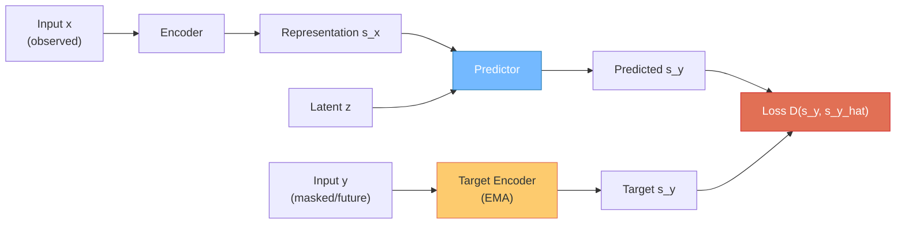
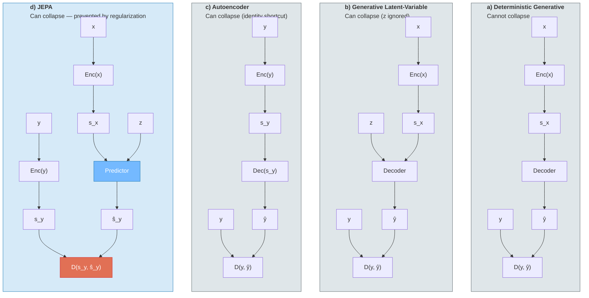
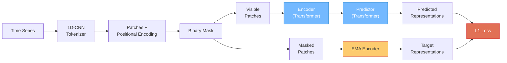
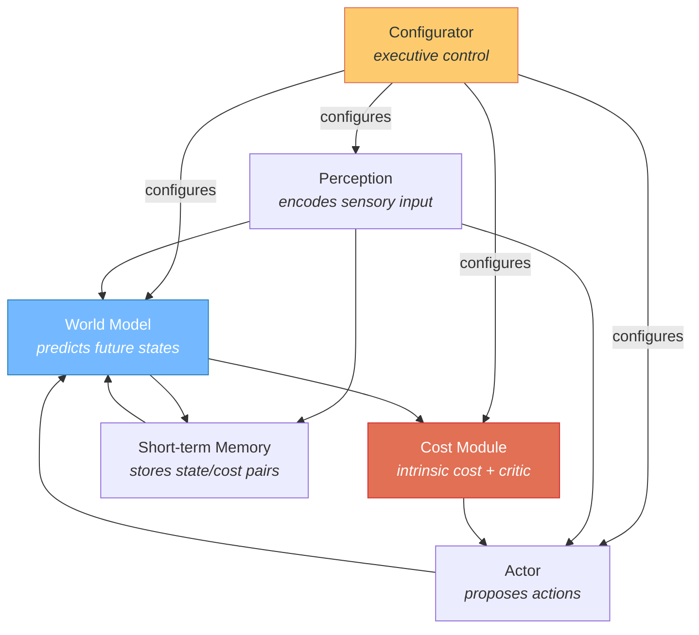
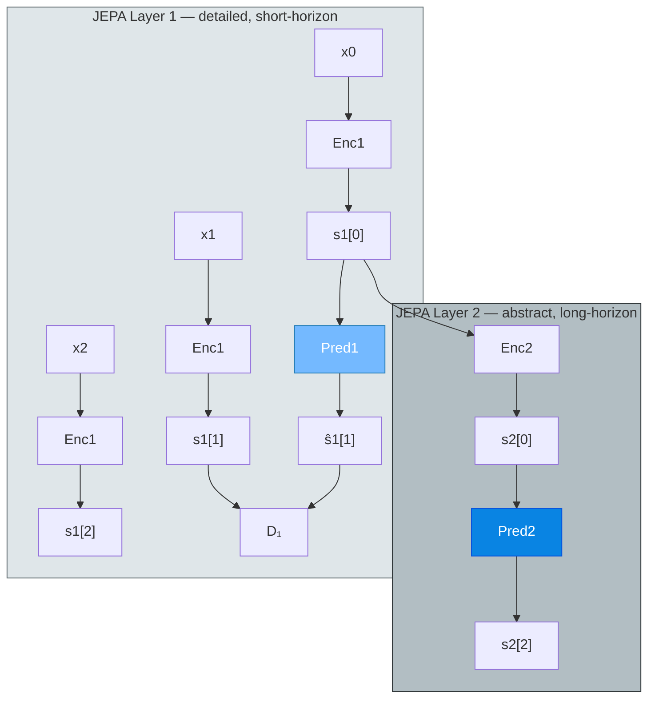
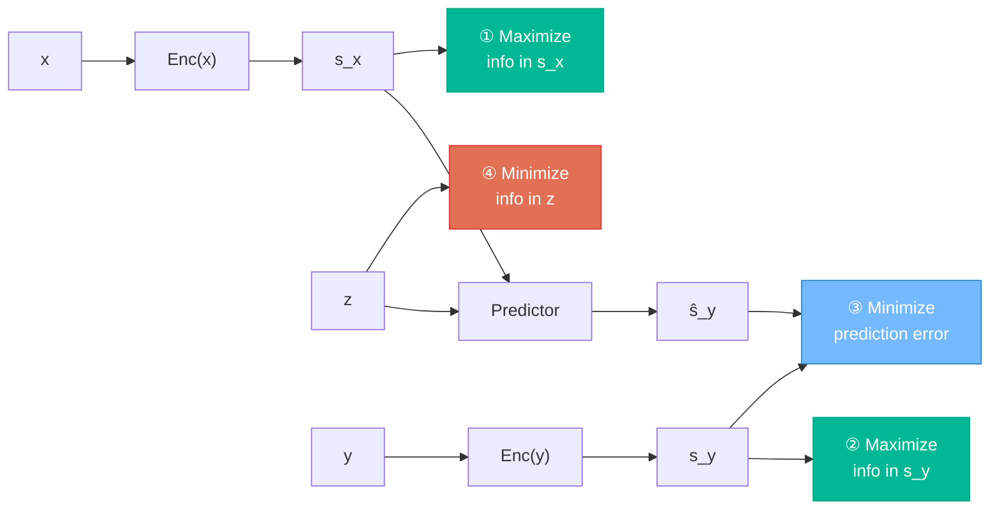
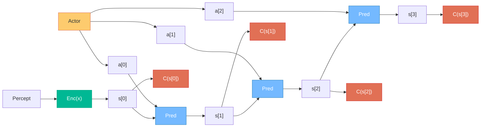

*JEPA predicts in latent space, not pixel space. That one difference underpins Yann LeCun's entire blueprint for machines that learn world models, plan hierarchically, and reason by simulation. Here's what JEPA actually is, where it's been applied, and what's still missing.*

> *This is Part 2 of 2 in the World Models series. [Part 1](../part1-from-cognitive-science-to-biology/) is a broad survey across three architectural generations and the biology crossover; this post is the technical deep dive on JEPA.*

*Photo by [Milad Fakurian](https://unsplash.com/@fakurian) on [Unsplash](https://unsplash.com)*

---

Most modern AI models learn by predicting raw outputs: the next token, the next pixel, the missing patch of an image. Joint Embedding Predictive Architecture (JEPA) breaks with this approach entirely. Instead of predicting in input space, JEPA predicts in **representation space** — a learned abstract space where irrelevant details have been discarded.

That distinction sounds subtle. It isn't. It changes what a model can learn, how efficiently it trains, and — if Yann LeCun is right — whether machines can build internal models of the world.

---

## What JEPA Actually Is

JEPA is a **training framework**, not a model architecture. Under the hood, JEPA implementations typically use standard Vision Transformers (ViTs). The innovation is in the training objective.

A JEPA system has four components:

1. **Encoder** — maps raw input (an image, a video clip, a time series) into a latent representation
2. **Predictor** — takes the encoder's output and predicts the representation of a missing or future part of the input
3. **Target encoder** (EMA) — a slowly-updated copy of the encoder that produces prediction targets
4. **Loss** — computed entirely in representation space: how close is the predictor's output to the target encoder's output?

The key property: because the loss is in representation space, the encoder is free to **discard unpredictable details**. Tree leaves in the wind, sensor noise, pixel-level textures — these get abstracted away. The model learns to represent only what's predictable: structure, objects, dynamics, causality.

To see why this matters, compare the four standard self-supervised architectures from LeCun's position paper (Figure 10). Each handles the relationship between input x and target y differently — and crucially, they differ in whether they can collapse to a trivial solution:

*Adapted from LeCun, "A Path Towards Autonomous Machine Intelligence" (2022), Figure 10.*

The critical difference: architectures (a–c) compute the loss in **input space** — the decoder must reconstruct y itself. Architecture (d), JEPA, computes the loss in **representation space** — it only needs to predict the encoding of y. This means the y-encoder can learn to discard irrelevant details, something generative decoders fundamentally cannot do.

This is fundamentally different from generative models (MAE, GPT, diffusion models), which are penalized for every detail they fail to reconstruct. A generative model forced to predict future video frames must model the exact texture of every surface. JEPA can learn that a ball is falling without modeling the carpet pattern behind it.

---

## Where JEPA Has Been Applied

### Vision (2023–present)

This is where JEPA started, and where the strongest results exist.

**I-JEPA** ([Assran et al., 2023](https://arxiv.org/abs/2301.08243)) applies JEPA to images. From a single context block of an image, it predicts the representations of masked target blocks. The results are striking — not for accuracy alone, but for efficiency:



*Recreated from Assran et al. (2023), Figure 1. I-JEPA achieves higher accuracy with an order of magnitude less compute than reconstruction-based methods.*

I-JEPA reaches ~79% top-1 accuracy on ImageNet-1K at ~1,200 GPU hours, while MAE needs ~10,000 GPU hours to reach 77%. A large I-JEPA model (ViT-H/14) requires less compute than even a small iBOT model (ViT-S/16).

The efficiency comes from two structural advantages: no decoder (the predictor operates in the much smaller latent space), and no multi-view augmentation (contrastive methods like DINO and iBOT process 2+ augmented views per image; JEPA uses a single view with masking).

**V-JEPA** ([Bardes et al., 2024](https://ai.meta.com/blog/v-jepa-yann-lecun-ai-model-video-joint-embedding-predictive-architecture/)) extends this to video: predict future frame representations from past ones. Meta reports 1.5x–6x training efficiency improvement over generative video approaches. V-JEPA is the closest existing system to LeCun's world model vision — it's a temporal predictor in latent space, learning how visual scenes evolve.

### Language (2025–2026)

Through early 2025, JEPA was almost exclusively a vision technique. Language models already operate on discrete tokens, so the pressure to move into latent-space prediction was lower. That changed rapidly:

| Paper | Date | Key Contribution |
|-------|------|-----------------|
| [Reversal Curse / JEPA binding](https://arxiv.org/abs/2504.01928) (Wang & Sun) | Apr 2025 | JEPA-based design that breaks the Reversal Curse in factual association learning. Accepted at ICLR 2026 |
| [Text-JEPA](https://arxiv.org/abs/2507.20491) | Jul 2025 | Lightweight NL-to-first-order-logic framework for closed-domain QA |
| [LLM-JEPA](https://arxiv.org/abs/2509.14252) (Huang, LeCun, Balestriero) | Sep 2025 | Applies JEPA objectives to LLM pretraining and finetuning across Llama3, Gemma2, OpenELM, and Olmo |
| [JEPA-Reasoner](https://arxiv.org/abs/2512.19171) (Liu et al.) | Dec 2025 | Separates reasoning (latent space) from token generation. 149.5% improvement on 8-shot GSM8K at 0.9B parameters |
| [BERT-JEPA](https://arxiv.org/abs/2601.00366) (Gillin et al.) | Jan 2026 | JEPA integrated into BERT for language-invariant multilingual semantics |
| [Semantic Tube Prediction](https://arxiv.org/abs/2602.22617) (Huang, LeCun, Balestriero) | Feb 2026 | JEPA regularization for language, 16x data efficiency on NL-RX-SYNTH |

The most significant of these is LLM-JEPA, coming directly from LeCun's group at Meta. It demonstrates that JEPA objectives can outperform standard language model training across multiple model families.

### Time Series (2024–2025)

JEPA's fit for time series is natural — like images and video, time series data is continuous and noisy. Predicting in latent space lets the model focus on trends and dynamics rather than reconstructing sensor noise.

| Paper | Date | Approach |
|-------|------|----------|
| [LaT-PFN](https://arxiv.org/abs/2405.10093) (Verdenius et al.) | May 2024 | JEPA + Prior-data Fitted Networks for zero-shot forecasting |
| [TimeCapsule](https://arxiv.org/abs/2504.12721) (Lu et al.) | Apr 2025 | JEPA for long-term forecasting in compressed representation domain |
| [CHARM](https://arxiv.org/abs/2505.14543) (Dutta et al.) | May 2025 | Foundation embedding model for multivariate time series using JEPA |
| [TS-JEPA](https://arxiv.org/abs/2509.25449) (Ennadir et al.) | Dec 2024 | First systematic study of JEPA for time series. NeurIPS 2024 Workshop (arXiv Sep 2025) |

TS-JEPA adapts the JEPA framework specifically for temporal sequences. A time series is split into patches, masked, and the predictor learns to predict masked patch representations from visible ones — mirroring I-JEPA's approach but along the temporal axis:

*Adapted from Ennadir et al. (2025), Figure 1.*

TS-JEPA is notable for an honest result: it doesn't beat autoregressive models at short-term forecasting, but it significantly outperforms them at classification while remaining competitive at forecasting. The value is in having a single pretrained representation that works across tasks — a foundation model property.

---

## JEPA's Role in LeCun's World Model Architecture

Everything above — images, video, language, time series — is groundwork. In LeCun's [2022 position paper](https://openreview.net/forum?id=BZ5a1r-kVsf) *"A Path Towards Autonomous Machine Intelligence,"* JEPA plays a much larger role: it's the mechanism by which machines learn **world models**.

### The cognitive architecture

LeCun proposes an agent with six modules:

The agent operates in two modes, analogous to Kahneman's System 1 and System 2:

- **Mode 1 (reactive):** Perception encodes state, a policy module directly outputs an action. Fast, no planning — like catching a ball.
- **Mode 2 (deliberate):** The actor proposes action sequences. The world model simulates future states for each sequence. The cost module evaluates them. The actor optimizes actions via gradient descent through the world model. This is model-predictive control with a learned simulator.

### Why JEPA is the world model's training method

The world model must predict future states of the world. LeCun argues this **cannot** be done generatively. You can't predict every pixel of every future video frame — the world is full of unpredictable details (textures, turbulence, exact pedestrian positions). A generative model is forced to reconstruct all of it and gets penalized for failing.

JEPA solves this by predicting in representation space. The encoder learns to represent only what's predictable — the abstract dynamics of how the world evolves. Unpredictable details are discarded by the encoder's invariance properties or absorbed into the predictor's latent variable.

From the position paper: the primary purpose of the world model is *predicting future representations of the state of the world*. Not future pixels. Not future tokens. Future **representations**.

### Hierarchical JEPA (H-JEPA)

A single JEPA predicts at one timescale. But intelligent behavior requires prediction at multiple levels of abstraction. LeCun's solution is **H-JEPA** — stacking JEPAs hierarchically:

- **Layer 1**: raw observations to low-level representations, short-term predictions (steering over the next few seconds)
- **Layer 2**: takes Layer 1 representations, produces higher-level abstractions, longer-term predictions (the car will arrive at its destination)
- **Layer N**: increasingly abstract representations, increasingly long horizons

The concrete example from the paper: planning a commute. At the highest level: "get to work." This decomposes into: drive to station, catch a train. "Drive to station" decomposes into: walk to car, start engine, navigate roads. This decomposition continues down to millisecond-level muscle control, which can only be planned when the local environment is perceived.

Each layer of H-JEPA discards more detail to enable longer-horizon prediction. This is what makes JEPA structurally suited for world models — generative models cannot discard detail, they can only push it into latent variables.

### Why not generative models or contrastive learning?

LeCun is explicit:

**Generative models** (autoregressive LLMs, diffusion models) are forced to model every detail of the output. They cannot learn to abstract — they're penalized for every unexplained pixel or token. Generative latent-variable models can push uncertainty into a latent variable z, but they cannot eliminate irrelevant details from the output representation itself.

**Contrastive methods** (SimCLR, DINO) suffer from the curse of dimensionality. The number of negative samples needed grows exponentially with representation dimension.

**JEPA with non-contrastive regularization** (VICReg, Barlow Twins) avoids both problems. The training is governed by four criteria that collectively prevent collapse while encouraging useful abstractions:

*Adapted from LeCun (2022), Figure 13. Criteria ①②④ prevent collapse; criterion ③ ensures prediction accuracy. Together, they force the encoder to discard only truly unpredictable information.*

Criteria ① and ② prevent the encoders from ignoring their inputs (informational collapse). Criterion ③ ensures the predictor actually learns the dynamics. Criterion ④ prevents the system from cheating by dumping all information into the latent variable z. The result: representations that are maximally informative yet contain only predictable content — exactly what a world model needs.

---

## The Predictor IS the Simulator

Here's the connection that's easy to miss: once JEPA training is complete, the **predictor module is literally the internal simulator**. Given a representation of the current state, it produces a prediction of the future state in latent space. Chain it: feed its output back as input to roll out multiple steps forward.

This is exactly what Mode-2 planning does in LeCun's architecture. The predictor is rolled out over T steps. At each step, the cost module evaluates the predicted state. The actor then optimizes the entire action sequence via gradient descent through the chain:

*Adapted from LeCun (2022), Figure 4. The world model (Pred, blue) is chained to simulate future states. The cost module (C, red) evaluates each state. The actor (yellow) optimizes actions by backpropagating cost gradients through the entire chain — this is model-predictive control with a learned simulator.*

JEPA doesn't "cause" a simulator to emerge mysteriously. The predictor is **designed to be** the simulator. The training objective directly optimizes it to predict future representations from current ones.

---

## What's Still Missing

Current JEPA implementations (I-JEPA, V-JEPA) are impressive, but they're far from the full world model vision. Three gaps remain:

### 1. Action conditioning

Current JEPAs are passive observers. They predict what happens next in an observed scene, but not what happens **if you do something specific**. The full world model needs `Pred(state, action) → next state`. No published JEPA does this yet.

### 2. Hierarchical stacking

H-JEPA — where Layer 1 handles short-term, fine-grained prediction and Layer 2 handles long-term, abstract prediction — is entirely theoretical. Nobody has trained a multi-level JEPA where higher layers learn coarser, longer-horizon predictions.

### 3. Closing the loop

Even with action conditioning and hierarchy, you still need integration with the actor (proposes actions), cost module (evaluates predicted states), and configurator (adapts everything per task). This full system has not been built.

What current JEPAs actually deliver is a **perceptual encoder** that produces good representations. The predictor module is typically discarded after pre-training; only the encoder is kept for downstream tasks. The leap from "good representations" to "internal world simulator that supports planning and reasoning" remains the research program.

---

## The Bottom Line

JEPA is a bet that the path to machine intelligence runs through prediction in representation space, not through predicting tokens or pixels. The evidence so far is encouraging:

- In vision, JEPA trains 2.5x–10x more efficiently than alternatives while producing better or comparable representations
- In language, JEPA objectives are starting to outperform standard training (LLM-JEPA, JEPA-Reasoner)
- In time series, JEPA offers the best balance across classification and forecasting from a single representation
- The architecture structurally contains a world simulator (the predictor), trained end-to-end

Whether this adds up to the autonomous intelligent agents LeCun envisions depends on solving the three open problems: action conditioning, hierarchical stacking, and closing the planning loop. As of mid-2026, those remain open.

But the foundations are being laid quickly, and the research surface area has expanded dramatically since 2025 — from a vision-only technique to an active area spanning language, time series, reasoning, and multimodal learning.

---

## Further Reading

- [A Path Towards Autonomous Machine Intelligence](https://openreview.net/forum?id=BZ5a1r-kVsf) — LeCun's 2022 position paper (the blueprint)
- [I-JEPA](https://arxiv.org/abs/2301.08243) — the original image JEPA (Assran et al., 2023)
- [V-JEPA](https://ai.meta.com/blog/v-jepa-yann-lecun-ai-model-video-joint-embedding-predictive-architecture/) — video JEPA (Bardes et al., 2024)
- [LLM-JEPA](https://arxiv.org/abs/2509.14252) — JEPA for language model training (Huang, LeCun, Balestriero, 2025)
- [TS-JEPA](https://arxiv.org/abs/2509.25449) — JEPA for time series (Ennadir et al., NeurIPS 2024 Workshop)
- [JEPA-Reasoner](https://arxiv.org/abs/2512.19171) — decoupling reasoning from generation (Liu et al., 2025)
